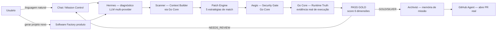

# ARCHITECTURE — Vision Core

**Documento principal da série de arquitetura (antigo `VISION_CORE_ARCHITECTURE.md`, renomeado 2026-07 na reestruturação de documentação — ver `docs/DECISIONS.md` DECISION-018). Leia `MASTER_SPEC.md` antes deste, se ainda não leu.**

> Versão: 1.0.0 · Criado: 2026-07-09
> Fonte: leitura direta de `CLAUDE.md`, `README.md`, `docs/CURRENT_STATE.md`, `docs/SDDF_SPEC.md` (raiz), `docs/HERMES_MISSION_SUPERVISOR.md`, `docs/PI_HARNESS_AUTONOMOUS_MISSION_RUNNER.md`, `docs/PASS-GOLD-SPEC-INTERNA.md`, `docs/SECURITY-SPEC.md`, `docs/PARITY_AUDIT.md`, `docs/LEGACY_DESIGN_REFERENCE.md`, `docs/VC_SECRET_GUARD_RUST_SPEC.md`, e verificação direta da árvore de arquivos (`go-core/internal/`, `backend/package.json`, `worker/`, `desktop-agent/`).

---

## Resumo

Vision Core é uma plataforma de execução supervisionada de missões de software: o usuário descreve um problema ou objetivo em linguagem natural, um conjunto de agentes reais (não simulados) diagnostica, planeja, aplica e valida a mudança, e nada é promovido sem um gate de evidência chamado **PASS GOLD**. O produto tem dois sistemas visíveis ao usuário final — **Chat/Mission Control** e **Software Factory** — e uma frente ativa de reconstrução de frontend chamada **Vision Core Next**.

Este documento também registra uma descoberta importante desta consolidação: **o vocabulário central do produto (`Hermes`, `PASS GOLD`, `Software Factory`) é reusado, com significados relacionados mas mecanicamente diferentes, por um segundo sistema interno** que governa como o próprio código do Vision Core é desenvolvido e promovido. Ver seção "Duas Camadas" abaixo — é a distinção mais importante para qualquer agente entender antes de tocar em qualquer arquivo.

---

## Objetivo

- Ser a fonte única de verdade sobre **o que o Vision Core é**, para qualquer agente de IA que for trabalhar no repositório.
- Eliminar a ambiguidade entre os dois usos do vocabulário central (`Hermes`/`PASS GOLD`/`Software Factory`) descrita na seção "Duas Camadas".
- Apontar, para cada peça do sistema, se ela é `EXISTENTE`, `EM IMPLEMENTAÇÃO`, `PLANEJADO` ou `IDEIA FUTURA` — nunca deixar isso implícito.

## Escopo

Arquitetura geral, as duas camadas do produto, módulos ativos, fluxo operacional, separação frontend/backend, segurança, testes, deploy, CI, boas práticas e regras obrigatórias. **Não** cobre detalhe de implementação de cada peça — isso vive nos 8 documentos-irmãos (ver `MASTER_SPEC.md`).

## Fora do escopo

Este documento não redefine nem substitui `docs/SDDF_SPEC.md` (5401 linhas, a spec canônica mais antiga e mais detalhada do pipeline de missão), `docs/HERMES_MISSION_SUPERVISOR.md`, nem os ~40 documentos de evidência/certificação em `docs/` (`STRESS-TEST-*`, `real-local-patch-*`, `controlled-runtime-*`, `one-real-tag-*`, `local-execution-*`). Esses continuam sendo a fonte primária para quem for trabalhar dentro da Camada 2 (ver abaixo) — este documento só mapeia onde eles se encaixam no todo.

---

## Duas Camadas — a distinção mais importante deste documento

Achado desta consolidação, verificado por leitura direta (não presumido): o Vision Core tem **duas camadas reais, ambas com código de verdade no repositório**, que compartilham nomes (`Hermes`, `PASS GOLD`, `Software Factory`, `Aegis`, `Scanner`) para conceitos relacionados mas **mecanicamente distintos**. Isso não é uma inconsistência a "corrigir" — são dois sistemas legítimos, um aplicando a filosofia do outro recursivamente a si mesmo. O risco é um agente ler uma spec de uma camada pensando que está lendo sobre a outra.

```mermaid
graph TD
    subgraph L1["CAMADA 1 — Produto (SaaS), o que o usuário final usa"]
        A1[backend/server.js<br/>Node.js/Express, AWS EB]
        A2[go-core — pacotes de produto<br/>scanner · patcher · validator · rollback<br/>passgold · passsecure · security · github · mcpserver · hermes · mission]
        A3[Frontend legado<br/>index.html + vision-core-bundle.js<br/>Cloudflare Pages]
        A4[Vision Core Next<br/>vision-core-next.html + clean.css/js<br/>em desenvolvimento ativo]
        A5[Worker Gateway<br/>Cloudflare Worker, proxy pra EB]
        A6[Software Factory produto<br/>SF-01..SF-09, geração de projeto]
        A1 --> A2
        A5 --> A1
        A3 -.referência visual.-> A4
        A1 --> A6
    end

    subgraph L2["CAMADA 2 — Governança interna, como o Vision Core desenvolve a SI MESMO"]
        B1[go-core — pacotes de governança<br/>authorityreview · evidenceledger · executionruntime<br/>gateauthority · promotionfirewall · sandboxtrace ... ~37 pacotes]
        B2[tools/ — 300+ módulos .mjs<br/>RTP chain RTP-0..RTP-6<br/>real-validation RV0..RV5]
        B3[pi-harness.mjs<br/>D0-D8, 13 gates PASS GOLD booleanos]
        B4[mission-supervisor.mjs<br/>Hermes-como-supervisor de CLAIMS de agente]
        B5[deploy.sh<br/>gate "PASS GOLD REAL AUTORIZADO"]
        B1 --> B2
        B2 --> B3
        B2 --> B4
        B3 --> B5
        B4 --> B5
    end

    L1 -."mesmo vocabulário,<br/>filosofia recursiva".-> L2
```

### Camada 1 — Produto (SaaS)

O sistema que um usuário final acessa em `visioncoreai.pages.dev`. Tudo neste documento fora desta seção e da próxima descreve a Camada 1, salvo aviso contrário.

- **`Hermes` (produto)** = agente de diagnóstico via LLM multi-provider (`hermes-rca.js`, endpoint `/api/hermes/analyze` e `/api/copilot`). Decide causa raiz de um bug, com memória de missões anteriores (Archivist).
- **`PASS GOLD` (produto)** = gate de promoção de uma missão de correção de bug do usuário final, calculado em `pass-gold-engine.js` como score ponderado de 6 dimensões (`llm_confidence` 0.30, `patch_specificity` 0.20, `risk_level` 0.15, `data_quality` 0.15, `build_passed` 0.10, `snapshot_exists` 0.10), níveis `GOLD`/`SILVER`/`NEEDS_REVIEW`. Complementado por uma cadeia anti-alucinação de 6 barreiras (AST parser → Semgrep → Hermes RCA D3/D4/D5 → sinalização de efeitos colaterais) documentada em `docs/PASS-GOLD-SPEC-INTERNA.md` — confidencial, não citar publicamente os nomes das tecnologias (AST/Semgrep) fora deste repo.
- **`Software Factory` (produto)** = feature de geração de projeto do zero (Auto-Pilot de 5-7 módulos ou Modo Avançado), módulos `SF-01` a `SF-09` (`docs/SF-SPEC-LIBRARY.md` + `docs/spec-library/*.json`), **hoje simulação/preview apenas** — todo spec de módulo exige `exec_real:false`/`file_creation:false`/`backend_write:false`. Ver `SOFTWARE_FACTORY_SPEC.md`.
- **10 agentes do "Decágono Multiagente"** — visual, definido em `SDDF_SPEC.md` §15 (legado: `activateAgent()` em `vision-core-clean-runtime.js`) e reimplementado do zero no Next como o **Atomic Core** (ver `ATOMIC_CORE_SPEC.md`).

### Camada 2 — Governança interna (o Vision Core desenvolvendo a si mesmo)

Um framework extenso — a maioria dos ~53 pacotes em `go-core/internal/` pertence a ele, não à Camada 1 — que governa como *mudanças no próprio repositório Vision Core* são planejadas, executadas, verificadas com evidência determinística (hashes SHA-256, nunca timestamp) e eventualmente promovidas para o release do próprio Vision Core (`deploy.sh --production`, que exige a frase literal `"PASS GOLD REAL AUTORIZADO"`).

- **`Hermes` (governança)** = supervisor de decisão sobre *fases de desenvolvimento deste repositório* (`mission-supervisor.mjs`, `tools/hermes/*.mjs`) — decide `READY`/`BLOCKED`/`NEEDS_FIX`/`ABORTED` para uma fase de trabalho, nunca toca arquivo, só audita. Documentado em `docs/HERMES_MISSION_SUPERVISOR.md` e `docs/SOFTWARE_FACTORY_SPEC.md`.
- **`PASS GOLD` (governança)** = gate booleano (não ponderado) para autorizar o **próprio Vision Core** a taggear/liberar/promover uma versão de si mesmo. `pi-harness.mjs` avalia 13 gates obrigatórios (D0-Preflight até D8-Report). Invariante repetida em toda versão do `HERMES_MISSION_SUPERVISOR.md`: `deploy_allowed`/`promotion_allowed`/`stable_allowed`/`release_allowed`/`tag_allowed` são **sempre `false`** até autorização humana explícita — mesmo com uma "autorização assinada" simulada, ela nunca vira execução real sozinha ("autorização é modelada, não executada").
- **`Software Factory` (governança)** = a metodologia SDDF (Scope→Design→Development→Firewall→Verification→Evidence→Handoff) que rege como uma *fase de desenvolvimento do Vision Core* é planejada (`TodoWrite`), executada (`Subagent`/`Fork`), auditada (`Firewall` contra `Date.now()`/`fetch(`/flags de promoção não-autorizados) e entregue (1 branch · 1 PR · máx 2 arquivos). Ver conteúdo completo em `docs/SOFTWARE_FACTORY_SPEC.md` **original** (não sobrescrito — a versão nova deste arquivo, referenciada pelo `MASTER_SPEC.md`, documenta a Camada 1; a metodologia de Camada 2 continua descrita em `docs/SDDF_SPEC.md`, seção 16 e adiante, documento canônico e não tocado nesta consolidação).

**Ferramenta compartilhada pelas duas camadas:** `pi-harness.mjs` (`tools/pi-harness.mjs`) é usado tanto como agente do pipeline de missão do usuário final (linha "PI Harness" em MÓDULOS ATIVOS, Camada 1) quanto como motor de evidência para o release do próprio Vision Core (D0-D8, Camada 2) — não é uma ambiguidade de nome, é a mesma ferramenta real cumprindo os dois papéis.

**Nota de auditoria honesta:** esta consolidação leu exaustivamente o histórico operacional real do Vision Core Next (`CLAUDE.md`, `docs/CURRENT_STATE.md` — dezenas de sessões, §53 a §200+) e **não encontrou nenhuma menção** a `deploy.sh --production`, `RTP chain`, `authorityreview` ou `pi-harness.mjs` sendo de fato executados nesse fluxo do dia-a-dia. A Camada 2 é real (código, testes e specs existem e são extensos — `npm test` no `package.json` raiz tem 100+ scripts `test:*`), mas sua integração operacional com o protocolo de revezamento de agentes documentado em `CLAUDE.md` **não está confirmada por esta auditoria** — é um gap de documentação real, registrado aqui em vez de resolvido por suposição. Quem for trabalhar na Camada 2 deve partir de `docs/SDDF_SPEC.md`/`docs/HERMES_MISSION_SUPERVISOR.md`/`docs/PI_HARNESS_AUTONOMOUS_MISSION_RUNNER.md` diretamente, não deste documento.

---

## Missão

> "IAs criam. VISION CORE corrige." — `frontend/landing.html:57`

A IA acelerou a criação de software, mas também criou um problema novo: código que nasce rápido e quebra rápido. O Vision Core existe para fechar esse loop — transformar erro em missão, missão em execução, execução em validação, validação em deploy seguro — nunca confiando no mesmo LLM que gerou o patch para também aprová-lo (ver `docs/PASS-GOLD-SPEC-INTERNA.md`, "é o equivalente a pedir para o suspeito investigar o próprio crime").

## Pilares

Princípios arquiteturais permanentes vivem exclusivamente em `docs/DECISIONS.md` (`ARCHITECTURAL PRINCIPLE-001` a `-006`). Eles governam qualquer evolução do Vision Core Next; este documento não duplica suas definições.

1. **Nenhuma promoção sem evidência real.** `SEM PASS GOLD REAL → não promove, não libera, não marca stable` — regra absoluta repetida em `README.md`, `SDDF_SPEC.md` e `SOFTWARE_FACTORY_SPEC.md` (Camada 2), e espelhada na Camada 1 pelo score de `pass-gold-engine.js`.
2. **Verificação nunca é feita só pelo mesmo LLM que gerou a mudança.** Segunda fonte de verdade sempre não-LLM (AST/Semgrep na Camada 1; hash SHA-256 determinístico + Firewall de regex na Camada 2).
3. **Legado é referência visual, nunca base de código.** `frontend/index.html`/`vision-core-bundle.js` só podem ser lidos para mapear comportamento — nunca importados, colados ou linkados no Next. Ver `docs/LEGACY_DESIGN_REFERENCE.md`.
4. **Gates de segurança só mudam com aprovação humana registrada por escrito** em `docs/CURRENT_STATE.md` — nunca por iniciativa própria de um agente, mesmo que pareça melhoria.
5. **Função insegura vira placeholder visível, nunca sucesso fingido.** "Não implementado ainda" é sempre preferível a uma UI que finge que uma ação insegura funcionou.
6. **Fail-closed por padrão.** Ferramenta desconhecida = perigosa até prova em contrário (INCIDENTE-4/`SESSION_SECRET` é o exemplo mais recente: sem segredo configurado, o processo recusa subir, em vez de assinar sessões com um segredo público).

---

## Arquitetura geral (Camada 1)



**Fluxo típico de missão** (mesmo texto do `CLAUDE.md`, confirmado): usuário descreve problema/projeto → Hermes diagnostica (LLM multi-provider) → Scanner constrói contexto real do repo → Patch Engine aplica fix → Aegis valida segurança → Go Core roda evidência real (testes) → PASS GOLD autoriza promoção → Archivist salva memória da missão → GitHub Agent abre PR.

### Módulos ativos (Camada 1)

| Módulo | Papel | Onde vive | Estado |
|---|---|---|---|
| Hermes | Orchestrator/RCA — LLM multi-provider | `backend/hermes-rca.js`, `/api/hermes/analyze`, `/api/copilot` | EXISTENTE |
| PI Harness | Runtime próprio de staging, evidência de execução | `tools/pi-harness.mjs` | EXISTENTE |
| OpenClaw | Orquestrador/planejador central | `/api/openclaw/orchestrate` | EXISTENTE |
| Scanner | Context Builder — varre arquivos do projeto real | Go Core (`go-core/internal/scanner`) | EXISTENTE |
| Patch Engine | Aplica fix real no disco, backup antes de escrever | `backend/patch-engine.js`, `/api/security/apply-fix` | EXISTENTE |
| Aegis | Security Gate — scanner de secrets/vulnerabilidades | Go Core (`go-core/internal/security`), `/api/aegis/validate` | EXISTENTE |
| Go Core | Runtime Truth — evidência real de execução | binário Go compilado (Windows+Linux) | EXISTENTE |
| PASS GOLD | Final Authorizer | `backend/pass-gold-engine.js` | EXISTENTE |
| Archivist | Memory Guard — memória de missões | `/api/archivist/learn`, `/api/memory/search` | EXISTENTE |
| GitHub Agent | Abre PR real após missão | `/api/github/create-pr` | EXISTENTE |
| Reserve Agents (Memory/Locator/Security/Validator/Architect) | Fallback quando agente primário falha | pré-registrado | PLANEJADO (não implementado, §200) |

---

## Componentes e camadas físicas

```
vision-core/
├── go-core/            Go — safe core (produto) + governança interna (~53 pacotes)
│   ├── cmd/vision-core/main.go
│   └── internal/       scanner · patcher · validator · rollback · passgold · passsecure ·
│                        security · github · mcpserver · hermes · mission        (produto)
│                        authorityreview · evidenceledger · executionruntime ·
│                        gateauthority · promotionfirewall · sandboxtrace · ...  (governança)
│
├── backend/            Node.js/Express — SaaS backend real (porta 3000/8080, AWS EB)
│   ├── server.js       gateway principal — auth, mission, vault, SF, billing, agent pairing
│   ├── pass-gold-engine.js, patch-engine.js, hermes-rca.js, provider-vault-crypto.js
│   └── scripts/        validate-syntax.js, self-healing-config.js, validate-passgold.js
│
├── frontend/            Cloudflare Pages — dois frontends coexistindo
│   ├── index.html + assets/vision-core-bundle.{js,css}   legado, produção, referência visual
│   ├── vision-core-next.html + assets/vision-core-next-clean.{css,js}   Next, em desenvolvimento
│   ├── about.html, landing.html                           páginas públicas
│   └── atomic-core.html + assets/atomic-core.{css,js}     protótipo isolado, não oficial
│
├── worker/              Cloudflare Worker — edge proxy + auth (`src/index.js`)
├── desktop-agent/       Electron — agente local (Vision Agent Local)
│
├── vc-secret-guard/     Rust — núcleo local de detecção de segredos (4ª peça do stack)
│
├── tools/               300+ módulos .mjs — maioria Camada 2 (governança/evidência)
│   ├── real-validation/    RV0–RV5 runtime smoke gates
│   ├── hermes/             mission-supervisor, decision-matrix, authorization-layer
│   ├── tests/               ~1730+ testes node:assert puro
│   └── pi-harness.mjs       compartilhado entre as duas camadas
│
├── bin/                 binário go-core compilado (git-ignored)
├── deploy.sh            deploy do PRÓPRIO Vision Core (Camada 2, gate PASS GOLD REAL)
├── setup.sh             setup local
└── bin/deploy-pages.sh  deploy real do frontend Cloudflare Pages (usado no dia-a-dia)
```

**Nota de nomenclatura:** existem dois scripts de deploy com propósitos diferentes — `deploy.sh` (raiz, Camada 2, gate `PASS GOLD REAL AUTORIZADO`, cobre go-core+backend) e `bin/deploy-pages.sh` (o script realmente usado sessão após sessão para publicar o frontend no Cloudflare Pages, documentado em `CLAUDE.md`). Não confundir os dois.

---

## Separação frontend/backend

- **Frontend legado** (`index.html`): estático, mas **não** livre de chamadas de backend — o bundle real (`vision-core-bundle.js`) faz chamadas reais a `/api/auth/*`, `/api/chat`, etc. (confirmado no INCIDENTE-3). `README.md` afirmava "no backend fetch calls by design" — corrigido em 2026-07-10 (ETAPA 4 de alinhamento README↔arquitetura). Servido via Cloudflare Pages.
- **Frontend Next** (`vision-core-next.html`): também estático (Cloudflare Pages), mas chama o backend real via `API_BASE_URL` fixo (o Worker gateway) — nunca relativo à própria origem. Ver `VISION_CORE_NEXT_FRONTEND_SPEC.md`.
- **Backend** (`backend/server.js`): único processo Express, todas as rotas `/api/*`, roda no AWS Elastic Beanstalk. Chama `go-core` via `resolveGoBinary()` como subprocesso para operações de segurança/scanner.
- **Worker Gateway**: proxy Cloudflare Worker entre os frontends e o EB — existe por causa de CORS/roteamento de domínio, não adiciona lógica de negócio própria.

---

## Estados de missão (Camada 1)

Herdados/consistentes com a Camada 2 (mesmo vocabulário, aplicado à missão do usuário final):

| Estado | Significado |
|---|---|
| `READY` | Missão validada, pronta para PR/merge |
| `MERGED` | PR integrado |
| `BLOCKED_INPUT` | Input inválido, incompleto ou inseguro |
| `BLOCKED_DEPENDENCY` | Evidência/fase anterior ausente |
| `NEEDS_FIX` | Erro corrigível — patch e retry |
| `ABORTED` | Risco alto ou ação sem autorização |

---

## Segurança

Nível atual: **8.5/10**, meta **9/10** antes de lançamento Enterprise (`docs/SECURITY-SPEC.md`). Ver `ROADMAP.md` para os itens pendentes com número de fase. Pilares já implementados:

- Senhas: scrypt N=16384, migração automática de PBKDF2 legado.
- Rate limiting: 5 registros/IP/hora, 10 logins/IP/15min.
- Sessão: HMAC assinada por `SESSION_SECRET` — **fail-closed desde o INCIDENTE-4** (2026-07-09): processo recusa subir sem o segredo, sem fallback público. JWT rotation + blacklist S3.
- LGPD: `DELETE /api/auth/me` (exclusão completa de conta).
- Auditoria: toda ação crítica logada com timestamp/IP/user-agent.
- `vc-secret-guard` (Rust, local): detecta secrets antes do commit — ver `VC_SECRET_GUARD_RUST_SPEC.md`.

**Histórico de incidentes reais** (não hipotéticos — 4 até esta consolidação, cada um motivou uma camada de defesa nova):

| Incidente | O quê | Resolução |
|---|---|---|
| 1 | Token GitLab exposto via `git remote -v` | Motivou a criação do `vc-secret-guard` |
| 2 | `agent_secret` vazando via `GET /mission/result/:id` público | Campo destruturado antes de persistir; pareamento por `agent_secret` implementado |
| 3 | Credencial de fallback (`'vc-user-auto'`) aceita em register/login e enviada pelo bundle legado real | Backend rejeita explicitamente; bundle não envia mais; runbook de contas legadas entregue |
| 4 | `SESSION_SECRET` com fallback público hardcoded assinando toda sessão | Fail-closed no boot; segredo forte configurado e verificado em produção |

---

## Testes

- **Camada 1 (Next):** Playwright, specs permanentes commitados em `tests/e2e/vision-core-next-*.spec.mjs` (agent-apply, sf, apply-fix, atomic-core, metrics, app-shell — 37 testes ao fim desta consolidação). Critério de "permanente": guarda um gate de segurança OU é superfície ativa de relay multiagente sem review por etapa.
- **Camada 1 (backend):** sem framework automatizado para `server.js` (não expõe `module.exports`) — padrão da casa é `node --check` + revisão + smoke manual via `curl`/`fetch` contra processo local.
- **Camada 2:** `npm test` na raiz — 100+ scripts `test:*`, ~1730+ testes `node:assert` puro, mais `go test ./...` no go-core.
- **`vc-secret-guard`:** `cargo test`, 57/57 no fim da Fase 1.5.

## Deploy

| O quê | Como | Aprovação necessária |
|---|---|---|
| Frontend (Cloudflare Pages) | `bash bin/deploy-pages.sh "msg"` | Explícita do usuário |
| Backend (AWS EB) | `python _deploy191b_eb.py` (ou `_deploy_eb_recreate.py`) | Explícita do usuário, redeploy só quando necessário |
| GitLab CI | Nunca — não funciona (runner allocation falha) | — |
| Vision Core (próprio release, Camada 2) | `deploy.sh --production`, frase `"PASS GOLD REAL AUTORIZADO"` | Frase de confirmação literal |

## CI

GitHub Actions roda a suíte Playwright + gera `docs/CI-LAST-RUN.md`/`STRESS-TEST-*-RESULTS.*` automaticamente a cada push (commits `ci: auto-update CI-LAST-RUN + RESULTS [skip ci]`, bot). CI **não** tem toolchain Rust configurado — `cargo test` do `vc-secret-guard` roda só localmente até isso ser adicionado (pendência aberta, ver `VC_SECRET_GUARD_RUST_SPEC.md`).

---

## Fluxo de desenvolvimento (protocolo de revezamento entre agentes)

Vigente desde 2026-07-08, texto completo em `CLAUDE.md`. Resumo:

1. Antes de começar: ler `CLAUDE.md` → spec relevante (esta série de 10) → `docs/CURRENT_STATE.md`.
2. Ao terminar uma etapa ou antes de bater limite de uso: atualizar os três.
3. Toda tarefa termina com: arquivos alterados, testes feitos (comando + resultado), pendências, próximo comando recomendado. Commit sempre — nunca deixar a working tree suja entre tarefas.
4. Gates de segurança só mudam com aprovação humana registrada por escrito em `docs/CURRENT_STATE.md`.

## Boas práticas / regras obrigatórias (extrato — lista completa em `CLAUDE.md`)

1. Painel condicional com `hidden` no HTML nunca tem `display:X` puro no CSS — sempre `.classe:not([hidden])`.
2. Nunca `innerHTML`/`insertAdjacentHTML`/`eval`/`document.write` nos arquivos Next.
3. `reducedMotion` explícito via `page.emulateMedia()` antes de `page.goto()` em todo teste Playwright com animação.
4. Todo endpoint chamado pela UI é verificado contra `backend/server.js` real por leitura direta, nunca assumido pelo nome.
5. Cache-bust do HTML/CSS/JS sempre incrementa junto.
6. Gate de segurança só muda com aprovação humana registrada.
7. Nunca commitar working tree sujo antes de terminar a sessão; nunca deployar código não commitado.

---

## Componentes em construção sem spec própria

Dois componentes reais têm código no repositório mas ainda não têm um documento de spec dedicado — o detalhe abaixo era mantido em `CLAUDE.md` (seção "CHECKPOINTS EM ANDAMENTO") antes da reestruturação de documentação de 2026-07 e foi movido para cá por ser conteúdo de arquitetura, não de estado de sessão. Estado atual (bloqueado/em pausa/próxima ação) fica em `docs/CURRENT_STATE.md`, não aqui.

### SF-Agent-Orchestrator (`tools/sf-agent-orchestrator.mjs`)

Orquestra "montar projeto do zero" usando o **Claude Agent SDK** real (`@anthropic-ai/claude-agent-sdk`, instalado). Um agente "Hermes" no topo delega para subagents (`backend-agent`/`frontend-agent`) via hooks de governança (`PreToolUse`/`PostToolUse`/`SubagentStop`) reaproveitando `validateAgentOutput` de `mission-supervisor.mjs` (Camada 2). Bloqueio estrutural real encontrado nos smoke tests: sessão aninhada herdava toolset restrito via env vars `CLAUDE_*` — corrigido com `sanitizeSpawnEnv()` + isolamento de processo via `ProcessStartInfo`. A disciplina de integração de SDK externo usada aqui (commit isolado por peça, revisão adversarial, incerteza documentada no código, defaults fail-closed, gate de confirmação humana antes de gastar API real) é regra permanente — ver `docs/DECISIONS.md` DECISION-017.

### AI Provider Vault ("Configuração Principal")

Unifica os dois sistemas de credencial de LLM do produto (env vars do EB vs. a tela "AI API VAULT", antes desconectadas) numa fonte única. Persistência: o vault é um **override opcional** sobre env vars — só vale quando salvo pela tela, cifrado AES-256-GCM em repouso (`PROVIDER_VAULT_SECRET`). `callLLM()` consulta o vault a cada chamada (sem cache do estado `connected`, só a derivação da chave-mestra é cacheada) — vence sobre env var só quando `status==='connected'`. Limitação conhecida: `status:'connected'` não expira sozinho, sem TTL/verificação periódica — uma chave revogada no provedor continua "conectada" até teste manual novo. Conectar `tools/sf-agent-orchestrator.mjs` ao vault é decisão de arquitetura em aberto (MCP server fino vs. lib compartilhada `provider-vault-crypto.js`/`provider-vault-routing.js`) — não presumir sem conversa com o usuário.

---

## Documentação

Esta série de 10 documentos (`MASTER_SPEC.md` + 9) é a fonte de arquitetura. `CLAUDE.md`/`docs/CURRENT_STATE.md` são o estado operacional vivo. `docs/SDDF_SPEC.md`, `docs/HERMES_MISSION_SUPERVISOR.md`, `docs/PI_HARNESS_AUTONOMOUS_MISSION_RUNNER.md` são a fonte canônica da Camada 2. `docs/LEGACY_DESIGN_REFERENCE.md` é a fonte de herança visual legado→Next. Os demais ~80 arquivos em `docs/` são specs de detalhe (`GIT-PROVIDER-SPEC.md`, `ENTERPRISE-SPEC.md`, `PENTEST-CHECKLIST.md`, `SF-SPEC-LIBRARY.md`) ou recibos de evidência datados de execuções passadas (`STRESS-TEST-*`, `real-local-patch-*`, `one-real-tag-*`) — não reescritos por esta consolidação, referenciados quando relevante.

---

## Checklist de aceite deste documento

- [x] Missão, objetivo, pilares declarados
- [x] As duas camadas mapeadas com fronteira explícita
- [x] Fluxograma geral (Mermaid)
- [x] Componentes/camadas físicas
- [x] Segurança com histórico de incidentes real
- [x] Testes, deploy, CI
- [x] Boas práticas e regras obrigatórias
- [x] Nenhuma funcionalidade inventada — toda afirmação rastreável a um arquivo lido nesta consolidação

## Pendências

- Confirmar com o usuário se a Camada 2 (governança interna) deve ser integrada ao protocolo de revezamento do dia-a-dia, ou se continua sendo um trilho separado — decisão de produto, não resolvida por esta consolidação.
- `docs/SOFTWARE_FACTORY_SPEC.md` (Camada 2, conteúdo original) precisa ganhar um cross-reference explícito de volta pra este documento — não foi tocado nesta consolidação por estar fora do escopo (a tarefa pediu para "criar" um arquivo de mesmo nome com conteúdo de produto; ver decisão registrada em `SOFTWARE_FACTORY_SPEC.md` deste pacote).

## Próximos passos

Ver `ROADMAP.md`.

## Histórico

| Data | Mudança |
|---|---|
| 2026-07-09 | Criação — primeira versão consolidada, substituindo a ausência de um documento de arquitetura único. |
| 2026-07 | Renomeado de `VISION_CORE_ARCHITECTURE.md` para `ARCHITECTURE.md` (DECISION-018); ganhou a seção "Componentes em construção sem spec própria" (SF-Agent-Orchestrator, AI Provider Vault), migrada de `CLAUDE.md`. |

## Controle de versão

**1.1.0** — 2026-07 (reestruturação de documentação)
**1.0.0** — 2026-07-09
