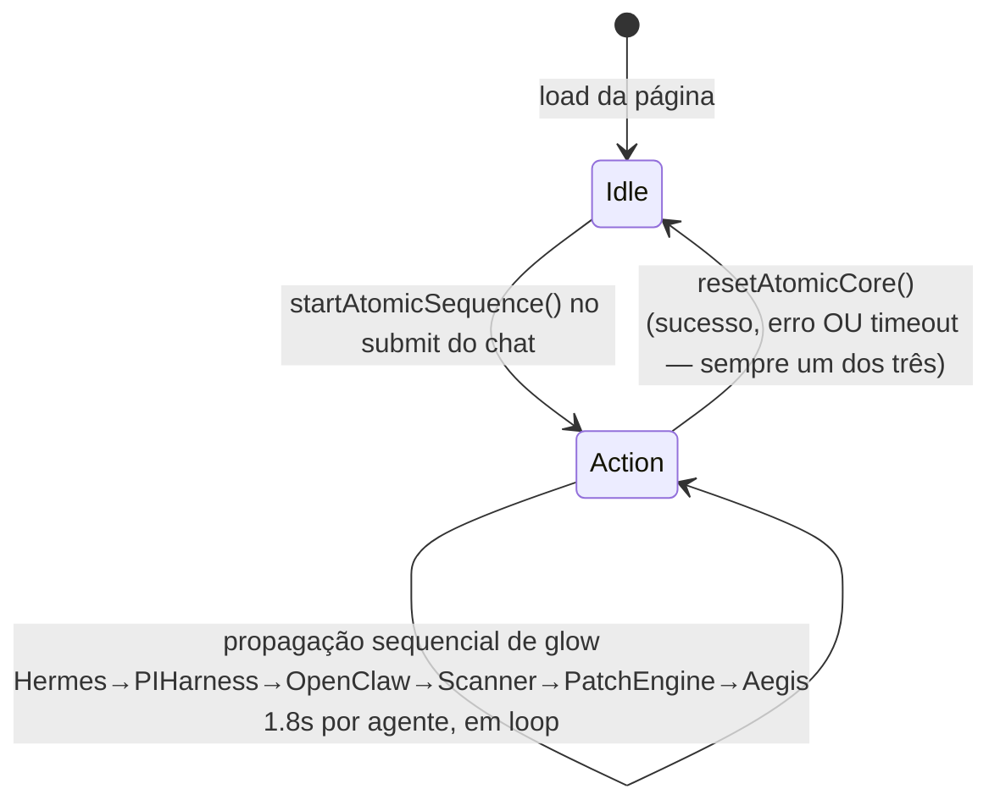

# ATOMIC CORE SPEC

**Parte da série de arquitetura — leia `MASTER_SPEC.md` e `VISION_CORE_ARCHITECTURE.md` antes deste.**

> Versão: 1.0.0 · Criado: 2026-07-09
> Fonte: `CLAUDE.md` seções "Atomic Core — APROVADO", "IDEIA REGISTRADA — Atomic Core", implementação real em `frontend/assets/vision-core-next-clean.js`/`.css`, `docs/SDDF_SPEC.md` §15 (ancestral visual), `docs/CURRENT_HANDOFF.md` (achados de sessão sobre reduced-motion).

---

## Resumo

O Atomic Core é o widget de identidade visual do Vision Core Next — um diagrama orbital onde 10 agentes "orbitam" um núcleo central, reinterpretando o pipeline de missão como um átomo. **É identidade de marca, não motor de execução** — nunca dispara nem controla nada sozinho, só reflete visualmente estados que já aconteceram em outro lugar do sistema. Área protegida: qualquer mudança visual exige aprovação explícita do usuário, mesmo pequena.

## Objetivo

Comunicar visualmente, em tempo real e sem dominar a tela, qual agente está ativo durante uma missão — sem nunca virar uma segunda fonte de verdade sobre o estado real da missão (o feature panel/chat continuam sendo a fonte textual).

## Escopo

O widget dentro de `vision-core-next-clean.js`/`.css` (`window.AtomicCoreNext`, `.vc-atomic-hud`). A analogia conceitual completa (máquina de estados de 4 fases) que ainda não foi implementada.

## Fora do escopo

`frontend/atomic-core.html` + `assets/atomic-core.{css,js}` — protótipo isolado, nunca commitado, não é a implementação oficial (a oficial vive dentro do Next). O blink do olho/logo é uma peça de identidade separada (documentado em `UI_COMPONENT_LIBRARY.md`), não parte do Atomic Core.

---

## Conceito e analogia atômica

CORE = núcleo. Os 10 agentes = elétrons. Órbitas = níveis de energia. Execução de missão = transferência de energia entre agentes.

## Agentes (10 — mesmo conjunto do "Decágono Multiagente" legado, `docs/SDDF_SPEC.md` §15)

1. Hermes
2. PI Harness
3. OpenClaw
4. Scanner
5. Patch Engine
6. Aegis
7. Go Core
8. PASS GOLD
9. Archivist
10. GitHub Agent

Cores por agente (`--agent-color`, CSS): `pi:#b86cff` · `hermes:#34d399` · `openclaw:#3b82f6` · `scanner:#22d3ee` · `patchEngine:#d946ef` · `aegis:#facc15` · `goCore:#f59e0b` · `passGold:#fb7185` · `archivist:#0f766e` · `github:#38bdf8`.

**Nota de herança:** o legado já tinha essa mesma lista de 10 agentes como ícones animados (`v33-running/done/fail/idle`, driver `activateAgent()` em `vision-core-clean-runtime.js`). O Atomic Core do Next é uma **reimplementação do zero** — visual e código novos, mesma lista conceitual de agentes, seguindo a regra anti-novo-legado (`docs/LEGACY_DESIGN_REFERENCE.md`: legado é referência, nunca base de código).

---

## Arquitetura



**Implementação real:** SVG + CSS transform/opacity + `requestAnimationFrame` — **nunca** Canvas/Three.js/WebGL. `data-state="idle"|"action"` em `[data-atomic-core]`, instância única no DOM (sem duplicação hero/sidebar).

### API pública

```js
window.AtomicCoreNext = { setState, highlight, reset }
window.startAtomicSequence()   // dispara a sequência completa (Action → glow → volta a Idle)
window.stopAtomicSequence()
window.setAtomicCoreState(state)      // usado por qualquer fluxo (chat, GitHub PR, Métricas...)
window.highlightAtomicAgents(agentList)
window.resetAtomicCore()              // SEMPRE chamado ao fim de um ciclo — sucesso, erro, timeout
```

Qualquer fluxo do Next que dispare uma ação (chat, GitHub PR, Apply-Fix, Dry-Run, ações SAFE READ) chama `setAtomicCoreState('action')` + `highlightAtomicAgents([...])` no início e `resetAtomicCore()` no fim — nunca fica preso em `action` por erro não tratado (confirmado por teste Playwright dedicado, `vision-core-next-atomic-core.spec.mjs`).

---

## Estados (implementados hoje)

| Estado | Quando | Comportamento visual |
|---|---|---|
| `idle` | 95%+ do tempo, padrão no load | Órbitas quase paradas, respiração/glow discretos, velocidades por agente nunca sincronizadas |
| `action` | Missão/ação em andamento | Propagação sequencial de glow entre os 6 primeiros agentes do pipeline, 1.8s cada, em loop até `resetAtomicCore()` |

## Estados conceituais — IDEIA FUTURA (não implementado)

A máquina de 4 estados completa registrada em `CLAUDE.md` ("IDEIA REGISTRADA — Atomic Core") **ainda não existe** — hoje só há o binário `idle`/`action` acima:

```
IDLE (95% do tempo) → THINKING (núcleo pulsa ao receber missão) →
EXECUTING (partículas viajando nas conexões, agente ativo desloca-se 8-12px da órbita) →
COMPLETED (pulso final, desaceleração suave) → volta a IDLE
```

**Antes de implementar isto:** repetir o mesmo rigor da reconstrução do Next — comparação visual, validação de identidade, revisão por etapas, `git diff` a cada passo, mudanças pequenas e verificáveis, nunca tudo de uma vez. Performance continua obrigatoriamente SVG+CSS+rAF, nunca Canvas/Three.js/WebGL.

---

## Motion / Performance / Responsividade

Fonte de verdade de movimento é `window.VCMotion` (ver `VISION_CORE_NEXT_FRONTEND_SPEC.md` seção "Motion System"), **não** o SO diretamente — decisão de produto: "a animação é identidade visual da marca, o VC controla, o SO não degrada por padrão." Default sempre `'full'`.

- **Modo `full`:** `requestAnimationFrame`, órbita em movimento contínuo, glow varia por estado.
- **Modo `reduced`** (só quando o usuário escolhe explicitamente em Settings): posição/escala **congeladas** (zero deslocamento), mas glow/opacidade continuam pulsando lentamente (`REDUCE_PULSE_MS≈4200`, seno sobre o tempo decorrido) via `setTimeout` recorrente (`REDUCE_TICK_MS≈500ms`, bem mais barato que rAF) — **nunca 100% estático**. Achado real corrigido em 2026-07-09: antes desse fix, o widget congelava por completo sob `reduced` (nada disparava um novo `render()` no período ocioso) — lido pelo usuário como "quebrado", não "calmo".

**Responsividade:** desktop 300×300px (`min(300px,23vw)`), área superior direita exclusiva do Atomic Core, opacidade 0.76. Breakpoint 1180px: encolhe pra 245px. Breakpoint 820px (mobile): **`display:none`** — decisão deliberada (ver `VISION_CORE_NEXT_FRONTEND_SPEC.md`), o Atomic Core é puramente decorativo (`pointer-events:none`) e a spec permite recolher em telas menores em vez de arriscar sobrepor conteúdo real.

`contain: layout paint` no CSS — não força reflow do resto da página.

## Semântica / Integração

O Atomic Core **nunca** é a fonte de verdade de nenhum dado — é sempre um espelho de um evento que já aconteceu (submit de chat, resposta de fetch, conclusão de ação). Nenhum componente lê o estado do Atomic Core para decidir o que fazer; a relação é sempre unidirecional (evento real → `setAtomicCoreState()`).

---

## Área protegida — regra de aprovação

**Comportamento atual confirmado e aprovado pelo usuário.** Qualquer PR que toque no Atomic Core (visual, mecanismo de glow, agentes, posicionamento) precisa de aprovação explícita, mesmo que pareça ajuste pequeno — histórico real de regressão: uma sessão do Codex já substituiu a detecção real de `prefers-reduced-motion` por um parâmetro de URL (`?reduce=1`) e removeu o guard do loop `requestAnimationFrame`, corrigido no commit `7278c633`.

## Checklist de aceite

- [x] SVG+CSS/JS, nunca Canvas/Three.js/WebGL
- [x] Idle automático por padrão, Action automático via evento real
- [x] Glow individual por agente, funcional mesmo sob reduced-motion (nunca 100% estático)
- [x] `resetAtomicCore()` sempre chamado ao fim de qualquer ciclo (sucesso/erro/timeout)
- [x] Responsivo, recolhe em telas menores, nunca sobrepõe composer

## Boas práticas / Princípios

1. Nunca deixar o widget preso em `action` — todo fluxo que o ativa precisa de um `resetAtomicCore()` garantido (inclusive em `catch`/timeout).
2. Nunca ler `matchMedia` diretamente para decidir animação — sempre via `VCMotion`.
3. Teste de motion sempre com `page.emulateMedia()` explícito antes de `page.goto()` — ver regra dura 3 em `VISION_CORE_NEXT_FRONTEND_SPEC.md`.

## Pendências

- Máquina de 4 estados (THINKING/EXECUTING com partículas/deslocamento) — IDEIA FUTURA, sem implementação.
- Configuração de intensidade visual (discreto/normal/ativo) — Etapa 3 do roadmap de Settings, não implementada.

## Próximos passos

Ver `ROADMAP.md`, Fase 1 (Frontend) e Fase 5 (IA/experiência).

## Histórico

| Data | Mudança |
|---|---|
| 2026-07-09 (v47/v48) | Correção de acoplamento de reduced-motion, depois inversão completa (SO nunca degrada por padrão, `VCMotion` como fonte de verdade). |
| 2026-07-09 | Criação deste documento consolidado. |

## Controle de versão

**1.0.0** — 2026-07-09
