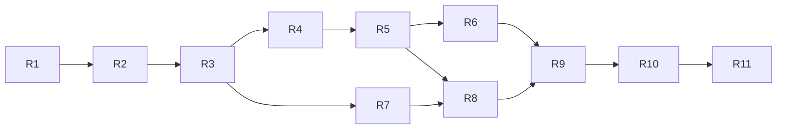

# MULTIPROVIDERS IMPLEMENTATION ROADMAP

> Factual roadmap derived from `VISION_CORE_ARCHITECTURE_GAP_REPORT.md`. It does not authorize implementation. Phase numbers here are roadmap-local; Phase 2 remains unstarted.

## Rules common to every phase

One objective, one atomic commit, no deploy/push without separate authority. Entry requires clean scoped diff and written approval. Exit requires tests, Hermes review, Ponytail gates, evidence receipt and updated handoff. Rollback is commit revert plus restoration of the prior read path; no destructive migration. Forbidden throughout: frontend legacy reuse, Provider-specific domain contracts, secrets in logs, automatic production activation and mixing unrelated worktrees.

## R1 — Provider security and ownership boundary

- Objective/motive: decide and enforce who may read/mutate global Provider configuration before building on it.
- Requirements/dependencies: Gap Report security findings; human decision on admin vs workspace ownership.
- Probable files: provider route middleware/tests, security docs; no registry yet.
- Allowed/forbidden: auth/authorization only; no Provider adapter/routing rewrite.
- Risks/Hermes/Ponytail: lockout or cross-tenant mutation; No Global Provider Mutation.
- Tests: anonymous, normal user, admin/owner, tenant isolation, metadata redaction.
- Entry/exit: ownership decision approved → all provider routes follow it and legacy behavior is characterized.
- Rollback/evidence/commit/authority: revert middleware; auth matrix receipt; `fix(security): bind provider configuration authority`; explicit approval required.

## R2 — Legacy provider characterization

- Objective/motive: freeze current `callLLM`, vault priority, Hermes router, status and failure semantics before replacement.
- Requirements/dependencies: R1; no production calls by default.
- Probable files: new focused tests around existing modules; minimal seams only if testability requires.
- Allowed/forbidden: tests and reversible extraction; no new domain or behavior change.
- Risks/Hermes/Ponytail: tests may canonize bugs; mark expected legacy contradictions explicitly.
- Tests: order, missing keys, vendor parsing, timeout, all-failed, priority, stale status, duplicate routers.
- Entry/exit: security boundary stable → deterministic legacy contract suite.
- Rollback/evidence/commit/authority: remove tests/seam; baseline receipt; `test(providers): characterize legacy routing`; approval required.

## R3 — Neutral domain contracts

- Objective/motive: implement language-level Provider, Model offering, Capability, Health, Transport, Cost, Privacy, Version and normalized result/error contracts.
- Requirements/dependencies: R2 and Phase 1/1.1 specs.
- Probable files: one small domain module plus contract tests.
- Allowed/forbidden: pure data/validation only; no I/O, registry, Vendor or endpoint.
- Risks/Hermes/Ponytail: abstraction explosion; four normative surfaces, fictitious examples.
- Tests: valid/invalid, unknown fields, version compatibility, redaction, no Vendor strings.
- Entry/exit: legacy baseline green → pure contract suite green.
- Rollback/evidence/commit/authority: delete isolated module; contract matrix; `feat(multiproviders): add neutral domain contracts`; Phase 2 authorization required.

## R4 — Provider and Model registries

- Objective/motive: create one authoritative Provider Registry and canonical Model Registry with offerings.
- Requirements/dependencies: R3; persistence decision explicit.
- Probable files: two cohesive modules, storage adapter, tests.
- Allowed/forbidden: registry APIs and legacy read adapter; no routing, discovery scanner or UI.
- Risks/Hermes/Ponytail: duplicate authorities, orphan entities, migration loss.
- Tests: idempotency, optimistic version, aliases, offerings, orphan rejection, lifecycle eligibility.
- Entry/exit: contracts stable → one writable authority each; legacy state readable without destructive migration.
- Rollback/evidence/commit/authority: switch reads back to legacy; snapshots/compat receipt; `feat(multiproviders): add authoritative registries`; approval required.

## R5 — Capability, Health and lifecycle resolution

- Objective/motive: add evidence-based capabilities, scoped TTL Health and uniform lifecycle.
- Requirements/dependencies: R4.
- Probable files: registry-owned evaluators and tests.
- Allowed/forbidden: deterministic state evaluation; no probes tied to Vendor, routing or UI.
- Risks/Hermes/Ponytail: false ONLINE, scope propagation, lifecycle bypass.
- Tests: TTL, transitions, Provider online/Model offline, declared vs validated capability.
- Entry/exit: registries authoritative → expired evidence becomes UNKNOWN and eligibility is deterministic.
- Rollback/evidence/commit/authority: disable evaluator behind internal composition boundary; state-transition receipt; `feat(multiproviders): resolve capabilities health lifecycle`; approval required.

## R6 — Discovery and configuration intake

- Objective/motive: normalize manual/env/Installer candidates without trust escalation.
- Requirements/dependencies: R4/R5; source trust rules.
- Probable files: discovery intake + configuration references + tests.
- Allowed/forbidden: candidate metadata/dedup/conflicts; no network scan, secret storage rewrite or auto-READY.
- Risks/Hermes/Ponytail: identity collision, discovery trust escalation.
- Tests: duplicate/conflict/disappearance/redetection, secret redaction, explicit registration.
- Entry/exit: lifecycle enforced → discovery can never skip validation.
- Rollback/evidence/commit/authority: disable intake; candidate ledger; `feat(multiproviders): add safe discovery intake`; approval required.

## R7 — Transport adapter boundary

- Objective/motive: move vendor HTTP/auth/body/parsing behind a common Transport adapter interface while preserving behavior.
- Requirements/dependencies: R2/R3/R4; first adapter must be fictitious/in-memory.
- Probable files: adapter interface, fake adapter, compatibility wrappers, tests.
- Allowed/forbidden: transport I/O boundary; no Colibri, policy routing or frontend.
- Risks/Hermes/Ponytail: first real Provider defines interface, secret leakage, hidden Vendor semantics.
- Tests: fake adapter contract, timeout, auth redaction, streaming declaration, normalized errors.
- Entry/exit: contracts/registries stable → fake and one compatibility wrapper pass same suite.
- Rollback/evidence/commit/authority: route legacy callers directly again; parity receipt; `refactor(multiproviders): isolate transport adapters`; approval required.

## R8 — Policy routing, compatible failover and metadata

- Objective/motive: replace array order with explainable candidate filtering/ranking using capabilities, Health, cost, privacy and comparable benchmark.
- Requirements/dependencies: R5/R7; policy schema approved.
- Probable files: pure router/policy module, decision receipts, tests.
- Allowed/forbidden: deterministic policy engine; no arbitrary weights, default Vendor or production cutover.
- Risks/Hermes/Ponytail: incompatible failover, unknown cost as zero, privacy by location.
- Tests: manual/automatic, hard constraints, ties, exclusions, affinity, confidence, idempotency/failover.
- Entry/exit: evidence model complete → every route/failure has reproducible receipt.
- Rollback/evidence/commit/authority: keep legacy route selected; golden decision corpus; `feat(multiproviders): add policy routing receipts`; approval required.

## R9 — Installer bridge and first neutral real adapter

- Objective/motive: connect successful installation to explicit registration, then certify one non-Colibri adapter without changing domain.
- Requirements/dependencies: R6/R7/R8; Installer SPEC available in this branch.
- Probable files: Installer bridge, one adapter, contract/integration tests.
- Allowed/forbidden: `register()` handoff and one adapter; no auto-READY, Blueprint or Colibri.
- Risks/Hermes/Ponytail: installation implies trust, adapter special cases.
- Tests: install→discovered/registered, failed install, revalidation, adapter parity.
- Entry/exit: bridge contract approved → installed Provider remains non-ready until validated; adapter changes no core file.
- Rollback/evidence/commit/authority: disable bridge/adapter registration; install receipt; separate atomic commits if bridge and adapter cannot remain one objective; explicit approval.

## R10 — Colibri adapter and Blueprint read model

- Objective/motive: add Colibri as ordinary Provider and expose read-only architecture state for future Blueprint diagrams.
- Requirements/dependencies: R9 certified; Colibri official protocol evidence; routing receipts stable.
- Probable files: Colibri adapter/plugin, read-model projector, tests; frontend only under separate Blueprint approval.
- Allowed/forbidden: common adapter and read-only projection; no Colibri contract fields in core, no operational controls in Blueprint.
- Risks/Hermes/Ponytail: dominant first-party special case, stale visualization.
- Tests: common adapter suite, Provider swap, projection consistency, secret omission.
- Entry/exit: neutral adapter precedent exists → Colibri passes unchanged suite; read model matches registries/receipts.
- Rollback/evidence/commit/authority: unregister adapter/read model; conformance receipt; separate commits; explicit Colibri and Blueprint approvals.

## R11 — Certification and controlled legacy retirement

- Objective/motive: prove parity/security and remove duplicate routing only after all consumers migrate.
- Requirements/dependencies: R1–R10; production release authorization separate.
- Probable files: certification suites, migration switches, removal of legacy arrays/Hermes duplicate router, release docs.
- Allowed/forbidden: deletion only with import/call-site proof; no deploy in implementation commit.
- Risks/Hermes/Ponytail: hidden consumer, rollback loss, tests validating obsolete behavior.
- Tests: full contract/E2E/security/load/fault injection, shadow decisions, rollback drill.
- Entry/exit: zero unknown consumers and parity window accepted → one router/registry authority, legacy removable.
- Rollback/evidence/commit/authority: restore compatibility path from prior commit; certification packet; `refactor(multiproviders): retire legacy routing`; human release approval required.

## Dependency summary

## Authorization state

All phases are proposals. None is started or authorized by this document. The next human decision should approve, reject or revise **R1 only**; approval must not be interpreted as approval for R2–R11.
