# ROADMAP — Vision Core

**Parte da série de arquitetura — leia `MASTER_SPEC.md` e `ARCHITECTURE.md` antes deste.**

> Versão: 1.0.0 · Criado: 2026-07-09
> Fonte: `CLAUDE.md` seção "PENDÊNCIAS IMEDIATAS", `docs/ENTERPRISE-SPEC.md`, `docs/PENTEST-CHECKLIST.md`, `docs/GIT-PROVIDER-SPEC.md`, `docs/CURRENT_STATE.md`, e os 8 documentos-irmãos desta série (seção "Pendências"/"Próximos passos" de cada um).

---

## Resumo

Roadmap técnico em 9 fases. **Nenhuma fase aqui é um compromisso de data** — são agrupamentos de pendências reais já registradas em algum lugar do projeto, organizadas por dependência e risco, não uma promessa de cronograma. Onde uma fase tem um documento fonte com número de decisão (`§NNN`), esse número é citado.

Direção de produto vigente: Vision Core Next está na fase de consolidação como frontend oficial futuro (ver `docs/DECISIONS.md` DECISION-019). A escolha de próximas tarefas prioriza, nesta ordem: arquitetura, UX, Software Factory, Atomic Core, performance, observabilidade, segurança, documentação e refinamentos visuais.

## Objetivo

Dar visibilidade de longo prazo sem inventar prazo. Toda entrada aqui é rastreável a uma pendência já registrada em `CLAUDE.md`/`docs/CURRENT_STATE.md`/uma spec — nada foi inventado para preencher a fase.

## Escopo / Fora do escopo

Escopo: as 9 fases pedidas. Fora do escopo: qualquer item que não tenha uma fonte real citável — se uma fase parece "vazia" de propósito real, ela diz isso explicitamente em vez de ser preenchida com ideia inventada.

---

## Visão geral

```mermaid
gantt
    dateFormat X
    axisFormat %s
    section Ativo
    Fase 1 — Frontend           :active, f1, 0, 10
    Fase 3 — Software Factory   :active, f3, 2, 6
    section Planejado
    Fase 2 — Backend            :f2, 3, 6
    Fase 4 — Secret Guard       :f4, 4, 8
    Fase 9 — Enterprise         :f9, 5, 9
    section Aberto / sem data
    Fase 5 — IA                 :f5, 6, 4
    Fase 6 — Desktop            :f6, 6, 3
    Fase 7 — Observabilidade    :f7, 6, 3
    Fase 8 — Cloud               :f8, 8, 2
```

*(Gantt ilustrativo de ordem relativa, não de datas — este roadmap não tem cronograma.)*

---

## FASE 1 — Frontend (Vision Core Next)

**Estado:** EM IMPLEMENTAÇÃO ativa — a frente de trabalho mais movimentada do projeto.

**Objetivos:** paridade funcional progressiva com o legado + camada visual completa (Métricas, Security Lab, App Shell), sem nenhuma dívida herdada de código.

**Dependências:** nenhuma externa — depende só de decisão de escopo do usuário item a item.

**Riscos:** Auth/login/OAuth no Next é o item mais sensível de todo o roadmap (mexe com sessão real de qualquer usuário) — não iniciar sem alinhamento explícito.

**Critérios de aceite:** ver checklist em `VISION_CORE_NEXT_FRONTEND_SPEC.md`.

**Prioridade:** ALTA · **Estimativa:** contínua, sem data de conclusão definida.

~~Pendências reais: Timeline estilo LionClaw (pipeline por estágios + custo por agente) bloqueada por dado real ausente no backend~~ **RESOLVIDO (2026-07-17)** — ver Fase 2: estágios persistidos desde `v5.9.65-mission-stages`, custo real por agente desde DECISION-032, `vcComponents.pipeline()` conectado desde `next-clean-116`/`117`. Fechados/fora da fila ativa do Next: ~~Páginas públicas `about.html`/`landing.html` (Etapas 5-7, escopo antes indefinido)~~ **IMPLEMENTADO (2026-07-13)** — escopo final escolhido: "IA Aplicada na Prática", mapa público real de IA/MCP/Fine-Tuning, dados usados e próximos gates; registra MCP parcial/flagado, REST como default/fallback, fine-tuning ainda sem pesos ajustados e dataset Hermes em 0/360 exemplos utilizáveis · ~~OAuth Google/GitHub no Next (email/senha já implementado, `next-clean-62` — bloqueado por mudança de backend no callback)~~ **IMPLEMENTADO (2026-07-13, `next-clean-77`)** · ~~Next nunca registrava suas próprias execuções do SF Auto-Pilot em `/api/mission/timeline` (Mission History/Timeline sempre vazias mesmo após rodar missões reais)~~ **CORRIGIDO (2026-07-13, `next-clean-71`)** · ~~`project-files`+`generate-zip`~~ **CORRIGIDO (2026-07-10)** · ~~Mission Input separado no Next~~ **REMOVIDO (2026-07-11)** — composer/chat principal é a única entrada de missão · ~~visualização gráfica completa das métricas estruturadas do Next~~ **CORRIGIDO E DEPLOYADO (2026-07-11, `next-clean-57`+`next-clean-58`+`next-clean-59`)** · ~~Tutorial Smile (Etapa 4)~~ **IMPLEMENTADO (2026-07-11, `next-clean-60`)** · ~~Auth email/senha no Next~~ **IMPLEMENTADO (2026-07-11, `next-clean-62`)** · ~~Settings do Atomic Core (on/off, intensidade)~~ **IMPLEMENTADO (2026-07-12, `next-clean-63`)** — "glow on/off" não incluído por já estar fechado como "nunca existiu como controle" em `VISION_CORE_NEXT_FRONTEND_SPEC.md` checklist item 6 · ~~Atomic Core preso à viewport (posicionamento fixo comprimindo outros painéis) + página de métricas em largura total~~ **IMPLEMENTADO (2026-07-12, `next-clean-64`)** — novo `ARCHITECTURAL PRINCIPLE-004` em `DECISIONS.md`, Atomic Core migrado pra fluxo normal de `#vcChatScroll`, nova página `Dashboard` reaproveitando gráficos já existentes · Fase 3.3d (`#vcSoftwareFactoryPage`/`#projectBuilder`) **não é blocker do Next**: os arquivos oficiais `vision-core-next.html`/`vision-core-next-clean.*` não contêm essas referências; resta como limpeza do frontend legado, que exige autorização explícita para tocar `index.html`/bundles. ~~Menu lateral com 14 itens sem agrupamento, sobreposição visual entre Timeline/Missions e Dashboard/Métricas não comunicada ao usuário~~ **REORGANIZADO (2026-07-13, `next-clean-74`)** — Proposta 1 (de 3 propostas investigadas) implementada: sidebar fixa (Chat/Missions/Software Factory/GitHub/Vault/Métricas/Settings) + 2 grupos colapsáveis nativos (`
`/`
`, sem JS novo) "Atividade" (Timeline/Agentes/Dashboard) e "Avançado" (Tools/Security Lab/Obsidian); nenhuma rota/endpoint/painel alterado, mesmas 14 abas funcionando. ~~Proposta 2 (fundir Timeline/Dashboard como abas próprias)~~ **IMPLEMENTADA (2026-07-13, `next-clean-75`)** — Timeline removida como destino separado; Histórico de Missões vive em Missions; Dashboard removido como aba própria; largura total vive como toggle dentro de Métricas. Agentes permanece separado por agregar status/catálogo/métricas safe-read.

> Nota de numeração: a referência histórica acima a `ARCHITECTURAL PRINCIPLE-004 — No Fixed Viewport Layout` passou a significar `ARCHITECTURAL PRINCIPLE-006` em 2026-07-14; o comportamento não mudou.

---

## FASE 2 — Backend

**Estado:** EXISTENTE e estável — pendências são de expansão, não de correção.

**Objetivos:** suportar múltiplos providers Git (não só GitHub), headers de segurança completos, isolamento real multi-projeto.

**Dependências:** Fase 9 (Enterprise) compartilha os itens §155/§156.

**Riscos:** nenhuma migração de infraestrutura em aberto — AWS→Alibaba já foi avaliada e **rejeitada explicitamente** (decisão fechada em `CLAUDE.md`, não reabrir sem necessidade real de escala horizontal).

**Critérios de aceite:** `docs/GIT-PROVIDER-SPEC.md` já define 10 specs (§62-001 a §62-010) e um rollout de 5 fases para o `GitProviderAdapter`.

**Prioridade:** MÉDIA · **Estimativa:** não iniciado.

Pendências: `GitProviderAdapter` (GitLab, `PLANEJADO`, zero código ainda — "🔵 SPEC CRIADA — implementação não iniciada") · ~~headers HSTS/CSP/X-Frame-Options (§153)~~ **CORREÇÃO DE REGISTRO (2026-07-18):** achado real — já estava implementado desde `6af95ae8` (2026-06-25), no gateway Cloudflare Worker (`worker/src/index.js`, `addSecurityHeaders()`), não em `backend/server.js`. Este documento nunca tinha sido atualizado depois do commit. Revalidado ao vivo nesta sessão via `Invoke-WebRequest` contra `https://visioncore-api-gateway.weiganlight.workers.dev/health`: `Strict-Transport-Security`, `Content-Security-Policy` (com `frame-ancestors 'none'`), `X-Frame-Options: DENY`, `X-Content-Type-Options: nosniff`, `Referrer-Policy`, `Permissions-Policy` todos presentes e corretos, batendo com os valores exigidos em `docs/PENTEST-CHECKLIST.md` §153. Não confundir com §160 (pentest OWASP ZAP formal) — esse continua não executado, checklist correto em não marcar essas linhas. · confirmar `HOTMART_HOTTOK`/`AWS_S3_BUCKET` totalmente reaplicados no EB · ~~**persistir estágios por missão**~~ **IMPLEMENTADO (2026-07-16, `v5.9.65-mission-stages`)** — `mission-timeline.json` ganhou `stages:[{name,status,started_at,completed_at}]` opcional e sanitizado (`sanitizeMissionStages()`), preenchido pelo SF Auto-Pilot com nomes reais (`project_builder/export_preview/project_templates/mission_composer/worker_handoff/gold_gate`, um por `step.module` de `SF_STEPS`/`SF_GOLD_GATE_STEP`); reaproveitou o endpoint existente (`POST /api/mission/timeline`) em vez de um endpoint novo de transição — decisão registrada, não é desvio da spec original. ~~`vcComponents.pipeline()` segue sem call site~~ **CORREÇÃO DE REGISTRO (2026-07-17):** já estava conectado desde `next-clean-116`/`next-clean-117` (2026-07-16) — `showMissionDetail()` renderiza `entry.stages` real via `stageToPipelineStep()`/`sfModuleLabel()`, horizontal, com duração calculada de `started_at`/`completed_at`; este documento e `docs/CURRENT_STATE.md` simplesmente não tinham sido atualizados após o commit (achado, não código novo) · ~~**custo real por agente**~~ **IMPLEMENTADO (2026-07-17, DECISION-032):** `callLLM()` extrai `usage`/`cost_usd` de forma aditiva (novos campos no retorno, nenhum call site existente muda de comportamento) e grava num ledger por agente (`backend/data/agent-costs.json`) quando o caller passa `opts.agent` — hoje `'Hermes RCA'` (`/api/copilot`, `/api/hermes/analyze`) e `'OpenClaw'` (`/api/openclaw/orchestrate`, ramo `diagnose`). `/api/metrics/agents` já não retorna `cost_usd: null` pra esses dois; Scanner/Aegis/Go Core/PASS GOLD continuam `null` corretamente (não chamam LLM). Custo por estágio individual de missão (não por agente agregado) segue fora de escopo — ver DECISION-032 "fora de escopo deliberado".

---

## FASE 3 — Software Factory

**Estado:** EXISTENTE (simulação) — ver `SOFTWARE_FACTORY_SPEC.md`.

**Objetivos:** ~~fechar os 2 endpoints SF restantes~~ **CORRIGIDO (2026-07-10)** — `project-files`+`generate-zip` conectados, `tests/e2e/vision-core-next-sf-project-files.spec.mjs` (6 testes). **Modo Avançado visual concluído localmente (2026-07-11):** Arquiteto determinístico, catálogo/grafo de stack, matriz de agentes, timeline e preview, ainda usando somente os endpoints SF existentes e simulação segura. Decidir se/quando a feature sai do modo simulação-only permanece em aberto.

~~Pendência registrada (2026-07-17): geração de diagrama de arquitetura visual para projetos gerados pelo Auto-Pilot/Modo Avançado (`PLANEJADO`, zero código ainda...)~~ **IMPLEMENTADO E DEPLOYADO (2026-07-17/18, `v5.9.69-tools-topology-fix`, confirmado funcional em produção com missão real)** — decisão resolvida a favor de (a) determinístico (sem LLM), coerente com a escolha já validada em `project-infographic.mjs`. Skill **Archify** (MIT, `github.com/tt-a1i/archify` v2.11.0) vendorizada em `tools/vendor/archify/` (só o renderer `architecture`, ver `README.md` lá para atribuição/escopo). Novo módulo `tools/project-architecture-diagram.mjs` gera `PROJETO_DIAGRAMA.html` **aditivo** ao branch `complexity==='complex'` de `/api/sf/project-files` — nunca substitui `PROJETO_INFOGRAFICO.html` existente, mesmo padrão best-effort. Bug real encontrado e corrigido durante a validação: labels de tecnologia realistas ("Java 21 + Spring Boot 3.4") excediam a largura de caixa default do renderer e falhavam silenciosamente (best-effort escondia o crash, mas o diagrama nunca aparecia) — fix calcula largura de caixa a partir do maior label real. Testes: `tools/tests/project-architecture-diagram.test.mjs` 38/38 PASS, `project-infographic.test.mjs` 54/54 sem regressão, suíte `vision-core-next-*.spec.mjs` 159/159 sem regressão. Escopo original: só o branch `complex` (onde já existia dado estruturado — brief com tabela de stack); branch `standard` estendido em seguida (pedido explícito do usuário, mesma sessão) — `buildArchitectureIRFromFiles` infere componentes direto dos caminhos de arquivo fixos que PROMPT1/PROMPT2 sempre geram (`public/index.html`→frontend, `src/index.js`/`package.json`→backend, `src/middleware/auth.js`→security, `Dockerfile`→infra quando presente), sem brief nem tabela — mesmo princípio de "nunca inventar" aplicado a presença de arquivo em vez de linha de tabela. `PROJETO_INFOGRAFICO.html` continua exclusivo do branch complex (depende de seções do brief que não existem no standard — fora de escopo, dado estruturalmente diferente). Gap de topologia de deploy (zip do EB é achatado, `tools/` não era encontrado) corrigido em `52401cc1`+deploy `v5.9.69`: `server.js` ganhou `importToolsModule()` com fallback de caminho, deploy inclui só os arquivos de `tools/` realmente usados em runtime. Confirmado com missão real em produção (`PROJETO_INFOGRAFICO.html`+`PROJETO_DIAGRAMA.html` gerados de verdade no branch complex). Narrativa completa em `docs/session_logs/2026-07-17-archify-architecture-diagram.md`.

**Dependências:** Fase 1 (é uma feature do frontend Next).

**Riscos:** ~~`generate-zip` seria o primeiro fluxo do Next tratando resposta binária~~ — feito, confirmado funcional por teste real de download (`page.waitForEvent('download')`), sem surpresas.

**Prioridade:** MÉDIA · **Estimativa:** concluído (2026-07-10).

---

## FASE 4 — Secret Guard (`vc-secret-guard`, Rust)

**Estado:** EM IMPLEMENTAÇÃO — Fase 1 e 1.5 (de 6 fases da spec) fechadas.

**Objetivos:** hooks git locais (Fase 2) → modo `watch` contínuo (Fase 3) → integração `server.js`/Next (Fase 4) → ponte `PASS SECURE` (Fase 5).

**Dependências:** cada fase exige aprovação humana explícita — não avança em bloco.

**Riscos:** CI sem toolchain Rust (`cargo test` só local); `high_entropy_blob` ainda com 53 achados no dogfood (meta era <50).

**Critérios de aceite:** ver tabela de fases em `VC_SECRET_GUARD_RUST_SPEC.md`.

**Prioridade:** decisão do usuário, sem urgência técnica declarada · **Estimativa:** Fase 2 sozinha, ~1 sessão.

---

## FASE 5 — IA

**Estado:** misto — parte EXISTENTE, parte bloqueada, parte IDEIA FUTURA.

**Objetivos:** conectar o AI Provider Vault ao `sf-agent-orchestrator.mjs` (Fase D(b), decisão de arquitetura em aberto: MCP server fino vs. lib compartilhada); fechar o smoke test real do `SF-AGENT-ORCHESTRATOR` (Claude Agent SDK); ativar os Reserve Agents (Memory/Locator/Security/Validator/Architect — pré-registrados, não implementados, §200); máquina de 4 estados completa do Atomic Core (IDEIA FUTURA); avaliar, quando o Software Factory estiver maduro, se `System Correcting Systems` deve virar princípio permanente futuro, com numeração ainda não reservada. Até lá, é apenas IDEIA FUTURA: toda melhoria deve, quando possível, aumentar a capacidade do Vision Core de analisar, validar, corrigir ou evoluir outros sistemas, incluindo ele próprio, sem autorizar execução automática nem reabrir gates.

**Dependências:** `SF-AGENT-ORCHESTRATOR` Fase 2 está **pausada por limite de cota de API** — precisa de decisão humana (esperar reset ou usar `ANTHROPIC_API_KEY` própria).

**Riscos:** integração de SDK externo exige a disciplina documentada em `CLAUDE.md` (commit isolado por peça, revisão adversarial, incerteza documentada explicitamente, defaults fail-closed, gate de confirmação humana antes de gastar API real).

**Prioridade:** BAIXA até a cota de API ser resolvida · **Estimativa:** indefinida.

Pendências registradas (achado real, 2026-07-13 — discussão mapeando MCP e Fine-Tuning contra a arquitetura real do Next, não especulação genérica): **adoção de MCP nos conectores externos** (`PLANEJADO`, zero código ainda, sem escopo definido — decisão de arquitetura pendente de discussão futura, não é spec pronta pra implementar): avaliar migrar GitHub Agent (`/api/github/create-pr`), Obsidian (`/api/obsidian/status`, hoje só leitura) e a busca de "Contexto de URL" do Software Factory (hoje busca externa simples) de endpoints REST customizados no backend para servidores MCP; reduziria código de integração mantido manualmente em `server.js`, e Obsidian ganharia capacidade de escrita que hoje não tem · **fine-tuning para agentes de avaliação/geração** (`PLANEJADO`, zero código ainda, sem escopo definido — dependente inclusive de qual provedor/infra de fine-tuning seria usado, fora do escopo de decisão deste registro): avaliar fine-tuning de modelo(s) menor(es) para Gold Gate Checker (critérios SDDF/OWASP/LGPD hoje avaliados via prompt genérico reexplicado a cada chamada), Scanner/Patch Engine (diagnóstico de código repetitivo) e Mission Composer (geração de estrutura de projeto); ligação direta com a pendência já registrada **custo real por agente** (ver Fase 2 — não duplicar o registro de custo aqui, só referenciar) — fine-tuning é uma via possível de reduzir esse custo por chamada de LLM, além de melhorar consistência das avaliações.

---

## FASE 6 — Desktop

**Estado:** EXISTENTE — dois produtos reais e ativos, **não são a mesma coisa empacotada de duas formas.**

**Investigação concluída (2026-07-17), resolve o "gap de documentação real" registrado anteriormente nesta seção — comparação linha a linha de `desktop-agent/src/main.js` (291 linhas) + `preload.js` + `BUILD.md` vs. `frontend/downloads/vision-agent.js` (1352 linhas):**

| | `frontend/downloads/vision-agent.js` | `desktop-agent/` (→ `VisionAgentSetup.exe`) |
|---|---|---|
| **Natureza** | Script Node standalone (`node vision-agent.js <caminho>`), porta 7070 (health check) | App Electron completo (tray, BrowserWindow, notificações nativas) |
| **O que faz de verdade** | Pipeline SDDF completo **local e real**: Scanner (varre disco), Hermes/askIA (`/api/chat` mode:fix), PatchEngine (escreve arquivo real + backup/rollback), Aegis (`node --check`/JSON.parse), GoCore (git add+commit local, nunca push automático), firewall de auto-modificação (§110, impede apontar pra si mesmo), dry-run real multi-arquivo (simulação em memória, sem escrita) | Chama só `/api/run-live` (sempre `mode:'dry-run'` hardcoded em `main.js:169`) e `/api/run-live-stream` (SSE) — **execução acontece no servidor**, nunca toca o disco da máquina do usuário. Também usa `/api/pass-gold/score` (report viewer) e `fetch-api` genérico via IPC. |
| **Autenticação** | Pareamento real `agent_id`/`agent_secret` via `POST /api/agent/register`, persistido em `.vc-agent-credentials.json`, exigido pra missões de escrita real (`apply_patch`/`apply_patch_multi`/`git_push`/`git_revert`) | Token JWT colado manualmente em Config (`BUILD.md` §"Configurar") — **sem conceito de `agent_secret`**, `preload.js` não expõe nenhum IPC de pareamento |
| **Como recebe trabalho** | Polling ativo: `GET /api/agent/mission/pending` a cada `POLL_MS` (3s default), despacha por `m.type` (`apply_patch`, `apply_patch_multi`, `git_push`, `git_revert`, `sf_dry_run_real`, default `executeMission`) | Usuário clica "iniciar missão" na UI; app faz 1 `POST /api/run-live` e escuta o SSE da resposta |
| **Referenciado ativamente?** | Sim — `frontend/index.html:2218` (`<a ... href="downloads/vision-agent.js" download>`) e Next (`vision-core-next.html`) descreve conceitualmente o fluxo de pareamento `agent_secret`/dry-run que **só este script implementa** | Sim — `frontend/index.html:260,2217` (botão "BAIXAR AGENT" + link direto pro GitHub Release `VisionAgentSetup.exe`) |

**Conclusão real (decisão de arquitetura, agora documentada — antes estava ambígua):** são dois produtos complementares e propositalmente diferentes, não uma divergência a corrigir — `vision-agent.js` é o motor de execução real (o que `CLAUDE.md`/`ARCHITECTURE.md` chamam de "Vision Agent Local" no sentido de pareamento + PI Harness), e o app Electron é um **cliente de monitoramento/disparo remoto** ("Vision Agent Desktop" seria nome mais preciso), sem qualquer acesso a disco local do usuário.

**Inconsistência real encontrada (não é a divergência que se temia, mas é um gap de UX/doc genuíno):** `frontend/index.html` apresenta os dois downloads lado a lado sob o mesmo rótulo "BAIXAR AGENT", como se fossem formatos alternativos da mesma ferramenta (GUI vs. CLI do mesmo agente) — não são. Um usuário que baixa só o `.exe` esperando o comportamento de "Vision Agent Local" descrito no Next (pareamento `agent_secret`, apply-patch real, dry-run real com firewall de auto-modificação) **não vai encontrar esse mecanismo no app Electron** — ele não existe lá. Isso não foi corrigido nesta missão (é investigação/documentação, não mudança de código/UI); fica como nota separada abaixo para decisão do usuário.

**Nota separada para decisão do usuário (não código, só recomendação):** considerar, numa sessão futura autorizada, (a) renomear o app Electron na UI de download para deixar claro que é um painel de monitoramento remoto, não o executor local real, e/ou (b) adicionar uma linha de esclarecimento ao lado dos dois botões em `frontend/index.html` explicando a diferença real de capacidade. Nenhum arquivo de código foi alterado, movido ou deletado nesta investigação.

**Prioridade:** sem pendência técnica ativa — o gap era de documentação/nomenclatura, agora resolvido; a nota de UX acima é opcional e depende de decisão do usuário. **Estimativa:** —.

---

## FASE 7 — Observabilidade

**Estado:** FECHADA — Métricas visual (Next) completa em `next-clean-57`+`next-clean-58`, DORA conectado.

**Objetivos:** ~~conectar `/api/metrics/summary` e `/api/metrics/memory`~~ **CORRIGIDO**. `next-clean-57` adiciona visualização gráfica SVG/CSS para agentes, DORA, runtime, memory layer, conectividade, Tools marketplace e Security history safe-read. `next-clean-58` fecha os 3 gaps restantes: Software Factory (donut DONE/FAIL/BLOCKED + duração por etapa + gauge de progresso), Security Lab (donut ok/fallback-local + gauge de conformidade + timeline das 6 checagens) e um toggle "Ver JSON bruto" reutilizável dentro de `#vcFeatureViz` para as ações safe-read (Agentes/Tools/Security-history) — JSON bruto permanece sempre atrás de toggle diagnóstico, nunca como conteúdo principal.

**Dependências:** Fase 1.

**Riscos:** nenhum novo — os 2 endpoints já existem e respondem em produção, é só trabalho de conexão de UI.

**Prioridade:** BAIXA (visual, não bloqueante) · **Estimativa:** ~1 sessão.

**Nota separada — Camada 2:** o framework de evidência interno (RTP chain, `tools/real-validation/`) é extenso e real, mas sua integração ao dia-a-dia do protocolo de revezamento **não está confirmada** (ver `ARCHITECTURE.md`) — se isso for uma prioridade real, precisa virar uma decisão de produto explícita antes de virar item de roadmap com prioridade.

---

## FASE 8 — Cloud

**Estado:** EXISTENTE e estável — decisões de infraestrutura já fechadas.

**Objetivos:** nenhum objetivo de migração aberto. AWS Elastic Beanstalk é a plataforma definitiva (decisão fechada, `CLAUDE.md`: "MIGRAÇÃO AWS→ALIBABA — NÃO migrar" — sem equivalente ao fluxo zip→version→rollback do EB na Alibaba para Node.js). S3 já é a fonte de verdade para dado persistente.

**Riscos:** nenhum em aberto.

**Prioridade:** N/A — só revisitar se houver necessidade real de escala horizontal/múltiplos serviços, não por billing.

---

## FASE 9 — Enterprise

**Estado:** PLANEJADO — nível atual de segurança **8.5/10**, meta **9/10** antes do lançamento Enterprise.

**Objetivos e critérios de aceite (por §, `docs/ENTERPRISE-SPEC.md`):**

| Item | O quê | Estado |
|---|---|---|
| §155 | SSO Enterprise via OpenID Connect (`/api/auth/sso/start`/`/callback`, PKCE+HMAC state) | PLANEJADO |
| §156 | Isolamento real multi-projeto (roles owner/editor/viewer, `/api/projects/:id/members`) | PLANEJADO |
| §157 | Workers Dashboard (`/api/workers/dashboard`) | PLANEJADO |
| §158 | 2FA TOTP obrigatório Enterprise/opcional PRO (RFC 6238, `/api/auth/2fa/*`) | PLANEJADO |
| §160 | Pentest OWASP ZAP — checklist pronto (`docs/PENTEST-CHECKLIST.md`), não executado ainda | PLANEJADO |

**Gate de liberação declarado na spec:** "§155 + §156 + §158 + §160 (pentest) → lançamento ENTERPRISE liberado."

**Dependências:** nenhuma técnica bloqueante — todos os 4 itens têm spec completa, é trabalho de implementação.

**Riscos:** pentest (§160) só pode rodar depois de §155/§156/§158 estarem no ar, senão testa uma superfície incompleta.

**Prioridade:** ALTA quando o lançamento Enterprise for decidido pelo usuário · **Estimativa:** 4 itens de escopo médio-grande cada, sem estimativa de sessões declarada nas specs de origem.

---

## Checklist de aceite deste documento

- [x] 9 fases, cada uma com objetivos/dependências/riscos/critérios/prioridade/estimativa
- [x] Toda pendência rastreável a uma fonte real (`CLAUDE.md`, spec, ou `§N`)
- [x] Nenhuma fase preenchida com ideia inventada — fases sem pendência real dizem isso explicitamente (Fase 6, Fase 8)
- [x] Gap real de documentação registrado, não escondido (Fase 6 — duas implementações do agente local)

## Pendências

Este próprio documento — revisão periódica recomendada a cada fase fechada, para não ficar desatualizado como um roadmap "congelado".

## Próximos passos

Decisão do usuário sobre qual fase priorizar a seguir — este documento não decide isso, só organiza as opções.

## Histórico

| Data | Mudança |
|---|---|
| 2026-07-09 | Criação — primeiro roadmap consolidado das 9 fases. |

## Controle de versão

**1.0.0** — 2026-07-09
