# ROADMAP — Vision Core

**Parte da série de arquitetura — leia `MASTER_SPEC.md` e `ARCHITECTURE.md` antes deste.**

> Versão: 1.0.0 · Criado: 2026-07-09
> Fonte: `CLAUDE.md` seção "PENDÊNCIAS IMEDIATAS", `docs/ENTERPRISE-SPEC.md`, `docs/PENTEST-CHECKLIST.md`, `docs/GIT-PROVIDER-SPEC.md`, `docs/CURRENT_STATE.md`, e os 8 documentos-irmãos desta série (seção "Pendências"/"Próximos passos" de cada um).

---

## Resumo

Roadmap técnico em 9 fases. **Nenhuma fase aqui é um compromisso de data** — são agrupamentos de pendências reais já registradas em algum lugar do projeto, organizadas por dependência e risco, não uma promessa de cronograma. Onde uma fase tem um documento fonte com número de decisão (`§NNN`), esse número é citado.

Direção de produto vigente: Vision Core Next está na fase de consolidação como frontend oficial futuro (ver `docs/DECISIONS.md` DECISION-019). A escolha de próximas tarefas prioriza, nesta ordem: arquitetura, UX, Software Factory, Atomic Core, performance, observabilidade, segurança, documentação e refinamentos visuais.

## Objetivo

Dar visibilidade de longo prazo sem inventar prazo. Toda entrada aqui é rastreável a uma pendência já registrada em `CLAUDE.md`/`docs/CURRENT_STATE.md`/uma spec — nada foi inventado para preencher a fase.

## Escopo / Fora do escopo

Escopo: as 9 fases pedidas. Fora do escopo: qualquer item que não tenha uma fonte real citável — se uma fase parece "vazia" de propósito real, ela diz isso explicitamente em vez de ser preenchida com ideia inventada.

---

## Visão geral

```mermaid
gantt
    dateFormat X
    axisFormat %s
    section Ativo
    Fase 1 — Frontend           :active, f1, 0, 10
    Fase 3 — Software Factory   :active, f3, 2, 6
    section Planejado
    Fase 2 — Backend            :f2, 3, 6
    Fase 4 — Secret Guard       :f4, 4, 8
    Fase 9 — Enterprise         :f9, 5, 9
    section Aberto / sem data
    Fase 5 — IA                 :f5, 6, 4
    Fase 6 — Desktop            :f6, 6, 3
    Fase 7 — Observabilidade    :f7, 6, 3
    Fase 8 — Cloud               :f8, 8, 2
```

*(Gantt ilustrativo de ordem relativa, não de datas — este roadmap não tem cronograma.)*

---

## FASE 1 — Frontend (Vision Core Next)

**Estado:** EM IMPLEMENTAÇÃO ativa — a frente de trabalho mais movimentada do projeto.

**Objetivos:** paridade funcional progressiva com o legado + camada visual completa (Métricas, Security Lab, App Shell), sem nenhuma dívida herdada de código.

**Dependências:** nenhuma externa — depende só de decisão de escopo do usuário item a item.

**Riscos:** Auth/login/OAuth no Next é o item mais sensível de todo o roadmap (mexe com sessão real de qualquer usuário) — não iniciar sem alinhamento explícito.

**Critérios de aceite:** ver checklist em `VISION_CORE_NEXT_FRONTEND_SPEC.md`.

**Prioridade:** ALTA · **Estimativa:** contínua, sem data de conclusão definida.

Pendências reais: Auth/registro/login/OAuth no Next (não iniciado) · Settings do Atomic Core (on/off, intensidade, Etapa 3) · Tutorial Smile (Etapa 4) · páginas públicas `about.html`/`landing.html` (Etapas 5-7). Fechados/fora da fila ativa do Next: ~~`project-files`+`generate-zip`~~ **CORRIGIDO (2026-07-10)** · ~~Mission Input separado no Next~~ **REMOVIDO (2026-07-11)** — composer/chat principal é a única entrada de missão · ~~visualização gráfica completa das métricas estruturadas do Next~~ **CORRIGIDO E DEPLOYADO (2026-07-11, `next-clean-57`+`next-clean-58`+`next-clean-59`)** · Fase 3.3d (`#vcSoftwareFactoryPage`/`#projectBuilder`) **não é blocker do Next**: os arquivos oficiais `vision-core-next.html`/`vision-core-next-clean.*` não contêm essas referências; resta como limpeza do frontend legado, que exige autorização explícita para tocar `index.html`/bundles.

---

## FASE 2 — Backend

**Estado:** EXISTENTE e estável — pendências são de expansão, não de correção.

**Objetivos:** suportar múltiplos providers Git (não só GitHub), headers de segurança completos, isolamento real multi-projeto.

**Dependências:** Fase 9 (Enterprise) compartilha os itens §155/§156.

**Riscos:** nenhuma migração de infraestrutura em aberto — AWS→Alibaba já foi avaliada e **rejeitada explicitamente** (decisão fechada em `CLAUDE.md`, não reabrir sem necessidade real de escala horizontal).

**Critérios de aceite:** `docs/GIT-PROVIDER-SPEC.md` já define 10 specs (§62-001 a §62-010) e um rollout de 5 fases para o `GitProviderAdapter`.

**Prioridade:** MÉDIA · **Estimativa:** não iniciado.

Pendências: `GitProviderAdapter` (GitLab, `PLANEJADO`, zero código ainda — "🔵 SPEC CRIADA — implementação não iniciada") · headers HSTS/CSP/X-Frame-Options (§153) · confirmar `HOTMART_HOTTOK`/`AWS_S3_BUCKET` totalmente reaplicados no EB.

---

## FASE 3 — Software Factory

**Estado:** EXISTENTE (simulação) — ver `SOFTWARE_FACTORY_SPEC.md`.

**Objetivos:** ~~fechar os 2 endpoints SF restantes~~ **CORRIGIDO (2026-07-10)** — `project-files`+`generate-zip` conectados, `tests/e2e/vision-core-next-sf-project-files.spec.mjs` (6 testes). **Modo Avançado visual concluído localmente (2026-07-11):** Arquiteto determinístico, catálogo/grafo de stack, matriz de agentes, timeline e preview, ainda usando somente os endpoints SF existentes e simulação segura. Decidir se/quando a feature sai do modo simulação-only permanece em aberto.

**Dependências:** Fase 1 (é uma feature do frontend Next).

**Riscos:** ~~`generate-zip` seria o primeiro fluxo do Next tratando resposta binária~~ — feito, confirmado funcional por teste real de download (`page.waitForEvent('download')`), sem surpresas.

**Prioridade:** MÉDIA · **Estimativa:** concluído (2026-07-10).

---

## FASE 4 — Secret Guard (`vc-secret-guard`, Rust)

**Estado:** EM IMPLEMENTAÇÃO — Fase 1 e 1.5 (de 6 fases da spec) fechadas.

**Objetivos:** hooks git locais (Fase 2) → modo `watch` contínuo (Fase 3) → integração `server.js`/Next (Fase 4) → ponte `PASS SECURE` (Fase 5).

**Dependências:** cada fase exige aprovação humana explícita — não avança em bloco.

**Riscos:** CI sem toolchain Rust (`cargo test` só local); `high_entropy_blob` ainda com 53 achados no dogfood (meta era <50).

**Critérios de aceite:** ver tabela de fases em `VC_SECRET_GUARD_RUST_SPEC.md`.

**Prioridade:** decisão do usuário, sem urgência técnica declarada · **Estimativa:** Fase 2 sozinha, ~1 sessão.

---

## FASE 5 — IA

**Estado:** misto — parte EXISTENTE, parte bloqueada, parte IDEIA FUTURA.

**Objetivos:** conectar o AI Provider Vault ao `sf-agent-orchestrator.mjs` (Fase D(b), decisão de arquitetura em aberto: MCP server fino vs. lib compartilhada); fechar o smoke test real do `SF-AGENT-ORCHESTRATOR` (Claude Agent SDK); ativar os Reserve Agents (Memory/Locator/Security/Validator/Architect — pré-registrados, não implementados, §200); máquina de 4 estados completa do Atomic Core (IDEIA FUTURA); avaliar, quando o Software Factory estiver maduro, se `ARCHITECTURAL PRINCIPLE-003 — System Correcting Systems` deve virar princípio permanente. Até lá, AP-003 é apenas IDEIA FUTURA: toda melhoria deve, quando possível, aumentar a capacidade do Vision Core de analisar, validar, corrigir ou evoluir outros sistemas, incluindo ele próprio, sem autorizar execução automática nem reabrir gates.

**Dependências:** `SF-AGENT-ORCHESTRATOR` Fase 2 está **pausada por limite de cota de API** — precisa de decisão humana (esperar reset ou usar `ANTHROPIC_API_KEY` própria).

**Riscos:** integração de SDK externo exige a disciplina documentada em `CLAUDE.md` (commit isolado por peça, revisão adversarial, incerteza documentada explicitamente, defaults fail-closed, gate de confirmação humana antes de gastar API real).

**Prioridade:** BAIXA até a cota de API ser resolvida · **Estimativa:** indefinida.

---

## FASE 6 — Desktop

**Estado:** EXISTENTE — Vision Agent Local já é um app Electron real e distribuído (`desktop-agent/`, build scripts win/mac/linux, tray+logs+report viewer), instalado via `VisionAgentSetup.exe` (`frontend/downloads/`).

**Objetivos:** esta consolidação não encontrou pendência registrada específica para o desktop agent além do que já está coberto pelo pareamento `agent_secret` (Fase 1, `ARCHITECTURE.md`).

**Nota honesta:** existem **duas implementações do agente local** no repositório — `desktop-agent/` (Electron completo) e `frontend/downloads/vision-agent.js` (script Node standalone) — ambas parecem servir o mesmo papel (Vision Agent Local, porta 7070). Esta auditoria não confirmou se são a mesma coisa empacotada de duas formas ou implementações paralelas divergentes — **gap de documentação real**, não resolvido por suposição.

**Prioridade:** sem pendência ativa conhecida · **Estimativa:** —.

---

## FASE 7 — Observabilidade

**Estado:** FECHADA — Métricas visual (Next) completa em `next-clean-57`+`next-clean-58`, DORA conectado.

**Objetivos:** ~~conectar `/api/metrics/summary` e `/api/metrics/memory`~~ **CORRIGIDO**. `next-clean-57` adiciona visualização gráfica SVG/CSS para agentes, DORA, runtime, memory layer, conectividade, Tools marketplace e Security history safe-read. `next-clean-58` fecha os 3 gaps restantes: Software Factory (donut DONE/FAIL/BLOCKED + duração por etapa + gauge de progresso), Security Lab (donut ok/fallback-local + gauge de conformidade + timeline das 6 checagens) e um toggle "Ver JSON bruto" reutilizável dentro de `#vcFeatureViz` para as ações safe-read (Agentes/Tools/Security-history) — JSON bruto permanece sempre atrás de toggle diagnóstico, nunca como conteúdo principal.

**Dependências:** Fase 1.

**Riscos:** nenhum novo — os 2 endpoints já existem e respondem em produção, é só trabalho de conexão de UI.

**Prioridade:** BAIXA (visual, não bloqueante) · **Estimativa:** ~1 sessão.

**Nota separada — Camada 2:** o framework de evidência interno (RTP chain, `tools/real-validation/`) é extenso e real, mas sua integração ao dia-a-dia do protocolo de revezamento **não está confirmada** (ver `ARCHITECTURE.md`) — se isso for uma prioridade real, precisa virar uma decisão de produto explícita antes de virar item de roadmap com prioridade.

---

## FASE 8 — Cloud

**Estado:** EXISTENTE e estável — decisões de infraestrutura já fechadas.

**Objetivos:** nenhum objetivo de migração aberto. AWS Elastic Beanstalk é a plataforma definitiva (decisão fechada, `CLAUDE.md`: "MIGRAÇÃO AWS→ALIBABA — NÃO migrar" — sem equivalente ao fluxo zip→version→rollback do EB na Alibaba para Node.js). S3 já é a fonte de verdade para dado persistente.

**Riscos:** nenhum em aberto.

**Prioridade:** N/A — só revisitar se houver necessidade real de escala horizontal/múltiplos serviços, não por billing.

---

## FASE 9 — Enterprise

**Estado:** PLANEJADO — nível atual de segurança **8.5/10**, meta **9/10** antes do lançamento Enterprise.

**Objetivos e critérios de aceite (por §, `docs/ENTERPRISE-SPEC.md`):**

| Item | O quê | Estado |
|---|---|---|
| §155 | SSO Enterprise via OpenID Connect (`/api/auth/sso/start`/`/callback`, PKCE+HMAC state) | PLANEJADO |
| §156 | Isolamento real multi-projeto (roles owner/editor/viewer, `/api/projects/:id/members`) | PLANEJADO |
| §157 | Workers Dashboard (`/api/workers/dashboard`) | PLANEJADO |
| §158 | 2FA TOTP obrigatório Enterprise/opcional PRO (RFC 6238, `/api/auth/2fa/*`) | PLANEJADO |
| §160 | Pentest OWASP ZAP — checklist pronto (`docs/PENTEST-CHECKLIST.md`), não executado ainda | PLANEJADO |

**Gate de liberação declarado na spec:** "§155 + §156 + §158 + §160 (pentest) → lançamento ENTERPRISE liberado."

**Dependências:** nenhuma técnica bloqueante — todos os 4 itens têm spec completa, é trabalho de implementação.

**Riscos:** pentest (§160) só pode rodar depois de §155/§156/§158 estarem no ar, senão testa uma superfície incompleta.

**Prioridade:** ALTA quando o lançamento Enterprise for decidido pelo usuário · **Estimativa:** 4 itens de escopo médio-grande cada, sem estimativa de sessões declarada nas specs de origem.

---

## Checklist de aceite deste documento

- [x] 9 fases, cada uma com objetivos/dependências/riscos/critérios/prioridade/estimativa
- [x] Toda pendência rastreável a uma fonte real (`CLAUDE.md`, spec, ou `§N`)
- [x] Nenhuma fase preenchida com ideia inventada — fases sem pendência real dizem isso explicitamente (Fase 6, Fase 8)
- [x] Gap real de documentação registrado, não escondido (Fase 6 — duas implementações do agente local)

## Pendências

Este próprio documento — revisão periódica recomendada a cada fase fechada, para não ficar desatualizado como um roadmap "congelado".

## Próximos passos

Decisão do usuário sobre qual fase priorizar a seguir — este documento não decide isso, só organiza as opções.

## Histórico

| Data | Mudança |
|---|---|
| 2026-07-09 | Criação — primeiro roadmap consolidado das 9 fases. |

## Controle de versão

**1.0.0** — 2026-07-09
