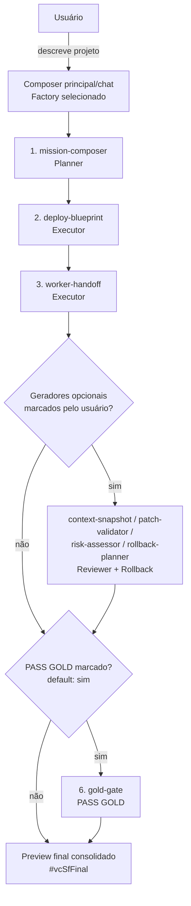
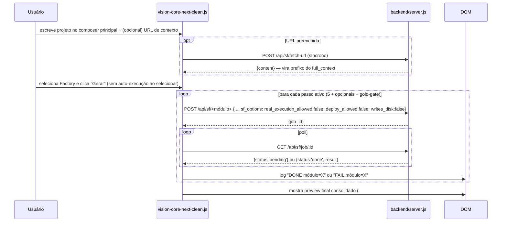

# SOFTWARE FACTORY SPEC (Produto)

**Parte da série de arquitetura — leia `MASTER_SPEC.md` e `VISION_CORE_ARCHITECTURE.md` antes deste.**

> Versão: 2.0.0 · Criado: 2026-07-09
> **Nota de escopo importante:** este arquivo existia com outro conteúdo (metodologia de desenvolvimento do próprio Vision Core — Hermes-como-supervisor, TodoWrite, Subagent, Fork, SDDF) — isso é Camada 2 (ver `VISION_CORE_ARCHITECTURE.md`) e **continua coberto por `docs/SDDF_SPEC.md`** (raiz, 5401 linhas, não tocado nesta consolidação), que já era citado pelo arquivo original como fonte primária ("Referenciado por: SDDF_SPEC.md seção 16"). Este documento passa a descrever a **feature de produto** Software Factory — o que um usuário final vê e usa — consistente com o uso do termo em `CLAUDE.md` e no frontend Next.

---

## Resumo

Software Factory é a feature do Vision Core que gera um projeto de software do zero a partir de uma descrição em linguagem natural, via Auto-Pilot (sequência automática de módulos) ou Modo Avançado (controle manual de provider/modelo/opções). **Hoje é simulação/preview** — nenhum módulo escreve em disco, executa código real ou faz deploy; toda chamada carrega flags explícitas de segurança sempre falsas.

## Objetivo

Dar ao usuário uma prévia estruturada e auditável de como um projeto seria montado — plano de missão, blueprint de deploy, validação de patch, avaliação de risco, plano de rollback, gate PASS GOLD — sem nenhum risco de execução real, como passo anterior a uma futura geração real (não implementada).

## Escopo

`SF_GENERATORS` (8 módulos reais em `backend/server.js`), a UI Software Factory Next (`#factory` em `vision-core-next-clean.js`), o contrato job_id+polling, os 9 specs `SF-01`–`SF-09` (`docs/SF-SPEC-LIBRARY.md`).

## Fora do escopo

A metodologia SDDF de desenvolvimento do próprio Vision Core (`docs/SDDF_SPEC.md`) — ver nota de escopo acima. A página standalone legada (`#vcSoftwareFactoryPage`/`#projectBuilder`) — já decidida para deleção (Fase 3.3d, `CLAUDE.md`), não documentada aqui como algo a preservar.

---

## Duas numerações "SF" — não confundir (achado real, registrado para não repetir o erro)

Existem dois sistemas de numeração `SF-01`…`SF-09` no projeto, **sem relação um com o outro**, confirmado em `docs/LEGACY_DESIGN_REFERENCE.md`:

1. **`SF_MODULE_SPEC_MAP`** (legado) — mapeia os módulos da página standalone (que será deletada) para os specs de `docs/SF-SPEC-LIBRARY.md`/`docs/spec-library/*.json`: `project_builder→SF-01`, `project_templates→SF-02`, `mission_composer→SF-03`, `worker_handoff→SF-04`, `export_preview→SF-05`, `real_file_command→SF-06`, `worker_receipt→SF-07`, `final_dashboard→SF-08`, `saas_api→SF-09`.
2. **Citação em `about.html:753`** ("§139, SF02-SF09 validados em produção") — rotula os **8 `SF_GENERATORS` do backend** (lista abaixo), um mapeamento diferente.

Este documento usa os nomes reais dos módulos backend (`mission-composer`, etc.) para evitar a ambiguidade — nunca o código `SF-0N` sozinho sem dizer a qual dos dois sistemas se refere.

---

## Arquitetura / Pipeline

Cada passo: `POST /api/sf/<módulo>` retorna `{job_id, status:'pending'}` (nunca síncrono, evita timeout de 10s do Worker) → `GET /api/sf/job/:id` até `status:'done'`, `result` como **string pura** (não objeto — achado de contrato real, o campo `result` da resposta HTTP já vem desembrulhado de `job.result.result`).

## Jobs (contrato assíncrono)

| Endpoint | Tipo | Contrato |
|---|---|---|
| `POST /api/sf/mission-composer` | Assíncrono | `{job_id}` → poll |
| `POST /api/sf/deploy-blueprint` | Assíncrono | `{job_id}` → poll |
| `POST /api/sf/worker-handoff` | Assíncrono | `{job_id}` → poll |
| `POST /api/sf/context-snapshot` | Assíncrono, opcional | `{job_id}` → poll |
| `POST /api/sf/patch-validator` | Assíncrono, opcional | `{job_id}` → poll |
| `POST /api/sf/risk-assessor` | Assíncrono, opcional | `{job_id}` → poll |
| `POST /api/sf/rollback-planner` | Assíncrono, opcional | `{job_id}` → poll |
| `POST /api/sf/gold-gate` | Assíncrono, default ligado | `{job_id}` → poll |
| `GET /api/sf/job/:id` | Poll | `{status, result (string), provider}` — `files` só existe pra `project-files`, nunca pros 8 acima |
| `POST /api/sf/fetch-url` | **Síncrono**, sem job_id | `{ok, content, url}` — contexto de URL opcional pro composer |

## Planner

`mission-composer` — primeiro passo de qualquer Auto-Pilot, monta o plano da missão a partir da descrição livre do usuário no composer/chat principal (+ contexto de URL opcional via `fetch-url`).

## Executor

`deploy-blueprint` e `worker-handoff` — geram a estrutura/blueprint do projeto e o pacote de handoff pro worker, encadeados via `full_context` acumulado entre passos.

## Reviewer

`patch-validator` e `risk-assessor` — geradores **opcionais** (desligados por padrão), avaliam o resultado dos passos anteriores.

## Rollback

`rollback-planner` — gerador opcional, produz um plano de rollback (nunca executa rollback nenhum — é preview, igual ao resto).

## PASS GOLD (produto, Software Factory)

`gold-gate` — 6º passo do Auto-Pilot, **ligado por padrão** (checkbox marcado), pode ser desmarcado (aí a sequência para em 5 passos e `gold-gate` nunca é chamado — verificado por teste, `route.abort()` se chamado indevidamente). Não confundir com o PASS GOLD do pipeline de missão de bug-fix (`pass-gold-engine.js`, score de 6 dimensões) — mesmo nome, gate diferente, aplicado a um contexto diferente (geração de projeto vs. correção de bug). Ver `VISION_CORE_ARCHITECTURE.md` seção "Duas Camadas" para o padrão geral de reuso de vocabulário no projeto.

## Human Approval / Dry Run

- **Dry-Run real** (`sf_dry_run_real`, Caminho B Fase 2a) — única ação desta frente que sai do preview puro e enfileira uma execução real no Vision Agent Local, **sempre em modo simulação** (nunca escreve em disco). Banner de risco não-dismissable, confirmação dupla obrigatória, polling com timeout de 5min, botão de "cancelar acompanhamento" (só para de perguntar, não cancela remotamente — sem endpoint de cancelamento).
- **`apply_patch`/`apply_patch_multi` reais** (Caminho B Fase 2b) — genuinamente irreversível, **fail-closed por design** (`AGENT_APPLY_ENABLED=false`), documentado em `VISION_CORE_NEXT_FRONTEND_SPEC.md` seção "Bloqueio de segurança". Não é parte do fluxo normal de Software Factory — é uma ação separada dentro da aba Missions.

## Versionamento

Cache-bust do frontend (`?v=next-clean-N`) segue o mesmo do resto do Next — sem versionamento próprio da feature Software Factory.

## Fluxo (Auto-Pilot completo, 6 passos com PASS GOLD default-on)

## Estados

Mesmos estados de missão de `VISION_CORE_ARCHITECTURE.md` (`READY`/`MERGED`/`BLOCKED_INPUT`/`BLOCKED_DEPENDENCY`/`NEEDS_FIX`/`ABORTED`) aplicados a cada passo do pipeline — decididos server-side pelo módulo, refletidos como `DONE`/`FAIL` no log do frontend (`#vcSfLog`, oculto por padrão, só aparece durante geração ativa).

## Segurança

Toda chamada carrega `sf_options` com três flags **sempre falsas** nesta fase: `real_execution_allowed:false`, `deploy_allowed:false`, `writes_disk:false` — confirmado também pelos specs de `docs/SF-SPEC-LIBRARY.md` (`exec_real`/`file_creation`/`backend_write` sempre `false` nos critérios PASS/FAIL de cada módulo). Nenhum endpoint desta feature grava em disco, cria commit, ou faz deploy — a única ação desta frente que se aproxima de execução real é o Dry-Run (sempre simulação) e o `apply_patch` real (fail-closed).

---

## Checklist de aceite

- [x] Pipeline mapeado com os 8 módulos reais + `fetch-url`
- [x] Contrato job_id+polling documentado com o achado de "result é string pura"
- [x] Distinção clara entre as duas numerações SF-01..SF-09
- [x] Segurança: simulação garantida por flags explícitas em toda chamada

## Boas práticas / Princípios

1. Nunca assumir o formato de resposta de um endpoint SF pelo nome — verificar contra `backend/server.js` direto (achado real: mocks antigos assumiam `{ok:true, content:...}` quando a resposta real é `{job_id}`+poll).
2. `gold-gate` só é chamado quando o checkbox PASS GOLD está marcado — nunca assumir que sempre roda.

## Pendências

- ~~`project-files`/`generate-zip` não conectados~~ **CORRIGIDO (2026-07-10).** Botão "Gerar Lista de Arquivos" no painel `#vcSfFinal` chama `project-files` com `{description, accumulated_context}` (mapeados a partir de `sfLastDescription`/`sfFullContext` já existentes no fluxo Auto-Pilot — `step1_analysis`/`step2_blueprint` deliberadamente não enviados, o backend já degrada bem sem eles). Botão "Baixar ZIP" chama `generate-zip` e dispara download real via `<a download>`+blob — primeiro fluxo binário do Next, confirmado funcional por teste (`page.waitForEvent('download')`). Spec permanente nova `tests/e2e/vision-core-next-sf-project-files.spec.mjs` (6 testes). Cache-bust `next-clean-51`.
- Página standalone legada (`#vcSoftwareFactoryPage`) — remoção **investigada e pausada** (2026-07-10): `initSoftwareFactoryPage()` tem um guard `if (!sfPage) return;` que gate-keeps a inicialização de partes AINDA VIVAS do painel embutido moderno (`#vcMissionSfPane` — chat send, chips, drawers, aprovação humana), não só da página legada em si. Deletar `#vcSoftwareFactoryPage` sem primeiro desacoplar esses inicializadores do guard quebraria funcionalidade real em produção. Ver `docs/CURRENT_HANDOFF.md` para o relato completo — decisão pendente do usuário sobre como prosseguir.

## Próximos passos

Ver `ROADMAP.md`, Fase 3 (Software Factory).

## Histórico

| Data | Mudança |
|---|---|
| 2026-07-08 | Software Factory Next v33-v46 — implementação incremental do Auto-Pilot, Modo Avançado, geradores opcionais, `fetch-url`. |
| 2026-07-09 | Este documento reescrito para descrever a feature de produto (era, antes, a metodologia de desenvolvimento do próprio repo — preservada em `docs/SDDF_SPEC.md`). |

## Controle de versão

**2.0.0** — 2026-07-09
