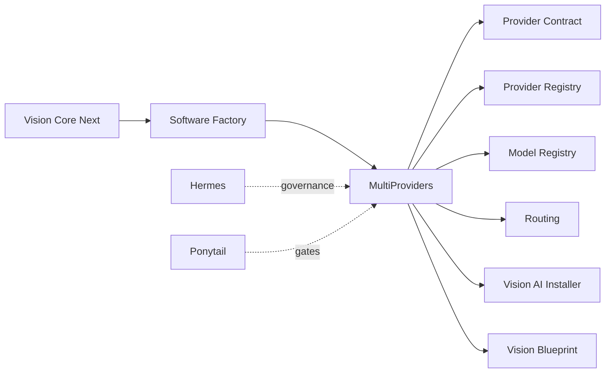
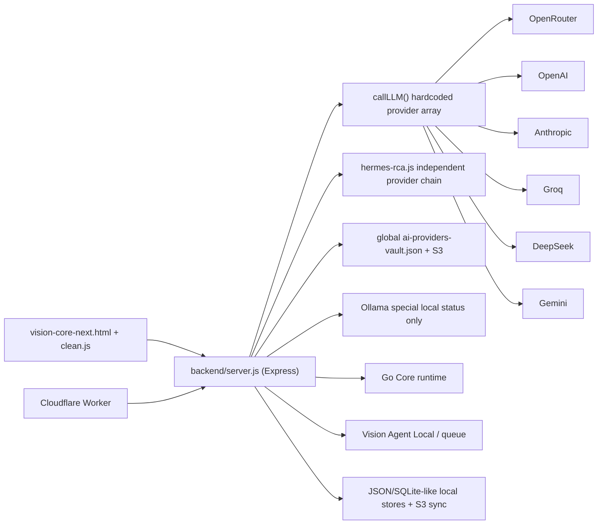
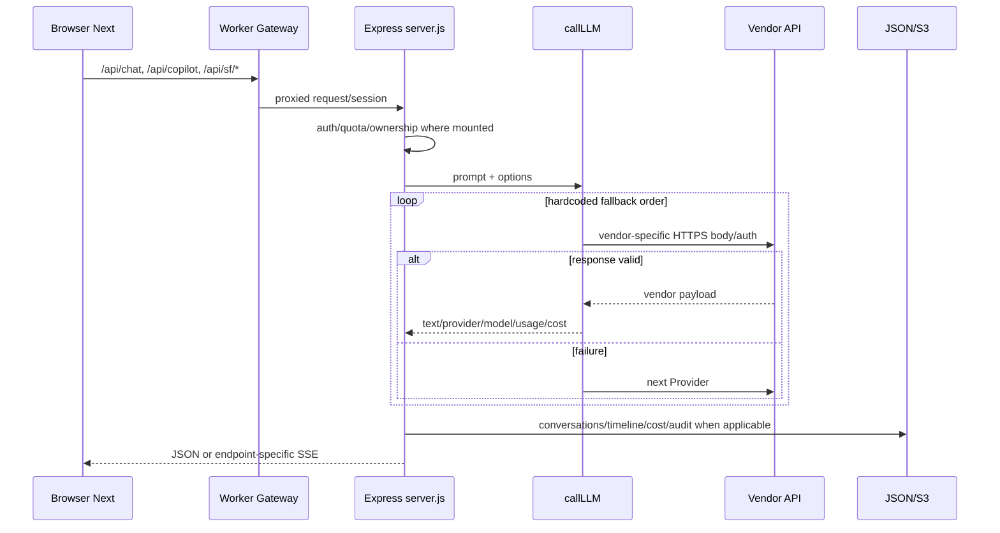
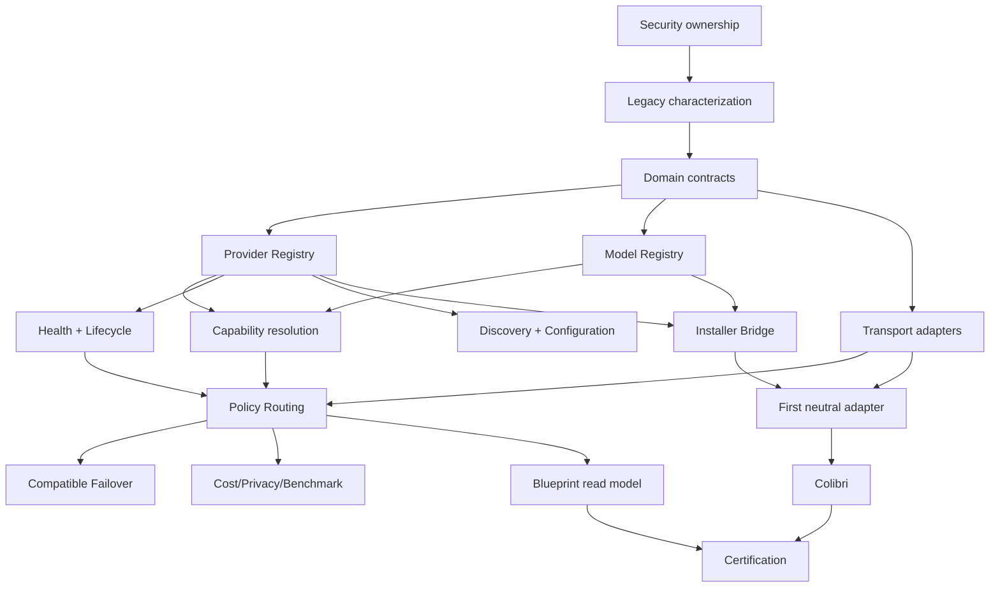

# VISION CORE ARCHITECTURE GAP REPORT

> Status: `ARCHITECTURE_INVESTIGATION_COMPLETE` · 2026-07-21 · Branch `atomic-core-2x-hub-tuning` · Brownfield, somente leitura/documentação.

## 1. Executive Summary

Vision Core Next é um produto brownfield amplo e funcional, não um greenfield. Chat, autenticação, projetos, conversas, agentes, Software Factory, Go Core, pairing local, vault, métricas, release gates e deploy tooling possuem implementação real em graus diferentes. Multi-provider também existe hoje, mas **não implementa a arquitetura MultiProviders Phase 1/1.1**: é um conjunto acoplado de arrays, branches por Vendor, endpoints hardcoded, modelos embutidos, fallback sequencial e estado global.

Conclusão: Core/Chat/Auth/Software Factory são condicionais ou operacionais; MultiProviders, Installer e Blueprint estão **NOT_READY** para implementação direta sem uma camada de compatibilidade e isolamento. O primeiro trabalho futuro não é integrar Colibri: é congelar o comportamento atual por contract tests e introduzir domínio neutro ao lado do mecanismo legado.

## 2. Scope

Investigados: estrutura, stack, entrypoints, frontend Next, backend, providers, Hermes, Software Factory, runtime local, Go/Rust, segurança, testes, deploy, artefatos, worktrees e documentação. Não houve rede, deploy, execução destrutiva, correção ou implementação.

Specs Phase 0 de Installer/Blueprint não existem nesta worktree; aparecem em worktrees isoladas `C:/tmp/vision-core-vai-phase0` e `C:/tmp/vision-core-blueprint-phase0`. Foram classificadas como documentação externa à branch, não copiadas.

## 3. Evidence Method

- Leitura direta de specs, ADRs, código e manifests.
- Busca por símbolos, rotas, Providers, Models, auth, filesystem e testes.
- Rastreamento de entrypoints e chamadas, não inferência por nome.
- Estado operacional cruzado com `CURRENT_STATE.md`.
- Sem considerar artefato gerado ou documento como prova de runtime.
- Testes pesados não executados: a worktree já contém resultados modificados preexistentes.

## 4. Declared Architecture

## 5. Implemented Architecture

Não existem Provider Contract, Provider Registry, Model Registry ou Routing neutros em runtime. `providerList()`, `providerStatus()`, `callLLM()`, `provider-vault-routing.js` e `hermes-rca.js` repartem responsabilidades equivalentes.

## 6. Runtime Architecture

### Fluxos reais

- Chat: Next → Worker/API → auth/context → `callLLM()` or local response → conversation/timeline stores → UI. Streaming exists in separate copilot/run-live paths, not as a common Provider capability.
- Software Factory: Next → async SF endpoint → job polling → LLM generators → preview/files; real project execution is a separate fail-closed bridge with pairing/allowlist/audit.
- Agent: selection/config → queue → Vision Agent Local → result/receipt/log; Go Core supplies execution evidence.
- Provider: vault/env key → hardcoded ordered array → vendor HTTPS → first successful response. No policy object, capability negotiation or compatible failover set.

## 7. Capability Inventory

| Capability | State | Evidence | Decision |
|---|---|---|---|
| Chat | IMPLEMENTED | Next clean JS; backend chat/copilot routes | KEEP |
| Conversations | IMPLEMENTED | `chat-conversations.json`, owner/project contracts | KEEP |
| Auth/users/sessions | IMPLEMENTED | session middleware, login/register/OAuth | KEEP |
| Workspaces | PARTIAL | project owner isolation; no workspace membership model | ADAPT |
| Projects | IMPLEMENTED | authenticated owner-scoped CRUD per current state | KEEP |
| Agents/pairing | IMPLEMENTED | agent queue, pairing secret, modes, tests | KEEP |
| Provider selection | PARTIAL | hardcoded fallback + vault priority | ADAPT |
| Model selection | PARTIAL | env/vault strings inside Provider entries | ADAPT |
| Streaming | PARTIAL | endpoint-specific SSE; absent common capability contract | ADAPT |
| Atomic Core | IMPLEMENTED | Next widget and E2E coverage | KEEP |
| Logs/metrics/cost | IMPLEMENTED | operation/audit logs, agent cost ledger | KEEP |
| Cache | PARTIAL | contextual caches exist; no MultiProviders cache contract | KEEP/ADAPT |
| Queues | IMPLEMENTED | agent/SF jobs; mixed persistence mechanisms | ADAPT |
| Scanner/patch/files | IMPLEMENTED | AST scanner, Go Core, Patch Engine, local agent | KEEP |
| Planning Layer Phase 0 | DOCUMENTED_ONLY here | ADR/spec status; no merged runtime surface | REFERENCE_ONLY |
| MultiProviders Phase 1/1.1 | DOCUMENTED_ONLY | seven specs and ADR-039..048 | BUILD |
| Installer | DOCUMENTED_ONLY in isolated worktree | no spec/runtime in this branch | BUILD after Registry |
| Blueprint | DOCUMENTED_ONLY in isolated worktree | no read model/UI in this branch | BUILD after Registry/Router |

## 8. Documentation Traceability

| Norm | ADR | Code/Test evidence | Status |
|---|---|---|---|
| Zero Legacy Debt | Principle-001 | Next clean files isolated from bundles | PARTIALLY_ALIGNED |
| Specification First | Principle-002 | Phase 1/1.1 precede future code | ALIGNED |
| Provider × Model | ADR-041/048 | Provider entries embed model strings | CONTRADICTED |
| local/cloud attributes | ADR-039 | `providerStatus()` prepends special `local` | CONTRADICTED |
| common contract | ADR-040 | multiple vendor-shaped objects/parsers | NOT_IMPLEMENTED |
| no privileged Provider | ADR-042 | array order and DEFAULT_AI_PROVIDER | CONTRADICTED |
| temporal scoped Health | ADR-043 | connected/status/latency with no TTL/scope | CONTRADICTED |
| capabilities not presumed | ADR-044 | protocol/name-specific behavior; no evidence object | NOT_IMPLEMENTED |
| Transport detail | ADR-045 | transport/body/auth embedded in routing array | CONTRADICTED |
| uniform lifecycle | ADR-047 | untested/connected/error plus local-only statuses | NOT_IMPLEMENTED |
| privacy/cost | Phase 1.1 | usage cost table exists; privacy metadata absent | PARTIALLY_ALIGNED |
| aliases/versions | ADR-048 | model/env strings; no canonical alias graph/version dimensions | NOT_IMPLEMENTED |
| compatible failover | ADR-042 | any configured next Provider is attempted | CONTRADICTED |

## 9. MultiProviders Readiness

**NOT_READY.** Existing behavior is useful but COUPLED:

| Finding | Class | Evidence |
|---|---|---|
| `callLLM()` six-entry vendor array | COUPLED | server.js 830–940 |
| fallback order is effective priority | DANGEROUS | first successful vendor wins |
| Provider+Model embedded together | COUPLED | model field per array entry |
| `providerStatus()` special local path | DANGEROUS | Ollama-only `/api/tags` |
| provider test branches by Vendor | COUPLED | server.js 2614–2686 |
| global Provider vault | ADAPTABLE | encrypted, masked, S3-synced |
| priority sorting helper | ADAPTABLE | preserves legacy fallback semantics |
| `hermes-rca.js` second router | DANGEROUS | independent provider catalog/order |
| token/cost extraction | ADAPTABLE | useful normalized output, incomplete catalog |
| Colibri/LM Studio | ABSENT | no runtime references found as Providers |

## 10. Installer Readiness

**NOT_READY.** No Installer contract/runtime is present in this branch. Existing manual env/vault configuration and Ollama status probing are not an Installer. Bridge must wait for Registry contract and must emit `discovered`/registration metadata without READY promotion.

## 11. Blueprint Readiness

**NOT_READY.** Existing architecture/Atomic Core visuals are not a Blueprint read model. No runtime view exists for Provider–Model–Routing–Health–Failover. Build only after authoritative registries and decision receipts exist.

## 12. Software Factory Readiness

**CONDITIONAL.** Preview/planning generators and project file generation are implemented; real execution bridge exists behind fail-closed flags, pairing, allowlist and audits. Gaps: Planning Layer Phase 0 is not merged here; generation depends directly on legacy `callLLM()`; runtime, release and deploy are separate surfaces; terminology overlaps product/governance layers.

## 13. Security Findings

| Severity | Finding | Evidence/impact | Future phase |
|---|---|---|---|
| RESOLVED-R1 | Global Provider vault was mutable by any authenticated user | save/delete/test routes use `requireVisionAuth`, not admin/owner; one user can affect all routing | Security prerequisite |
| RESOLVED-R1 | Runtime Provider metadata/status was readable without auth | `/api/runtime/providers`, `/api/runtime/provider-status` expose config flags, base URL/model/env names | Security prerequisite |
| RESOLVED-R1 | Health status could remain trusted without TTL | vault `connected` persists; routing helper documents no expiry | Domain/Health |
| MEDIUM | Vendor endpoints and Gemini key in query URL | logs/proxies may expose query material if mishandled | Transport |
| MEDIUM | Scanner AST route appears unauthenticated | scans bounded repo paths and may expose structure | Security review |
| LOW | Provider default route reports input/default but does not establish authoritative policy | misleading control surface | Routing cleanup |
| INFORMATIONAL | Strong controls exist around CORS, SSRF fetch-url, pairing, owner vault, path bounds and fail-closed execution | preserve with regression tests | All phases |

No secrets were read or included.

## 14. Test Coverage

Repository evidence: 35 files under `tests`, 96 under `tools/tests`, Playwright E2E, Node unit/contract suites, Go tests, syntax, auth, security, release, pairing, packaging, grounding and PASS GOLD. `package.json` exposes quick/postmerge/prepush/certify lanes.

Coverage relevant to MultiProviders is indirect: vault routing/crypto, LLM cost, health HTTP contract and UI provider flows exist. Missing: common Provider contract, Model Registry, capability negotiation, TTL/scoped Health, lifecycle, discovery, alias graph, version dimensions, policy routing and compatible failover. No suites were run; current modified test artifacts prevent treating the worktree as a clean verification baseline.

## 15. Legacy Classification

| Surface | Class | Reason |
|---|---|---|
| Next clean HTML/CSS/JS | KEEP | active isolated frontend |
| backend server/auth/projects/queues/Go bridge | KEEP | active runtime, tested |
| provider vault crypto/storage | ADAPT | useful security/storage; global ownership and schema conflict |
| `callLLM()` | ADAPT | real behavior; must become compatibility adapter, not domain |
| `hermes-rca.js` provider router | REMOVE_LATER | duplicate routing after parity migration |
| legacy `frontend/index.html` and bundles | REFERENCE_ONLY | forbidden technical base |
| `next.html`, Atomic Core standalone prototypes | ARCHIVE | non-official prototypes |
| old deploy scripts | UNKNOWN/REMOVE_LATER | inspect individually before deletion |
| generated test-results/artifacts/data | ARCHIVE | evidence/runtime debris, not source |
| isolated worktrees | UNKNOWN | preserve; ownership/merge status differs |
| mocks/fixtures | KEEP when referenced; UNKNOWN otherwise | usage must be proven before removal |

Nothing was deleted.

## 16. Hermes RCA

Why a correct SPEC could still fail:

| Root cause | Trigger/impact | Evidence | Prevention / Phase / Gate |
|---|---|---|---|
| legacy behavior becomes domain | wrapping `callLLM` types directly | hardcoded array | anti-corruption layer / Contracts / No Vendor Lock |
| first adapter sets interface | Colibri added before fake adapter contract | current vendor branches | fictitious adapter first / Adapter phase / No Provider Special Case |
| duplicate routers survive | Hermes and core disagree | two provider chains | one authority + parity receipts / Migration / No Duplicate Registry |
| global mutable state | tenant changes shared routing | global vault routes | admin/ownership decision / Security / No Global Provider Mutation |
| wrong tests freeze legacy | snapshot expects fallback order | existing behavior contracts | characterize then replace intentionally / Contracts |
| false Health | connected never expires | documented limitation | TTL/scopes / Health / No Stale Health |
| incompatible failover | next vendor lacks capability/privacy | blind continue loop | eligible candidate set / Routing / No Incompatible Failover |
| UI controls imply policy | priority/default appear authoritative | vault priority/default route | server decision receipt / Routing |
| module explosion | every noun becomes service | broad future scope | four normative surfaces / all / Ponytail |
| accidental legacy migration | copy old providers endpoint schema | Provider+Model mixed | mapping boundary / Registry |

## 17. Ponytail Results

| Gate | Status | Evidence | Corrective phase |
|---|---|---|---|
| No Provider Special Case | FAIL | vendor branches and local special case | Contracts/Adapters |
| No Model Coupling | FAIL | model embedded per Provider | Model Registry |
| No Hardcoded Provider | FAIL | arrays/endpoints/defaults | Adapters/Routing |
| No Transport Assumption | FAIL | HTTPS bodies in router | Transport adapters |
| No Vendor Lock | FAIL | vendor parsers/auth in core | Anti-corruption |
| No False Health | FAIL | connected/status lacks TTL/scope | Health |
| No Duplicate Registry | FAIL | providerList, vault, callLLM, Hermes catalogs | Registry migration |
| No Capability Assumption | NO_EVIDENCE | no capability evidence model | Capabilities |
| No Boolean Health | PARTIAL | richer strings but reachable boolean | Health |
| No Version Mixing | FAIL | generic/implicit model/API versions | Contracts |
| No Transport Logic | FAIL | transport logic inside selection | Adapters |
| No Alias Loop | NOT_APPLICABLE | no alias system | Model Registry |
| No Stale Health | FAIL | status persists without expiry | Health |
| No Orphan Model | NO_EVIDENCE | no canonical registry | Model Registry |
| No Orphan Provider | NO_EVIDENCE | no canonical registry | Provider Registry |
| No Benchmark as Health | PARTIAL | latency from test, no benchmark domain | Benchmark |
| No Unknown Cost as Zero | PARTIAL | computeCost can return null; full policy absent | Cost/Policy |
| No Privacy by Location | NO_EVIDENCE | privacy metadata absent | Privacy |
| No Discovery Trust Escalation | NOT_APPLICABLE | discovery absent | Discovery |
| No Lifecycle Bypass | FAIL | no uniform lifecycle | Lifecycle |
| No Incompatible Failover | FAIL | fallback ignores capabilities/policy | Routing |
| No Global Provider Mutation | FAIL | authenticated users mutate shared vault | Security prerequisite |

## 18. Architecture Gaps

1. Provider security/ownership boundary.
2. Characterization tests for current provider behavior.
3. Neutral domain contracts and versioned error/result model.
4. Authoritative Provider Registry with legacy read adapter.
5. Canonical Model Registry and offerings.
6. Capability evidence/resolution.
7. Scoped temporal Health and uniform lifecycle.
8. Discovery/configuration without trust escalation.
9. Transport adapters behind common boundary.
10. Policy routing, receipts and compatible failover.
11. Cost/privacy/benchmark metadata.
12. Installer bridge, first neutral adapter, then Colibri.
13. Blueprint read model.
14. Certification and controlled legacy retirement.

## 19. Dependency Graph

## 20. Recommended Implementation Phases

Derivadas dos gaps: 11 fases, descritas em `MULTIPROVIDERS_IMPLEMENTATION_ROADMAP.md`: security boundary; characterization; domain contracts; registries; capability/health/lifecycle; discovery/config; transport adapter boundary; routing/failover/metadata; Installer + first adapter; Colibri + Blueprint; certification/retirement.

## 21. Stop Conditions

Bloquear implementação se: ownership do vault não estiver decidido; contract tests do legado faltarem; um Provider real for necessário para validar o domínio; Registry/Model identity tiver duas autoridades graváveis; Health não tiver TTL/escopo; routing não explicar decisão; failover puder violar requisito; segredo entrar em receipt/log; Phase 2 não tiver autorização escrita; worktree não estiver isolada.

## 22. Evidence Appendix

Comandos: `git branch --show-current`, `git status --short`, `git log --oneline -10`, `git diff --stat`, `git worktree list`, buscas `rg`, leitura de manifests/specs/código. Evidências principais: `backend/server.js:388-405,566,830-940,1593-1594,2544-2688`; `backend/provider-vault-routing.js`; `backend/hermes-rca.js`; `package.json`; `backend/package.json`; frontend Next e specs oficiais.

### Readiness Matrix

| Área | Implementado | Parcial | Documental | Ausente | Risco | Prontidão |
|---|---:|---:|---:|---:|---|---|
| Core | alto | sim | sim | não | médio | CONDITIONAL |
| Chat/Auth/Projects | alto | workspaces | sim | workspace model | médio | CONDITIONAL |
| Agents | alto | sim | sim | não | médio | CONDITIONAL |
| Software Factory | alto | execução/release | Phase 0 planning | não | alto | CONDITIONAL |
| MultiProviders | legado | alto | completo | domínio neutro | crítico | NOT_READY |
| Provider Contract | não | não | sim | runtime | alto | NOT_READY |
| Provider Registry | fragmentos | sim | sim | autoridade | crítico | NOT_READY |
| Model Registry | não | strings | sim | catálogo | alto | NOT_READY |
| Routing/Failover | fallback | alto | sim | policy/compatibilidade | crítico | NOT_READY |
| Health/Lifecycle | status | alto | sim | TTL/escopo | alto | NOT_READY |
| Capabilities/Discovery/Benchmark | baixo | baixo | sim | domínio | alto | NOT_READY |
| Installer | não nesta branch | não | worktree isolada | bridge | alto | NOT_READY |
| Blueprint | não | não | worktree isolada | read model | médio | NOT_READY |
| Hermes | sim | dois contextos | sim | unificação | alto | CONDITIONAL |
| Ponytail | plugin/docs | gates sem runtime | sim | executable gates | médio | CONDITIONAL |
| Security | forte em várias bordas | gaps Provider | sim | ownership | alto | CONDITIONAL |
| Tests | amplo | MultiProviders ausente | plano | suites novas | alto | CONDITIONAL |
| Release | amplo | operações manuais | sim | certificação MP | médio | CONDITIONAL |
