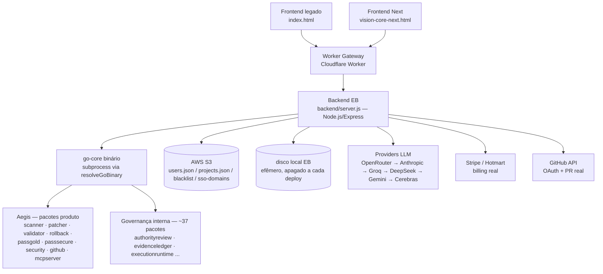

# VISION CORE BACKEND SPEC

**Parte da série de arquitetura — leia `MASTER_SPEC.md` e `VISION_CORE_ARCHITECTURE.md` antes deste.**

> Versão: 1.0.0 · Criado: 2026-07-09
> Fonte: leitura direta de `backend/server.js`, `backend/package.json`, `go-core/internal/` (listagem de pacotes), `worker/src/index.js` (existência), `CLAUDE.md` seção "STACK & URLS"/"VARIÁVEIS DE AMBIENTE"/"MÓDULOS ATIVOS".

---

## Resumo

**O backend do Vision Core é Node.js (Express), não Go.** `backend/server.js` é o único processo servindo todas as rotas `/api/*`, rodando em AWS Elastic Beanstalk. `go-core` é um binário Go separado, invocado pelo backend como subprocesso para operações de segurança/scanner (Camada 1) e para um framework interno de governança de release (Camada 2) — ver `VISION_CORE_ARCHITECTURE.md` seção "Duas Camadas". Este documento cobre os dois, com a fronteira explícita.

## Objetivo

Documentar a separação real entre API/gateway/storage/auth/queue/observabilidade do backend, para que nenhum agente presuma uma arquitetura de microsserviços ou um backend Go que não existe.

## Escopo

`backend/server.js` e módulos irmãos (`pass-gold-engine.js`, `patch-engine.js`, `hermes-rca.js`, `provider-vault-crypto.js`, `agent-queue-db.js`), `go-core` (as duas camadas de pacotes), `worker/src/index.js`.

## Fora do escopo

Endpoints individuais linha-a-linha (ver `API_CONTRACT.md`), a metodologia SDDF completa da Camada 2 (ver `docs/SDDF_SPEC.md`/`docs/HERMES_MISSION_SUPERVISOR.md`).

---

## Arquitetura

### Separação de responsabilidade

| Camada física | Papel | Estado |
|---|---|---|
| **API / Gateway** | `backend/server.js` — único ponto de entrada HTTP, todas as rotas `/api/*` | EXISTENTE |
| **Worker** | `worker/src/index.js` — proxy Cloudflare Worker entre frontends e EB, roteamento/CORS | EXISTENTE |
| **Storage** | S3 (fonte de verdade — `users.json`/`projects.json`/token blacklist/domínios SSO) + disco local efêmero (apagado a cada deploy) | EXISTENTE |
| **Auth** | JWT/HMAC próprio (`signSession`/`verifySession`, não `jsonwebtoken` apesar da lib estar no `package.json`) + OAuth Google/GitHub real | EXISTENTE |
| **Queue/Jobs** | `agent-queue-db.js` (fila SQLite local, `agentQueueDB`) para missões do Vision Agent Local; `SF_GENERATORS`/job_id+polling para Software Factory | EXISTENTE |
| **Observabilidade** | `/api/metrics/*`, `/api/dora-metrics`, `/api/agent/status`, audit log em S3 | EXISTENTE |
| **Segurança** | `go-core` Aegis (scanner/security), rate limiting, scrypt, `SESSION_SECRET` fail-closed | EXISTENTE |

---

## API

Único processo Express (`backend/server.js`), ~133 rotas reais confirmadas por `docs/PARITY_AUDIT.md` (grep direto no arquivo). Não expõe `module.exports` — não há framework de teste automatizado para o arquivo inteiro; o padrão da casa é `node --check` + revisão manual + smoke via `curl`/`fetch` contra o processo local (porta configurável via `.env`, default 3000). Contrato completo em `API_CONTRACT.md`.

Padrão de resposta uniforme: `sendOk(res, payload)` sempre retorna `{ok:true, ...payload, time: now()}`. Todo endpoint novo carrega `anti_stub: true` no corpo — convenção da casa para nunca ter um endpoint "fake" indistinguível de um real.

## Workers

`worker/src/index.js` — Cloudflare Worker. Papel: proxy entre os domínios públicos (`visioncoreai.pages.dev`) e o backend EB (`vision-core-prod.eba-pdk6anxy.us-east-1.elasticbeanstalk.com`), resolvendo CORS e dando uma URL estável independente de qual ambiente EB está ativo. Não contém lógica de negócio própria.

## Gateway

O próprio Worker cumpre o papel de gateway único de borda. Não há API Gateway AWS nem outro proxy — a URL pública fixa (`visioncore-api-gateway.weiganlight.workers.dev`) é a única porta de entrada externa para o backend real.

## Storage

- **S3 (`AWS_S3_BUCKET=vision-core-data-prod`)** — fonte de verdade para `users.json`, `projects.json`, token blacklist, domínios SSO. O disco local do EB é apagado a cada deploy — nada crítico pode depender só dele.
- **AI Provider Vault** — chaves de API de LLM cifradas AES-256-GCM em repouso (`provider-vault-crypto.js`), override opcional sobre env vars, só entra em jogo quando salvo pela tela de configuração.
- **`backend/data/` local** — `agent-queue.sqlite` (fila de missões do agente local) + resíduo histórico (`users.json` local, achado de segurança conhecido — ver `VISION_CORE_ARCHITECTURE.md` incidentes).

## Auth

Login/registro reais, OAuth Google + GitHub reais, rate limiting (5 registros/IP/hora, 10 logins/IP/15min), senha com scrypt N=16384 (migração automática de PBKDF2 legado no primeiro login pós-upgrade), sessão HMAC própria (`signSession`/`verifySession`, JTI + blacklist para revogação, expiração 24h) — **fail-closed desde o INCIDENTE-4**: sem `SESSION_SECRET` configurado (mínimo 32 bytes, diferente do literal de fallback conhecido), o processo recusa subir. SSO Enterprise via domínio Google (auto-upgrade de plano). LGPD: `DELETE /api/auth/me`.

## Queue / Jobs

Dois mecanismos distintos, não confundir:

1. **Fila de missões do Vision Agent Local** (`agent-queue-db.js`, SQLite) — `POST /api/agent/mission/queue` enfileira, `GET /api/agent/mission/pending` o agente local puxa (filtrado por `agent_id` desde 2026-07-08), `POST/GET /api/agent/mission/result` para o resultado. Pareamento real por `agent_secret` desde 2026-07-08 (401 sem prova de posse) — `agentPairings` em memória (não SQLite/S3), self-healing: o agente reregistra sozinho ao levar 401.
2. **Jobs assíncronos da Software Factory** — `POST /api/sf/*` retorna `{job_id, status:'pending'}` imediatamente (evita timeout de 10s do Worker), resultado via `GET /api/sf/job/:id` — polling do frontend, não WebSocket/SSE.

## Observabilidade / Métricas / Eventos / Logs

- `GET /api/metrics/agents` — status por agente (`ok`/`binary_not_found`/`PENDING_EVIDENCE`/`no_provider`), custo (`cost_usd`, hoje sempre `null` — nunca computado ainda).
- `GET /api/metrics/summary` — CPU/memória/heap/uptime do processo Node.
- `GET /api/dora-metrics` — deployment frequency/lead time/MTTR/change failure rate, calculado a partir de `vault/PASS-GOLD/` + `data/deploy-log.json`; retorna strings honestas ("sem dados PASS-GOLD") quando não há dado, nunca zero disfarçado.
- `GET /api/agent/status` — conectividade do Vision Agent Local (`connected`, `last_seen_ms_ago`, `mode`).
- Audit log — toda ação crítica (login, register, delete de conta, rejeição de credencial legada) gravada em S3 com timestamp/IP/user-agent, nunca o valor do segredo.
- Logs de aplicação — `console.log`/`console.error` padrão Node, sem agregador centralizado confirmado (CloudWatch do EB por padrão da plataforma, não configurado explicitamente no código).

## Segurança

Ver `VISION_CORE_ARCHITECTURE.md` seção "Segurança" para o histórico de incidentes. Resumo backend-específico: CORS restrito, headers de segurança (HSTS/CSP/X-Frame-Options) planejados §153 (ver `ROADMAP.md`), rate limiting já ativo nas rotas de auth, webhook Hotmart verificado por HMAC obrigatório.

## Rate Limit

`rateLimitMiddleware('register', 5, 60*60*1000)` e `rateLimitMiddleware('login', 10, 15*60*1000)` — únicas rotas com rate limit confirmado (por IP). `/api/copilot` e `/api/run-live` têm `checkMissionQuota` (5 missões/mês FREE) — quota de plano, não rate limit de rede. Demais rotas sem limite explícito.

## Configuração

`.env` local (gitignored) + env vars reais no EB (27 chaves migradas na recriação do ambiente, §206 — não listadas por serem segredos). Nomes documentados em `VISION_CORE_ARCHITECTURE.md`/`CLAUDE.md`: `GOOGLE_CLIENT_ID`/`SECRET`, `GITHUB_CLIENT_ID`/`SECRET`, `OAUTH_REDIRECT_BASE`, `FRONTEND_URL`, `SESSION_SECRET` (obrigatório, sem fallback), `PROVIDER_VAULT_SECRET` (obrigatório, sem fallback — ver nota abaixo), `HOTMART_HOTTOK` (pendente), `AWS_S3_BUCKET` (pendente de reaplicar). `backend/.env.example` documenta `SESSION_SECRET` como obrigatório real; `JWT_SECRET` fica marcado como legado/não usado (dependência `jsonwebtoken` está no `package.json` mas o backend usa HMAC próprio, não essa lib).

**`PROVIDER_VAULT_SECRET` — fail-closed (correção aplicada na limpeza de resíduos de dogfood pós-INCIDENTE-4).** Antes: `provider-vault-crypto.js` caía num `DEV_FALLBACK_SECRET` hardcoded (`'vision-core-dev-vault-secret-change-me'`) quando a env var não estava setada — mesma classe de risco do `SESSION_SECRET` pré-INCIDENTE-4, mas cifrando chaves de API de LLM em vez de assinar sessão. Agora `requireProviderVaultSecret()` (mesmo padrão de `requireSessionSecret()`, `backend/server.js:377-386`) lança no carregamento do módulo se a env var estiver ausente, for o literal de fallback conhecido, ou tiver menos de 32 bytes — `backend/server.js` requer `provider-vault-crypto.js` no topo do arquivo, então o processo inteiro não sobe sem `PROVIDER_VAULT_SECRET` real configurado. Regressão permanente: `tools/tests/dogfood-provider-vault-secret-failclosed.test.mjs` (mesmo padrão de `tools/tests/incident-4-session-secret.test.mjs`). **Implicação operacional:** `PROVIDER_VAULT_SECRET` precisa existir no EB `vision-core-prod` com valor forte antes do próximo deploy de backend — sem verificação feita nesta sessão se já está configurado lá (mesma limitação do INCIDENTE-4 original: sem acesso de escrita ao ambiente real a partir deste repo).

## Escalabilidade / Separação futura

Hoje: processo único Express no EB (auto-scaling gerenciado pela plataforma AWS, não configuração custom). Nenhuma separação de microsserviço implementada. `docs/GIT-PROVIDER-SPEC.md` (PLANEJADO) propõe uma camada `GitProviderAdapter` para suportar GitLab além de GitHub sem acoplar a lógica de PR ao provider específico — primeiro passo formal de modularização do backend. `docs/ENTERPRISE-SPEC.md` (PLANEJADO) propõe isolamento real multi-projeto (roles owner/editor/viewer) que hoje só existe como estrutura de dado, sem enforcement de permissão granular.

---

## go-core (Go)

Binário compilado (Windows + Linux), `cmd/vision-core/main.go`, invocado como subprocesso por `backend/server.js` via `resolveGoBinary()`. Contém **duas famílias de pacotes** em `go-core/internal/` (confirmado por listagem direta, ~53 pacotes total):

### Pacotes de produto (Camada 1 — Aegis)

| Pacote | Papel | Garantia de design |
|---|---|---|
| `scanner` | Mapeia arquivos/stack do projeto | **Read-only por design** — comentário no próprio código: "NUNCA altera arquivos" |
| `security` | Regras `AEGIS_SECRET_001`…`010` (chave AWS, token GitHub, chave Stripe, etc.) | Read-only, roda como parte do scan |
| `patcher` | Aplica patch de código | **Supervisionado, nunca automático** — `ApplyMode='supervised'` obrigatório, `'automatic'` não existe nesta versão |
| `passgold` / `passsecure` | Avalia gates, retorna `GOLD`/`FAIL` em JSON + exit code (0=GOLD, 2=FAIL) | Contratos JSON com schema em `go-core/contracts/` |
| `github` | Fluxo de PR | Write-gate explícito: só abre PR real com `CanOpenPR=true` **e** `VISION_GITHUB_WRITE=1` **e** `GITHUB_TOKEN` **e** `DryRun=false` |
| `mcpserver` | Servidor MCP local | **Read-only por design** — toda tool mutante retorna erro |
| `hermes`, `mission`, `planning`, `memory`, `report`, `validator`, `rollback` | Suporte ao pipeline de missão do produto | — |

### Pacotes de governança interna (Camada 2)

`authorityreview`, `authorizationmanifest`, `codeburn`, `contractregistry`, `dashboard`, `dryrun`, `evidencebinding`, `evidenceledger`, `executionadapter`, `executionrequest`, `executionresponse`, `executionruntime`, `executionverification`, `executorpreflight`, `finalauthorization`, `gateauthority`, `graphmemory`, `handoffpackage`, `impeccable`, `invocationboundary`, `isolatedruntime`, `policymatrix`, `promotioncontract`, `promotionfirewall`, `promotionsimulation`, `readiness`, `rehearsalrecorder`, `remediationharness`, `resultintake`, `safetyenvelope`, `sandboxadapter`, `sandboxauditreport`, `sandboxreadiness`, `sandboxtrace`, `sandboxtracepersistence`, `sandboxtracereplay`, `sovereigndecision`, `testfixtures`, `fileops`. Governam o release do próprio Vision Core — ver `VISION_CORE_ARCHITECTURE.md` seção "Duas Camadas" e `docs/HERMES_MISSION_SUPERVISOR.md`/`docs/PI_HARNESS_AUTONOMOUS_MISSION_RUNNER.md` para o detalhe mecânico. **Este documento não descreve cada pacote individualmente** — está fora do escopo desta série (ver `MASTER_SPEC.md`).

---

## Checklist de aceite

- [x] Backend identificado corretamente como Node.js, não Go
- [x] go-core documentado com as duas famílias de pacotes separadas
- [x] Storage, auth, queue, observabilidade mapeados com estado real
- [x] Nenhum endpoint específico inventado (contrato completo delegado a `API_CONTRACT.md`)

## Boas práticas / Princípios

1. Nunca usar `node-fetch` — `httpsPost`/`https.request` nativo já existe em `server.js`.
2. Nunca redeployar o EB sem necessidade — só quando o backend de fato mudou.
3. Todo endpoint novo carrega `anti_stub: true`.
4. Toda ação crítica é auditada (audit log), nunca logando o valor de um segredo.

## Pendências

- Confirmar se `HOTMART_HOTTOK`/`AWS_S3_BUCKET` estão de fato configurados no EB atual (histórico marca como "pendente de reaplicar" desde a recriação do ambiente, §206/§146).
- `backend/data/users.json` commitado no git com um hash de senha de teste — decisão de limpeza pendente do usuário (ver `VISION_CORE_ARCHITECTURE.md`).
- Headers de segurança (HSTS/CSP/X-Frame-Options) — §153, ver `ROADMAP.md`.

## Próximos passos

Ver `ROADMAP.md`, Fase 2 (Backend).

## Histórico

| Data | Mudança |
|---|---|
| 2026-07-09 | Criação — primeira versão, corrigindo a descrição de "backend Go" presente em `README.md` para o Node.js real, e mapeando as duas famílias de pacotes do go-core. |

## Controle de versão

**1.0.0** — 2026-07-09
