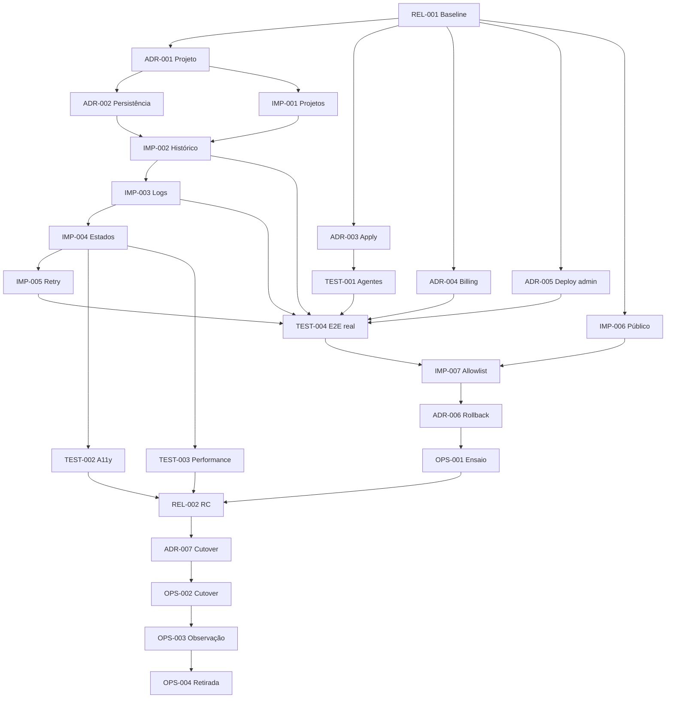

# Vision Core Next — Engineering Executive Backlog V2

## 1. Executive Summary

Backlog executivo para levar o baseline reconciliado `e4eee79c` até a retirada do frontend legado. A V2 separa permanentemente cinco naturezas de trabalho: decisão (`ADR`), software (`IMP`), certificação (`TEST`), preparação de release (`REL`) e operação controlada (`OPS`). Um item pertence a exatamente uma categoria.

Os 22 itens da V1 foram preservados semanticamente. Dois itens mistos foram divididos: política+ensaio de rollback e estratégia+execução de cutover. Resultado: **24 itens — 7 ADR, 7 IMP, 4 TEST, 2 REL e 4 OPS**.

## 2. Modelo de Governança

| Tipo | Finalidade | Estados | Regra de saída |
|---|---|---|---|
| ADR | decisão permanente | Proposto, Aprovado, Rejeitado, Substituído | decisão humana registrada em `DECISIONS.md` |
| IMP | mudança de software | Todo, Doing, Review, Done | DoD, testes e commit isolado |
| TEST | certificação, nunca correção | Backlog, Ready, Running, Passed, Failed | evidência e critério de aprovação objetivos |
| REL | preparação/congelamento | Backlog, Ready, Review, Approved, Rejected | artefato imutável e checklist aprovado |
| OPS | ação externa controlada | Backlog, Ready, Running, Succeeded, Rolled Back, Failed | runbook, autoridade e métricas de sucesso |

Fluxo permitido: `ADR → IMP → TEST → REL → OPS`. Uma falha de TEST cria novo ADR/IMP quando necessário; o TEST não absorve correção. IMP nunca depende de OPS. OPS só inicia depois dos TEST/REL exigidos.

## 3. Dashboard Executivo

| Indicador | Valor |
|---|---:|
| ADR | 7 |
| IMP | 7 |
| TEST | 4 |
| REL | 2 |
| OPS | 4 |
| Total | 24 |
| Concluídos | 0 |
| Pendentes | 24 |
| Bloqueados por dependência | 23 |
| Critical Path | 17 itens |
| Paralelizáveis | 13 itens (54%) |

Percentual concluído por trilha: Arquitetura 0%; Desenvolvimento 0%; Certificação 0%; Release 0%; Operação 0%.

## 4. Trilha A — ADRs

### ADR-001 — Estratégia multi-projeto

- **Objetivo/contexto/problema:** definir identidade, ownership, CRUD e seleção de projeto antes de integrar `/api/projects`; hoje o backend existe e o Next não possui contexto normativo.
- **Alternativas:** contexto global; projeto explícito por sessão; projeto implícito por missão.
- **Decisão tomada:** **Proposto** — projeto explícito, autenticado e selecionável; confirmar antes de aprovar.
- **Consequências/impacto:** histórico, timeline e logs ganham `project_id`; UI precisa de vazio/erro/reload; elimina estado ad hoc.
- **Riscos:** cross-project leak e seleção stale.
- **Revisão futura:** quando multi-tenant ou compartilhamento exigir novo modelo.
- **Origem/dependências:** V1 IMP-002; depende de REL-001; desbloqueia IMP-001 e ADR-002.

### ADR-002 — Persistência de histórico e sessões

- **Objetivo/contexto/problema:** definir sessão, mensagem, retenção, visitante e autenticado sem copiar o fallback localStorage/backend legado.
- **Alternativas:** local-only; backend-only; híbrido com sincronização explícita.
- **Decisão tomada:** **Proposto** — backend como fonte para autenticados e sessão efêmera explícita para visitantes; confirmar retenção.
- **Consequências/impacto:** histórico por projeto, paginação e logout previsíveis.
- **Riscos:** PII, duplicação e retenção indevida.
- **Revisão futura:** mudança regulatória ou suporte offline real.
- **Origem/dependências:** V1 IMP-004; depende de ADR-001; desbloqueia IMP-002.

### ADR-003 — Apply real

- **Objetivo/contexto/problema:** declarar se apply integra o RC; `AGENT_APPLY_ENABLED=false` é gate deliberado.
- **Alternativas:** permanecer fechado; abrir com pairing atual; abrir após ownership durável.
- **Decisão tomada:** **Proposto: permanecer fechado no RC**, conforme DECISION-005, salvo aprovação humana posterior.
- **Consequências/impacto:** UI continua fail-closed; nenhuma execução destrutiva é requisito de substituição.
- **Riscos:** abertura acidental ou expectativa de capacidade inexistente.
- **Revisão futura:** somente com autenticação/ownership comprovados e aprovação registrada.
- **Origem/dependências:** V1 IMP-007; depende de REL-001; desbloqueia TEST-001/004.

### ADR-004 — Billing/account

- **Objetivo/contexto/problema:** decidir destino do checkout/status legado ausente no Next.
- **Alternativas:** integrar ao cockpit; externalizar; excluir formalmente.
- **Decisão tomada:** **Proposto: externalizar**, mantendo link/jornada honesta se produto exigir.
- **Consequências/impacto:** evita UI financeira ornamental e reduz superfície sensível.
- **Riscos:** perda de jornada se não houver destino externo válido.
- **Revisão futura:** quando billing se tornar capacidade central do cockpit.
- **Origem/dependências:** V1 IMP-008; depende de REL-001; desbloqueia TEST-004.

### ADR-005 — Deploy administrativo

- **Objetivo/contexto/problema:** decidir se Pages/EB pertence ao Next; legado contém automerge/autodeploy local inseguro.
- **Alternativas:** cockpit; console administrativa separada; exclusão.
- **Decisão tomada:** **Proposto: console separada**, nunca automação implícita no cockpit.
- **Consequências/impacto:** Next não precisa reproduzir toggles legados; autoridade fica isolada.
- **Riscos:** console inexistente precisa de owner ou exclusão formal.
- **Revisão futura:** somente com modelo de autoridade e confirmação auditável.
- **Origem/dependências:** V1 IMP-009; depende de REL-001; desbloqueia IMP-007/TEST-004.

### ADR-006 — Política de rollback

- **Objetivo/contexto/problema:** definir artefato anterior, thresholds e autoridade antes de ensaiar ou operar rollback.
- **Alternativas:** rollback manual de Pages; alias para artefato anterior; rebuild do commit antigo.
- **Decisão tomada:** **Proposto: republicação do artefato imutável anterior**, sem rebuild.
- **Consequências/impacto:** rollback verificável por hash e independente da árvore local.
- **Riscos:** artefato expirado ou incompatibilidade de backend.
- **Revisão futura:** mudança de plataforma ou estratégia blue/green.
- **Origem/dependências:** parte decisória da V1 IMP-018; depende de IMP-007; desbloqueia OPS-001/REL-002.

### ADR-007 — Estratégia de cutover

- **Objetivo/contexto/problema:** definir como a raiz deixa o legado sem trocar o artefato certificado.
- **Alternativas:** substituir `index.html`; redirect; alias/roteamento progressivo.
- **Decisão tomada:** **Proposto: raiz serve diretamente o mesmo artefato RC**, mantendo artefato legado para rollback durante a janela.
- **Consequências/impacto:** zero dependência runtime do bundle antigo; smoke e cache tornam-se gates.
- **Riscos:** cache, links profundos e divergência entre preview/alias.
- **Revisão futura:** suporte de traffic splitting ou nova plataforma.
- **Origem/dependências:** parte decisória da V1 IMP-020; depende de ADR-006 e REL-002; desbloqueia OPS-002.

## 5. Trilha B — Implementações

DoR comum: ADR aplicável aprovado, contrato/spec suficiente, dependências Done, testes e rollback definidos. DoD comum: spec atendida, testes verdes, autorevisão, docs atualizadas, commit isolado, sem dívida/legado novo.

### IMP-001 — Integrar projetos no Next

- **Objetivo/motivação:** UI→estado→`/api/projects`→resultado; fecha DATA-001.
- **Arquivos candidatos/proibidos:** Next clean, specs e testes; bundle legado e `go-core/internal/*` proibidos.
- **Dependências:** ADR-001. **Testes:** contrato, E2E, vazio/erro/reload/auth.
- **Rollback:** revert do commit sem apagar dados. **Estimativa/complexidade:** M/média.
- **Impacto:** contexto arquitetural explícito e UX de seleção/criação. **Status:** Todo.

### IMP-002 — Integrar histórico no Next

- **Objetivo/motivação:** sessões por projeto persistem e recarregam; fecha CHAT-004.
- **Arquivos candidatos/proibidos:** Next/backend apenas se ADR exigir, specs/testes; fallback legado proibido.
- **Dependências:** ADR-002, IMP-001. **Testes:** round-trip, paginação, troca de projeto, logout, isolamento.
- **Rollback:** retirar UI mantendo dados. **Estimativa/complexidade:** M/alta por privacidade.
- **Impacto:** continuidade de chat e fonte única. **Status:** Todo.

### IMP-003 — Integrar logs correlacionados

- **Objetivo/motivação:** painel read-only redigido por mission/job/project; substitui download bruto.
- **Arquivos candidatos/proibidos:** Next, adapter API/backend, specs/testes; logs/secrets reais proibidos.
- **Dependências:** IMP-001/002. **Testes:** redaction, auth, paginação, vazio/erro e correlação.
- **Rollback:** remover superfície sem desativar logging. **Estimativa/complexidade:** M/alta.
- **Impacto:** observabilidade operacional segura. **Status:** Todo.

### IMP-004 — Uniformizar estados de erro

- **Objetivo/motivação:** loading/vazio/erro/sucesso coerentes em projetos, histórico, logs e SF.
- **Arquivos candidatos/proibidos:** Next/UI spec/tests; abstração nova sem necessidade proibida.
- **Dependências:** IMP-001/002/003. **Testes:** estados, foco e recuperação.
- **Rollback:** revert. **Estimativa/complexidade:** S/baixa.
- **Impacto:** UX previsível e menos branches duplicados. **Status:** Todo.

### IMP-005 — Uniformizar retry e cancelamento

- **Objetivo/motivação:** retry idempotente e cancelamento visível em fluxos suportados.
- **Arquivos candidatos/proibidos:** Next/spec/tests; cancelamento backend inventado proibido.
- **Dependências:** IMP-004. **Testes:** latência, abort, double-click, mutação sem duplicata.
- **Rollback:** revert. **Estimativa/complexidade:** S/média.
- **Impacto:** controle do usuário e integridade de POSTs. **Status:** Todo.

### IMP-006 — Estabilizar páginas públicas

- **Objetivo/motivação:** landing/about sem WIP, links e layout certificados.
- **Arquivos candidatos/proibidos:** landing/about/tests; cockpit não relacionado proibido.
- **Dependências:** REL-001. **Testes:** link check, mobile, claims e smoke.
- **Rollback:** revert. **Estimativa/complexidade:** S/baixa.
- **Impacto:** superfície publicada determinística. **Status:** Todo.

### IMP-007 — Pacote Pages por allowlist

- **Objetivo/motivação:** substituir cópia ampla+exclusões nominais por manifesto aprovado.
- **Arquivos candidatos/proibidos:** deploy script/spec/test; produção proibida nesta implementação.
- **Dependências:** ADR-005, IMP-006, TEST-004. **Testes:** inclusões/exclusões, secret scan, hash.
- **Rollback:** reverter script. **Estimativa/complexidade:** M/média.
- **Impacto:** supply chain determinística e menos debris. **Status:** Todo.

## 6. Trilha C — Certificações

### TEST-001 — Fila e pairing de agentes

- **Objetivo/escopo:** certificar register/pairing/queue/status sem apply destrutivo.
- **Pré-requisitos/ferramentas:** ADR-003 aprovado; ambiente descartável; Node/HTTP harness.
- **Esperado/aprovação:** 401 sem secret, round-trip com par e isolamento; todos passam.
- **Falha:** missão cross-agent, secret em evidência ou ação destrutiva.
- **Evidências:** request IDs redigidos, resultados e cleanup. **Status:** Backlog.

### TEST-002 — Acessibilidade transversal

- **Objetivo/escopo:** navegação, formulários, modais, foco e reduced motion.
- **Pré-requisitos/ferramentas:** IMP-004; Playwright/axe ou mecanismo aprovado e roteiro de teclado.
- **Esperado/aprovação:** zero violações críticas; fluxo completo por teclado.
- **Falha:** suppressions globais, foco perdido ou motion ignorado.
- **Evidências:** relatório por selector e checklist manual. **Status:** Backlog.

### TEST-003 — Budget de performance

- **Objetivo/escopo:** tamanho dos assets e carga inicial reproduzível.
- **Pré-requisitos/ferramentas:** IMP-004; medição local controlada/stdlib.
- **Esperado/aprovação:** baseline e limites aprovados, sem regressão no candidato.
- **Falha:** threshold sem medição ou bundle acima do limite.
- **Evidências:** hashes, bytes e tempos. **Status:** Backlog.

### TEST-004 — E2E crítico sem mocks

- **Objetivo/escopo:** auth, chat grounded, projetos, histórico, SF→ZIP, timeline, logs e agentes.
- **Pré-requisitos/ferramentas:** ADR-003/004/005, IMP-002/003/005 e TEST-001; Playwright+ambiente descartável.
- **Esperado/aprovação:** endpoints-alvo sem interceptação, dados isolados e cleanup; 100% verde.
- **Falha:** mock, secret, flake não explicado ou correção embutida no teste.
- **Evidências:** screenshots, correlation IDs, resultados e manifesto de rede. **Status:** Backlog.

## 7. Trilha D — Release

### REL-001 — Promover baseline oficial

- **Objetivo:** tornar `e4eee79c` referência remota imutável e revisável.
- **Critérios/dependências:** ancestry e diff conferidos; nenhuma dependência.
- **Checklist:** status limpo; 114/114+grounding já registrados; docs e hash iguais.
- **Responsáveis:** Chief Architect A; Release R; Quality Gates C.
- **Artefatos/evidências:** branch/tag, hash, diff e estado dos testes.
- **Aprovação:** referência oficial aponta ao baseline sem alteração funcional. **Status:** Backlog.

### REL-002 — Congelar e certificar RC

- **Objetivo:** produzir artefato imutável com zero P0 e P1 resolvido/aceito.
- **Critérios/dependências:** ADR-006, IMP-007, TEST-002/003/004 aprovados.
- **Checklist:** suites verdes; manifest/secret scan; hash Git=artefato; notes; rollback pronto.
- **Responsáveis:** Release R/A; Chief Architect C; Quality Gates C; Operações I.
- **Artefatos/evidências:** RC, manifest, checksums e pacote de evidência.
- **Aprovação:** checklist completo sem exceção oral. **Status:** Backlog.

## 8. Trilha E — Operações

Comandos concretos só entram no runbook quando verificados contra as ferramentas reais; este backlog não inventa comandos. Toda OPS exige autoridade explícita aplicável.

### OPS-001 — Ensaio de rollback

- **Objetivo/runbook:** publicar candidato em preview, smoke, reverter ao artefato anterior e repetir smoke.
- **Pré-requisitos:** ADR-006 aprovado, IMP-007 Done, preview isolado.
- **Comandos:** os comandos oficiais de Pages registrados no runbook aprovado; alias principal proibido.
- **Rollback/riscos:** cleanup do preview; risco de tocar produção por target errado.
- **Métricas/sucesso:** hashes, URLs, tempo de reversão e dois smokes verdes. **Status:** Backlog.

### OPS-002 — Cutover da raiz

- **Objetivo/runbook:** fazer a raiz servir exatamente o artefato REL-002.
- **Pré-requisitos:** ADR-007, REL-002 e OPS-001 aprovados; autorização explícita.
- **Comandos:** somente runbook verificado; rebuild proibido.
- **Rollback/riscos:** republicar artefato anterior; cache, links e indisponibilidade.
- **Métricas/sucesso:** hash/cache corretos, raiz e smoke imediato verdes. **Status:** Backlog.

### OPS-003 — Monitoramento pós-release

- **Objetivo/runbook:** smoke real e janela de observação de raiz, auth, chat, projeto/histórico, SF→ZIP, timeline, providers e métricas.
- **Pré-requisitos:** OPS-002 Succeeded; contas/dados controlados.
- **Comandos:** Playwright UI real e consultas read-only aprovadas.
- **Rollback/riscos:** acionar ADR-006 por threshold; risco de PII em evidência.
- **Métricas/sucesso:** zero P0/P1 na janela, error rate e correlation IDs íntegros. **Status:** Backlog.

### OPS-004 — Retirada do legado

- **Objetivo/runbook:** remover entrada/bundles legados da superfície publicada, preservando Git e artefato arquivado.
- **Pré-requisitos:** OPS-003 Succeeded e janela encerrada.
- **Comandos:** atualização do manifesto e publicação autorizada.
- **Rollback/riscos:** republicar artefato arquivado; rollback tardio indisponível.
- **Métricas/sucesso:** manifest/link scan limpos, raiz Next verde e assets antigos conforme política. **Status:** Backlog.

## 9. DAG Intercategorias

Raiz operacional: REL-001. Folha: OPS-004. O fluxo não contém IMP→OPS nem OPS→TEST.

## 10. Critical Path

**17 itens:** REL-001 → ADR-001 → ADR-002 → IMP-001 → IMP-002 → IMP-003 → IMP-004 → IMP-005 → TEST-004 → IMP-007 → ADR-006 → OPS-001 → REL-002 → ADR-007 → OPS-002 → OPS-003 → OPS-004.

## 11. Roadmap em Cinco Trilhas

| Onda | Trilha A — ADR | Trilha B — IMP | Trilha C — TEST | Trilha D — REL | Trilha E — OPS |
|---|---|---|---|---|---|
| 0 | — | — | — | REL-001 | — |
| 1 | ADR-001,003,004,005 em paralelo | IMP-006 | — | — | — |
| 2 | ADR-002 | IMP-001 | TEST-001 após ADR-003 | — | — |
| 3 | — | IMP-002→003→004→005 | TEST-002/003 após IMP-004 | — | — |
| 4 | — | — | TEST-004 | — | — |
| 5 | ADR-006 | IMP-007 | — | — | OPS-001 após ambos |
| 6 | ADR-007 | — | — | REL-002 | OPS-002 após ADR/REL |
| 7 | — | — | — | — | OPS-003→OPS-004 |

Bloqueios entre trilhas: REL-001 abre A/B; ADRs abrem IMP/TEST; TEST-004 abre IMP-007; ADR-006+IMP-007 abrem OPS-001; OPS-001+TEST-002/003 abrem REL-002; REL-002+ADR-007 abrem operações de Go Live.

## 12. Kanban Inicial

| Backlog | Ready | Doing | Review | Done |
|---|---|---|---|---|
| REL-001; ADR-001–007; IMP-001–007; TEST-001–004; REL-002; OPS-001–004 | — | — | — | — |

Nenhum item é marcado Done apenas porque sua capacidade predecessora existe; este backlog mede o trabalho de substituição a partir da V2.

## 13. Matriz RACI

Legenda: R Responsible, A Accountable, C Consulted, I Informed. “Domínio” indica o owner especializado aplicável entre Software Factory, Atomic Core, Secret Guard, Timeline e Observabilidade.

| Categoria | Chief Architect | Software Factory | Quality Gates | Atomic Core | Secret Guard | Timeline | Observabilidade | Release | Operações |
|---|---|---|---|---|---|---|---|---|---|
| ADR | A/R | C | C | C | C | C | C | I | C |
| IMP | A | R* | C | R* | C | R* | R* | I | I |
| TEST | A | C | R | C | C | C | C | I | I |
| REL | C | I | C | I | C | I | C | A/R | I |
| OPS | I | I | C | I | C | I | R* | A | R |

`R*` aplica-se apenas quando o item pertence ao domínio; nos itens transversais, Chief Architect designa um único R antes de Ready.

## 14. Critérios Globais

### Definition of Ready — IMP

ADR aprovado; spec suficiente; dependências Done; arquivos/endpoints e fora de escopo definidos; testes, riscos, rollback e DoD escritos; cabe em um commit.

### Definition of Done — IMP

Spec atendida; testes verdes; autorevisão; documentação atualizada; commit isolado; nenhum legado/dívida/secret novo; rollback viável.

### Aprovação — TEST

Pré-requisitos satisfeitos; ambiente/ferramentas identificados; resultado reproduzível; evidência sem secrets; nenhuma correção misturada à certificação.

### Aprovação — REL

Checklist completo; hash Git=manifest=artefato; zero P0; P1 resolvido/aceito; autoridade e rollback registrados.

### Sucesso — OPS

Runbook e target verificados; autorização aplicável; métricas dentro do threshold; evidência completa; rollback acionado imediatamente em falha.

## 15. Riscos e Recomendações

- ADRs propostos não são decisões aprovadas; nenhum IMP dependente pode entrar em Ready antes da aprovação.
- TEST-004 pode revelar novos gaps. Cada finding deve virar ADR/IMP novo, nunca correção dentro do TEST.
- O package allowlist é IMP porque altera software de build; ensaio/cutover são OPS porque mudam estado externo.
- REL-001 é o primeiro item: sem baseline oficial, todas as trilhas podem produzir evidências sobre hashes diferentes.
- Evolução futura: manter IDs estáveis, registrar transições de estado e recalcular DAG/dashboard a cada item Done; não converter o documento em narrativa de sessão.

## 16. Evidências

- Fonte V1: `docs/VISION_CORE_IMPLEMENTATION_MASTER_PLAN.md` antes desta reestruturação, 22 itens.
- Auditorias: `VISION_CORE_NEXT_MASTER_GAP_ANALYSIS.md` e `VISION_CORE_NEXT_PARITY_AUDIT.md` no workspace aplicável.
- Baseline: `e4eee79c`; frontend `next-clean-82`; backend Hermes `v116`.
- Gates previamente registrados: 114/114 Playwright, grounding e syntax PASS. Nenhum teste foi executado nesta missão.
- Somente este documento foi atualizado; nenhum código, commit, push ou deploy foi realizado.
