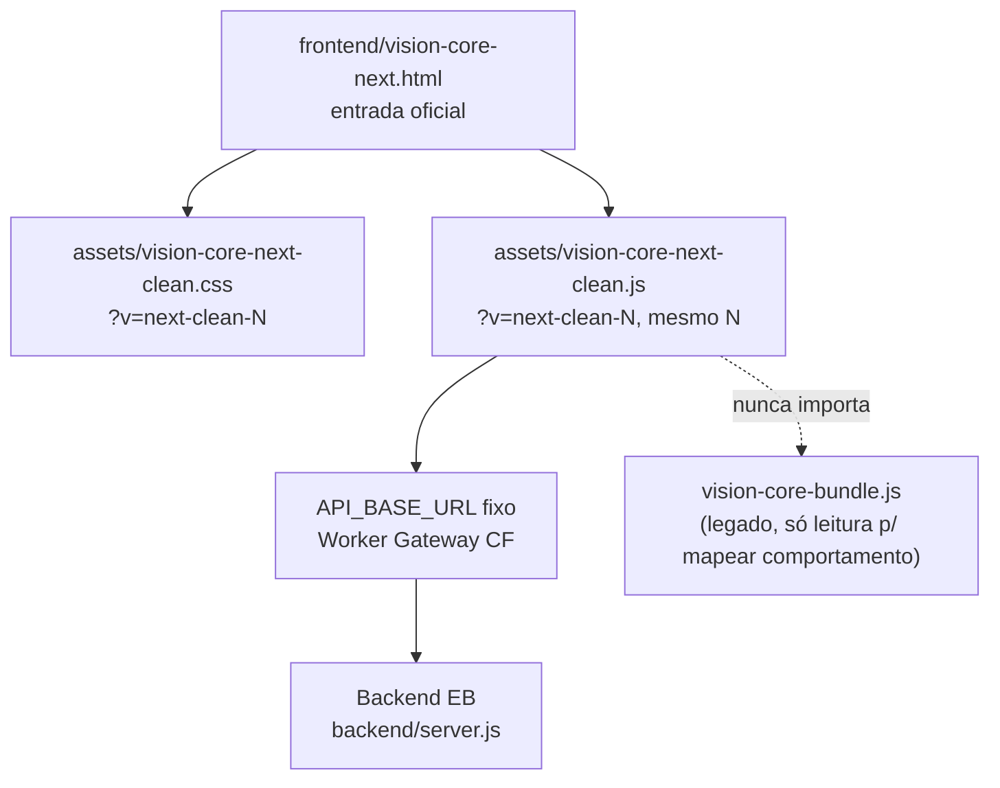
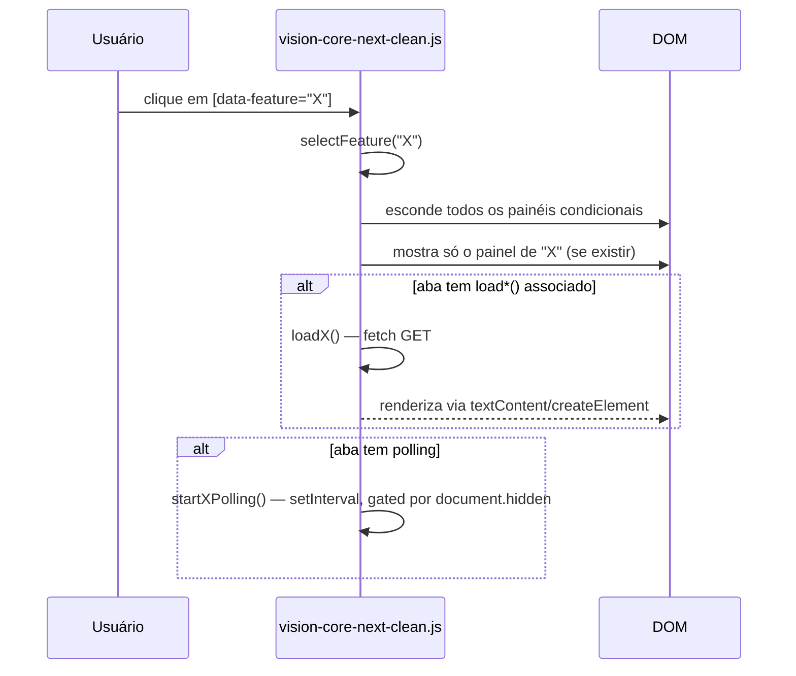
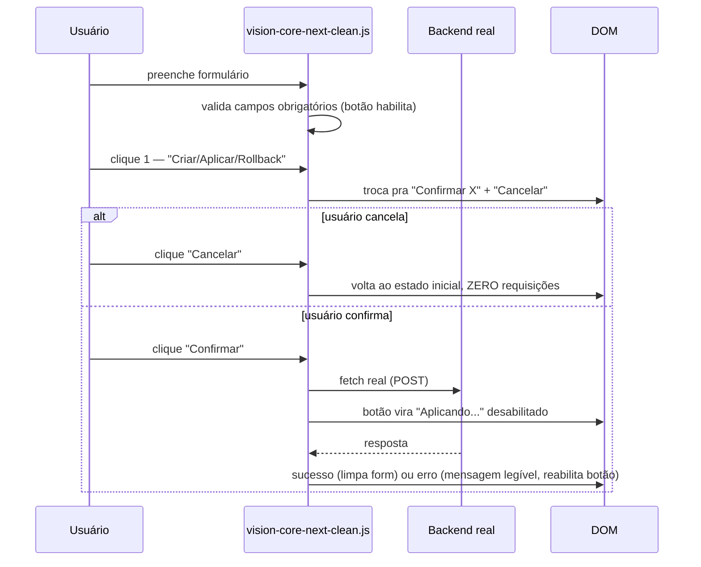

# VISION CORE NEXT — Frontend Spec

**Parte da série de arquitetura — leia `MASTER_SPEC.md` antes deste.**

> Versão: 2.0.0 · Criado originalmente 2026-07-08, consolidado 2026-07-09
> Esta versão substitui a v1 do mesmo arquivo (preservando 100% das regras duras e decisões de escopo dela) e adiciona: template padrão da série, diagramas, catálogo do que já existe hoje (a v1 só descrevia a intenção inicial; muito foi implementado desde então).
> **Para o estado operacional exato de cada feature (o que a última sessão mexeu), consulte sempre `docs/CURRENT_STATE.md` — este documento é a especificação estável, não muda a cada sessão.**

---

## Resumo

Vision Core Next é a interface paralela e ativa de reconstrução do frontend do Vision Core — um app operacional de chat/missão no estilo ChatGPT/Claude/Cursor, não uma landing page nem um dashboard denso. Roda ao lado do frontend legado (`index.html`) sem substituí-lo, acessível por URL própria, sem nenhum código do legado copiado ou importado.

Esta frente é governada por `ARCHITECTURAL PRINCIPLE-001` (Zero Legacy Debt), `ARCHITECTURAL PRINCIPLE-002` (Specification First) e `ARCHITECTURAL PRINCIPLE-003` (Evidence Before Change), registrados em `docs/DECISIONS.md`: o legado é referência funcional/histórica, o Next implementa as specs oficiais sem portar dívida técnica, e decisões arquiteturais exigem evidência objetiva antes da mudança.

Direção de evolução vigente: ver `docs/DECISIONS.md` DECISION-019. O Next deve ser tratado como futuro frontend oficial do Vision Core; cada missão começa por comparação implementação × specs e prioriza arquitetura/UX antes de refinamentos visuais soltos.

## Objetivo

Paridade funcional progressiva com o legado, com rigor de segurança (nunca uma chamada destrutiva sem confirmação dupla), zero dívida herdada, e uma identidade visual coesa (minimalista, escura, sidebar colapsável, chat como centro).

## Escopo

Tudo que roda em `frontend/vision-core-next.html` + `frontend/assets/vision-core-next-clean.{css,js}`. Cobre: layout, componentes, estados, eventos, integração com os endpoints reais do backend (via o Worker gateway), motion system, responsividade, acessibilidade.

## Fora do escopo

- `frontend/index.html`, `vision-core-bundle.{js,css}` — legado, produção, só referência visual (nunca copiar código).
- `frontend/about.html`, `frontend/landing.html` — páginas públicas, só editadas após validação local correspondente.
- `backend/`, `worker/src/index.js` — nenhuma mudança de backend nasce aqui.
- `frontend/atomic-core.html` + `assets/atomic-core.{css,js}` — protótipo isolado do decágono, nunca commitado, não é a implementação oficial do Atomic Core (essa vive dentro de `vision-core-next-clean.js`, ver `ATOMIC_CORE_SPEC.md`).
- `frontend/assets/vision-core-next.{css,js}` (sem `-clean`) — protótipo pré-clean, nunca editar. **Achado real de 2026-07-09:** uma tarefa chegou a listar esses nomes como "arquivos permitidos" por engano — confirmado por `git ls-files` que eles nunca foram versionados e não têm efeito nenhum na página real, que carrega só os arquivos `-clean`.

---

## Arquitetura



### Core Interaction Principle

O Chat nunca pode ser deslocado da primeira posicao cognitiva da interface.

A ordem principal do fluxo deve ser obrigatoriamente:

1. Header
2. Conversation / Chat
3. Composer principal
4. Ferramentas contextuais

Nunca inverter para um fluxo em que o usuario precise passar por `Mission -> Marketplace -> Vault -> Metrics -> ... -> Chat`. Isso quebra o fluxo cognitivo: o produto deixa de parecer um cockpit conversacional e vira uma pilha de paginas.

**Mission Input removido da arquitetura Next.** A área superior direita pertence exclusivamente ao Atomic Core. A entrada de missão ocorre apenas pelo composer/chat principal. Nenhuma nova implementação pode reintroduzir painel, textarea ou estado paralelo de missão.

**Software Factory = modo operacional do chat, nao pagina.** Exemplo oficial: o usuario descreve "Implementar login OAuth", liga `Factory`, a conversa continua, a IA analisa, gera plano, executa, mostra logs e entrega resultado. O Factory entra como contexto/modo da conversa.

**Vault = contexto, nao interrupcao.** Anexar snapshot deve enriquecer a conversa atual. Nunca abrir uma pagina Vault, executar algo fora do fluxo e obrigar o usuario a voltar ao chat.

**Metrics = widgets vivos.** CPU, RAM, agentes, jobs, DORA e pipeline podem aparecer como widgets abaixo/ao lado do fluxo, mas nunca substituir a conversa principal.

**Métricas estruturadas = gráfico primeiro.** Toda métrica numérica, temporal, percentual, categórica ou comparativa exposta no Next deve possuir representação gráfica apropriada (barra, donut, gauge, sparkline ou timeline). Texto puro é complemento; JSON bruto fica oculto por padrão e só pode aparecer em modo diagnóstico.

**Marketplace = drawer sob demanda.** Se o usuario pede "Instalar SpiderFoot", o Marketplace abre em drawer, instala, fecha e a conversa continua. Ele nao ocupa o espaco principal por padrao.

**GitHub = contexto.** Repo, branch, PR e status entram como contexto ou painel lateral, nunca como pagina principal que toma o lugar do chat.

**Atomic Core = permanente, mas nao empurra o chat.** Ele deve permanecer visivel quando houver espaco, sem deslocar o Chat para baixo e sem competir com o composer. **Excecao unica confirmada por colisao real (next-clean-61):** recolhe (opacity/scale, nunca `display:none`) automaticamente so no Modo Avancado do Software Factory, onde o grid de stack/matriz/timeline disputa a mesma zona reservada do widget. Nenhum outro painel recolhe o Atomic Core. Preferencia reversivel em Settings -> Atomic Core ("manter sempre visivel"), mesmo padrao getMode/setMode/onChange + localStorage de `window.VCMotion` (`window.VCAtomicCollapse`, chave `vc_atomic_collapse_pref`, default `'auto'`) — nunca trava permanente.

Layout oficial do fluxo:

```text
HEADER
------------------------------
CHAT
CHAT
CHAT
CHAT
------------------------------
COMPOSER
[ Missao ] [ GitHub ] [ Factory ] [ Vault ] [ IA ] [ Executar ]
------------------------------
Widgets vivos:
- Metrics
- Jobs
- Agents
- Timeline
- Security
- Secret Guard
```

**Regra de ouro:** nenhuma nova funcionalidade pode alterar a posicao do Chat Principal. Toda nova feature deve ser integrada como contexto, drawer, painel lateral, widget, aba contextual, modal ou painel colapsavel. Nunca deslocar o fluxo principal da conversa.

### Arquivos oficiais (únicos que devem ser tocados sem aprovação explícita adicional)

| Componente | Caminho |
|---|---|
| HTML | `frontend/vision-core-next.html` |
| CSS | `frontend/assets/vision-core-next-clean.css` |
| JS | `frontend/assets/vision-core-next-clean.js` |

Cache-bust `?v=next-clean-N` sempre sincronizado nos três lugares (`<link>`, `<script>` — o CSS/JS são o mesmo N do HTML que os referencia).

### Regra de segurança fundamental desta frente

**Nesta fase, o Next só lê por padrão.** Toda ação que escreve, executa ou é irreversível passa por (a) formulário com validação de campos obrigatórios, (b) segundo clique de confirmação explícita ("Confirmar X" / "Cancelar"), (c) guard de double-click (botão desabilitado durante a requisição). Isso vale para GitHub PR, Vault Rollback, Apply-Fix, Dry-Run real, e está **bloqueado por padrão** (fail-closed) para `apply_patch`/`apply_patch_multi` reais via Vision Agent Local até existir pareamento real por agente/projeto/owner (ver seção "Bloqueio de segurança" abaixo).

| Permitido ✅ | Bloqueado ❌ |
|---|---|
| GET em endpoints de status/leitura | `apply_patch` real via Vision Agent Local (gate `AGENT_APPLY_ENABLED=false`) |
| `POST /api/chat` (chat livre, sem quota) | POST destrutivo sem confirmação dupla |
| `POST /api/sf/*` com job_id polling | Deploy (CF Pages, EB) a partir da UI |
| `POST /api/github/create-pr` (confirmação dupla) | Missão paga (`/api/run-live`) |
| `POST /api/vault/rollback/:id` (confirmação dupla) | Escrita em disco fora do fluxo de Apply-Fix confirmado |
| `POST /api/security/apply-fix` (confirmação dupla) | — |
| Anexo de arquivos (local apenas, sem upload real) | — |

---

## Direção visual

Estilo geral: **app de chat/IA**, inspirado em ChatGPT/Claude/Cursor/OpenCode/Linear.

**Princípios:** minimalista · escuro/cinza nativo · chat como centro da experiência · sem aparência de landing page · sem hero gigante · sem excesso de painéis · sidebar discreta e recolhível · legado é referência visual/UX, nunca base de código (catálogo completo em `docs/LEGACY_DESIGN_REFERENCE.md`).

```
┌─────────────┬───────────────────────────────────────┬──────────┐
│  Sidebar    │  Header (logo+olho+identidade)         │ Mission  │
│  colapsável │ ─────────────────────────────────────  │ Input    │
│  (ícones ou │  Chat stream (histórico de mensagens)  │(flutuante│
│  ícone+     │                                         │ topo dir)│
│  label)     │                                         │          │
│             │                                         │ Atomic   │
│  C Chat     │ ─────────────────────────────────────  │ Core     │
│  M Missions │  Feature panel contextual (status,      │(discreto,│
│  F Factory  │  ações, formulários específicos da aba) │ canto sup│
│  T Timeline │                                         │ direito) │
│  A Agentes  │ ─────────────────────────────────────  │          │
│  G GitHub   │  Composer fixo no rodapé                │          │
│  V Vault    │  [textarea + chips de ação + Executar]  │          │
│  M Métricas │                                         │          │
│  T Tools    │                                         │          │
│  L Security │                                         │          │
│  O Obsidian │                                         │          │
│  S Settings │                                         │          │
└─────────────┴───────────────────────────────────────┴──────────┘
```

### Tokens / tema

Todo o CSS usa um conjunto pequeno de variáveis `:root` em vez de valores soltos repetidos:

```css
--bg: #030207          /* fundo geral */
--text: #f8f7ff         /* texto principal */
--muted: #a8a1b8        /* texto secundário */
--violet: #a855f7       /* acento primário */
--violet-2: #c084fc     /* acento secundário */
--cyan: #22d3ee         /* acento secundário 2 */
--green: #34d399        /* estado ok/sucesso */
--radius: 8px           /* raio de borda padrão */
--sidebar-width: 252px  /* expandida — 78px quando colapsada */
```

Cores de estado semântico fora das variáveis raiz (por convenção do arquivo, repetidas como literal em cada bloco, não centralizadas): âmbar `#facc15`/`rgba(250,204,21,*)` para "atenção/pendente"; vermelho `#f87171`/`rgba(248,113,113,*)` para erro. `color-scheme: dark` é declarado explicitamente — não há tema claro implementado.

---

## Componentes (catálogo resumido — detalhe completo em `UI_COMPONENT_LIBRARY.md`)

| Componente | Estado |
|---|---|
| Sidebar colapsável | EXISTENTE |
| Composer fixo | EXISTENTE |
| Mission Input flutuante | REMOVIDO — proibido reintroduzir |
| Chat (mensagens usuário/sistema) | EXISTENTE |
| Atomic Core (widget) | EXISTENTE |
| Feature panel contextual por aba | EXISTENTE |
| GitHub PR (formulário + confirmação dupla) | EXISTENTE |
| Vault Rollback (confirmação dupla) | EXISTENTE |
| Apply-Fix (confirmação dupla) | EXISTENTE |
| Dry-Run real (confirmação dupla, polling, timeout 5min) | EXISTENTE |
| Agent Apply (fail-closed, sempre desabilitado) | EXISTENTE — bloqueado por design |
| Métricas (gráficos de agentes, DORA, runtime, memory layer, conectividade, Tools/Security safe-read) | EXISTENTE |
| Security Lab (Safe Status + Secret Guard card) | EXISTENTE |
| Software Factory Next (`#factory`, Auto-Pilot + Modo Avançado) | EXISTENTE — Arquiteto visual local, catálogo/grafo de stack, matriz de agentes, timeline e preview |
| Mission History (Timeline) | EXISTENTE |
| Settings / AI Provider Vault | EXISTENTE |
| Logo/olho (piscada) | EXISTENTE — protegido |

---

## Logs inteligentes

Nenhum log aparece por padrão. `#vcSfLog` (Software Factory) nasce `hidden` e só aparece durante geração ativa. O painel de Safe Status (Security Lab) só popula ao entrar na aba — nunca no load da página. Regra geral da frente: nenhum componente novo deve popular um log/painel de estado no `DOMContentLoaded` — sempre gatilho de navegação ou ação do usuário.

## Status / Context Panel

O `#vcFeaturePanel` (dentro do chat stage) é o painel contextual único — muda de conteúdo conforme a aba ativa (`selectFeature(key)`), sempre com: título, badge de status textual (`READY`/`SAFE READ`/etc.), corpo descritivo, e ações específicas da aba (botões SAFE READ que despejam resumo no chat, ou formulários dedicados como GitHub PR/Vault/Apply-Fix/Dry-Run/Métricas/Security Lab).

## Motion System

Fonte de verdade **não é** o sistema operacional — é `window.VCMotion` (`getMode`/`isReduced`/`setMode`/`onChange`, backed por `localStorage['vc_animation_mode']`, `'full'|'reduced'`, default sempre `'full'`). Decisão de produto explícita (2026-07-09): "a animação é identidade visual da marca; o VC tem controle próprio de acessibilidade, o SO não degrada por padrão." Controle exposto em Settings → Animações. As únicas duas leituras diretas de `matchMedia('(prefers-reduced-motion...)')` no arquivo inteiro são: (1) o blink do olho/logo (área protegida, decisão de UX separada) e (2) a dica de primeira visita (só decide se mostra um aviso apontando pro Settings, nunca o que animar).

Painéis de dados (Métricas, Security Lab) **não têm animação de entrada própria** — aparecem já no estado final, tanto em `full` quanto `reduced` — decisão deliberada de tratá-los como dashboard, não como identidade de marca.

---

## Estrutura HTML

Um único `<div class="vc-app-shell" data-sidebar-state="expanded|collapsed">` com dois filhos: `<aside class="vc-sidebar">` (nav com `data-feature="chat|missions|factory|timeline|agents|github|vault|metrics|tools|security|obsidian|settings"`) e `<main class="vc-main">` contendo header, `<section class="vc-chat-stage">` (intro + `#vcChatStream` + `#vcFeaturePanel` com todos os sub-painéis condicionais dentro, cada um `hidden` por padrão) e `<form class="vc-composer">` fora do chat-stage. O Software Factory deve coexistir como contexto/painel operacional da conversa e ler a missão do composer/chat principal; não pode ter textarea próprio de missão. O Modo Avançado adiciona apenas painéis visuais/editáveis (`#vcSfAdvancedPanel`) de interpretação, stack, agentes, timeline e preview.

### Tutorial Smile

`#vcSmileModal` e o unico overlay/modal do Vision Core Next. Ele abre somente por clique em `[data-smile-open]`, usa X/ESC/Voltar/Proximo, renderiza passos estaticos via `textContent`, nao grava localStorage, nao chama backend e nao cria textarea/campo paralelo de missao. A entrada de missao continua exclusivamente no composer/chat principal.

## Estrutura CSS

Um arquivo único (`vision-core-next-clean.css`), organizado por bloco de componente na ordem em que aparecem no HTML, com `:root` no topo. **Regra dura não-negociável:** todo painel condicional que usa o atributo `hidden` no HTML precisa do seletor `.classe:not([hidden]) { display: X }` — nunca `.classe { display: X }` puro, porque CSS de autor com a mesma especificidade do atributo `hidden` vence por ordem de declaração e o painel aparece mesmo escondido. Bug real, já corrigido mais de 6 vezes nesta frente (GitHub PR, Mission Patch, SF stage/log/progress/final, Métricas body/error/skel, Safe Status/Secret Guard).

## Arquitetura JS

Um único IIFE (`(function(){'use strict'; ... })()`) em `vision-core-next-clean.js` — todo o estado (`activeFeature`, timers de polling, flags de confirmação pendente) vive em `var` no escopo do IIFE, sem módulos ES/bundler. Funções declaradas com `function nome(){}` (hoisted) são chamadas de qualquer lugar do arquivo independente de ordem de declaração — padrão usado deliberadamente (`selectFeature()` chama `loadMetrics()`/`loadSafeStatusPanel()` definidas centenas de linhas depois). `window.AtomicCoreNext`/`window.VCMotion`/`window.startAtomicSequence` são a única API exposta globalmente, para o restante do arquivo e para testes.

### Eventos

- Navegação: clique em `[data-feature]` → `selectFeature(key)` → troca `hidden` de todos os painéis + dispara `load*()` da aba se aplicável.
- Composer: `submit` do `#vcComposer` → `POST /api/chat` com `AbortController` 45s; chips `[data-feature]` prefixam o textarea; `[data-quick="attach|image"]` abrem `<input type=file hidden>`.
- Polling: `setInterval` por feature (badge do agente 10s, Métricas 12s), sempre pausado via `document.visibilitychange`/`document.hidden` e só ativo quando a aba correspondente está selecionada.

### Renderização

**Nunca `innerHTML`/`insertAdjacentHTML`/`eval`/`document.write`.** Toda renderização de conteúdo vindo do backend usa `textContent`/`createTextNode`/`createElement` — sem exceção, mesmo para HTML aparentemente confiável. Verificado por grep estático a cada sessão desta frente.

### Lazy loading / performance

Não há code-splitting nem lazy loading de módulos — um único CSS e um único JS carregados de uma vez (`defer`). Painéis condicionais (Métricas, Security Lab, Vault, etc.) não fazem fetch até a aba ser selecionada — isso é o único "lazy" real da frente (lazy de *dado*, não de *código*). Atomic Core usa `pointer-events: none` e `contain: layout paint` para não forçar reflow do resto da página.

---

## Fluxos

### Fluxo de navegação/renderização de aba



### Fluxo de ação irreversível (padrão dupla-confirmação)



---

## Responsividade

Desktop-first, dois breakpoints:

- `max-width: 1180px` — Atomic Core encolhe e permanece na área superior direita sem cobrir chat/composer.
- `max-width: 820px` — sidebar vira barra horizontal (`position:static`, `flex-direction:row`, scroll horizontal, só ícones — `.vc-sidebar-foot` some). **Atomic Core vira `display:none` neste breakpoint** — decisão deliberada: o Atomic Core é puramente decorativo (`pointer-events:none`) e recolher em telas menores é mais seguro que arriscar sobrepor chat/composer.

## Acessibilidade

`aria-label`, `aria-live="polite"` nos painéis dinâmicos (chat stream, listas de status), `aria-expanded` no toggle da sidebar, `role="alert"` nos banners de erro/risco. Motion respeita `VCMotion` (ver seção Motion System) — não é gated pelo SO diretamente, mas o controle existe e é persistente.

---

## Bloqueio de segurança — Executar Missão Fase 2b (`apply_patch` real)

**Estado: fail-closed por design, `AGENT_APPLY_ENABLED=false` no código.** A UI existe (documenta o payload esperado) mas o botão nunca chama `/api/agent/mission/queue`, mesmo com JSON válido + frase de confirmação exata. Motivo: `agent_id` sozinho não é autenticação (hash não-secreto de hostname+pasta, nenhuma rota `/api/agent/mission/*` tem middleware de auth por si só — o pareamento real via `agent_secret` existe desde 2026-07-08, mas o gate de UI continua fechado até decisão explícita do usuário reabri-lo). Regressão de gate: `tests/e2e/vision-core-next-agent-apply.spec.mjs` — **um de 7 specs permanentes desta frente** (`agent-apply`, `apply-fix`, `app-shell`, `atomic-core`, `metrics`, `sf`, `sf-project-files`), permanente por guardar um gate de segurança, deve continuar passando em todo handoff.

## Fora de escopo — decidido em 2026-07-08 (categorias completas, não reabrir sem novo motivo)

Confirmado pelo usuário após auditoria de paridade (`docs/PARITY_AUDIT.md`): SF Console legado (`#vcSoftwareFactoryPage`/`#projectBuilder`), tutorial `STEPS_SF` zumbi, `vision-core-clean-runtime.js` (fork abandonado, 312KB), `vision-core-clean-state.js` (duplicata byte-a-byte do bundle), painéis estáticos OSINT/OPENCLAW (§98-F, roadmap), Billing UI decorativa, Vault rollback UI do legado (nunca existiu). 19 arquivos CSS de hotfix legado (`v297`→`v298-final-hard-fix2`) não entram no Next. Reconciliação 2026-07-11: `#vcSoftwareFactoryPage`/`#projectBuilder` já não existem nos arquivos oficiais do Next; qualquer limpeza restante é do frontend legado e não deve tocar `index.html`/bundles sem autorização explícita.

---

## Regras Duras (violação = bug garantido, já aconteceu mais de uma vez)

1. **`.classe:not([hidden])`, nunca `display:X` puro** em painel condicional com atributo `hidden`.
2. **Nunca `innerHTML`/`insertAdjacentHTML`/`eval`/`document.write`.**
3. **`page.emulateMedia({reducedMotion})` explícito ANTES de `page.goto()`** em todo teste Playwright com animação — `test.use({reducedMotion:...})` sozinho não é confiável em `file://`.
4. **Todo endpoint chamado pela UI é verificado por `grep` direto em `backend/server.js`**, nunca assumido pelo nome.
5. **Cache-bust sempre incrementa nos três lugares junto** (`?v=next-clean-N`).
6. **Gate de segurança só muda com aprovação humana registrada em `docs/CURRENT_STATE.md`.**
7. **Nunca commitar working tree sujo; nunca deployar código não commitado.**
8. **Todo spec Playwright que faz `page.goto()` na página Next mocka `/api/agent/status` e `/api/mission/quota`** — ambos disparam sozinhos, sem gate, em toda carga de página.
9. **UTF-8 é verificado por leitura, não assumido** — achado real de 2026-07-09: texto novo com mojibake (`Não` em vez de `Não`) passou por `node --check` e testes sem ser pego (é um bug de conteúdo, não de sintaxe) — revisão visual/grep por `Ã[£§¡©³µª¢]` recomendado para todo texto em português adicionado.
10. **Toda métrica estruturada (numérica, temporal, percentual, categórica ou comparativa) deve ter representação gráfica apropriada** (`metricCharts.{bar,donut,gauge,sparkline,timeline}`), não só texto — regra fechada em `next-clean-58` depois de 3 gaps reais (Software Factory, Security Lab, ações safe-read fora da aba Métricas ainda despejando resumo textual/JSON sem gráfico). Texto puro complementa, nunca substitui. JSON bruto fica sempre atrás de um toggle explícito ("Ver JSON bruto", reutilizando `.vc-metrics-raw-toggle`/`.vc-metrics-raw`), nunca como conteúdo principal — inclusive fora da aba Métricas.
11. **Nunca declarar uma feature "corrigida" só porque passa localmente — verificar o cache-bust real servido em produção antes.** Achado real (`next-clean-59`, 2026-07-11): duas entregas inteiras (`next-clean-57`/`58`) foram commitadas, testadas 69/69 e nunca deployadas; um bug reportado como "os gráficos não aparecem" era, antes de mais nada, "o código nunca chegou em produção" — confirmável em segundos com `Invoke-WebRequest` no HTML servido, não exige reproduzir nada.
12. **Conteúdo dinâmico alto (gráficos, listas, diffs) dentro de `#vcFeaturePanel` precisa nascer visível sem exigir rolagem manual** — `#vcComposer` é `position:sticky`; qualquer painel que cresça na MESMA rolagem que ele pode acabar visualmente atrás dele. Solução adotada: `.vc-chat-scroll` isola a rolagem de `#vcChatStream`+`#vcFeaturePanel`, e código que popula conteúdo relevante deve chamar `elemento.scrollIntoView({block:'start'})` depois de renderizar — se outra chamada de `scrollIntoView` (ex.: `appendMessage()`) roda depois na mesma cadeia de promises, ela vence e desfaz o scroll; a ordem de chamadas importa.

---

## O que o Next NÃO é / O que É

**NÃO é:** landing page promocional · dashboard pesado com dezenas de cards · substituição imediata do `index.html` · prova de conceito descartável.

**É:** interface operacional de chat/agentes · implementação paralela e segura · evolutiva (cada etapa testada antes de avançar) · pronta para validação antes de substituir produção.

---

## Checklist de aceite (layout alvo)

1. Abrir em `/vision-core-next.html` sem redirecionar para `index.html` — ✅
2. Não alterar `index.html` nem bundles legados — ✅ (verificado a cada sessão via `git diff --stat`)
3. Sidebar recolher via botão toggle, persistindo estado — ✅
4. Chat é o foco visual — ✅
5. Atomic Core pequeno/discreto (~300×300px desktop, `display:none` em mobile) — ✅
6. Sem botões Idle/Action/Glow visíveis — ✅ (nunca existiram como controles)
7. Mission Input separado não existe no DOM — ✅
8. Composer fixo embaixo (`position:sticky; bottom:18px`) e é a única entrada de missão — ✅
9. Nenhuma chamada destrutiva sem confirmação dupla — ✅
10. Sem dependência de backend novo — ✅ (só endpoints já existentes no EB)

## Pendências

- `frontend/atomic-core.html` + assets paralelos: candidatos a limpeza/remoção formal (decisão do usuário, não urgente).
- `/api/metrics/summary` e `/api/metrics/memory` (runtime CPU/memória, memory layer) não conectados na aba Métricas — fora do escopo pedido nas sessões até aqui.
- ~~`project-files` + `generate-zip` (Software Factory Next)~~ **CORRIGIDO (2026-07-10)** — ver `SOFTWARE_FACTORY_SPEC.md`.
- Auth/registro/login/OAuth no Next — não iniciado, item mais sensível do roadmap (mexe com sessão real de qualquer usuário).

## Próximos passos

Ver `ROADMAP.md`, Fase 1 (Frontend).

## Regra para agentes

> Qualquer sessão que mexa no frontend deve ler `MASTER_SPEC.md` → este arquivo → `CLAUDE.md` → `docs/CURRENT_STATE.md` antes de editar código.

## Histórico

| Data | Mudança |
|---|---|
| 2026-07-08 | v1 — spec inicial da direção visual, regras duras 1-8, fora de escopo. |
| 2026-07-09 | v2 (este arquivo) — consolidado no template da série de 10 documentos; adiciona diagramas Mermaid, catálogo de componentes existentes, regra dura 9 (mojibake), seção Duas Camadas referenciada de `ARCHITECTURE.md`. Nenhuma regra da v1 foi removida. |

## Controle de versão

**2.0.0** — 2026-07-09
