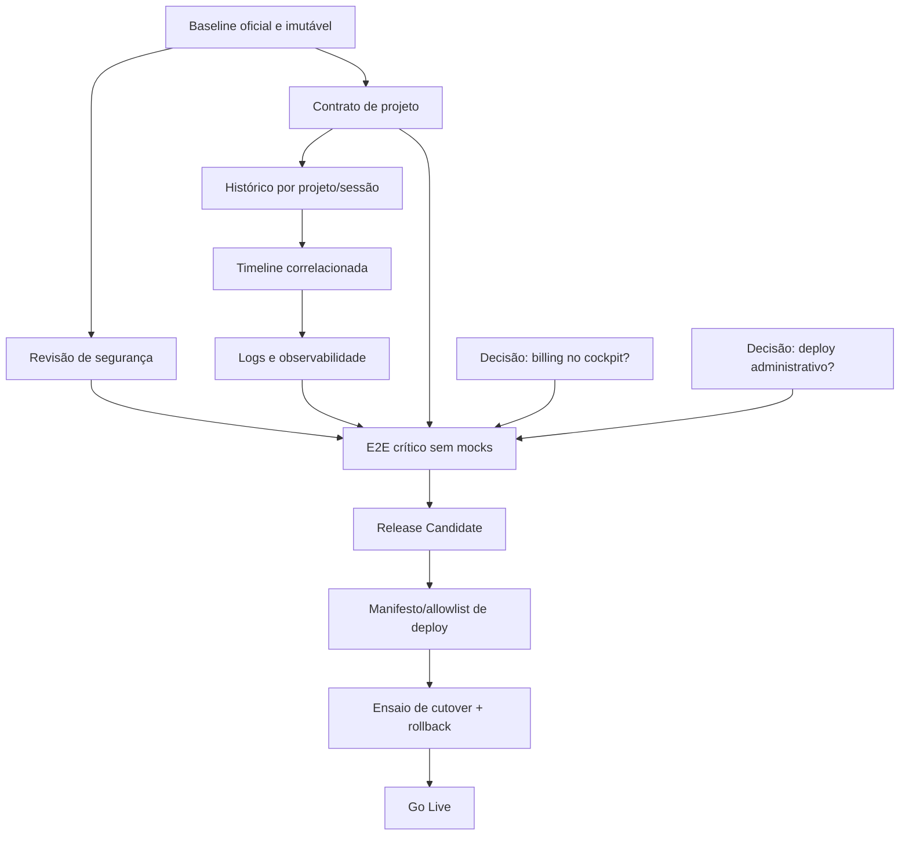

# Executive Summary

O Vision Core Next está **74% pronto para substituir o legado**, pela fórmula arquitetural definida neste documento. Das 41 capacidades observáveis catalogadas, 5 são legado descartável; nas 36 relevantes à substituição, há 23 completas, 8 parciais e 5 ausentes. O Next já cobre o cockpit principal, mas ainda não pode assumir a raiz: faltam histórico/projetos, logs, decisões sobre billing e deploy administrativo, validação ponta a ponta sem mocks e um procedimento ensaiado de cutover/rollback.

Baseline auditado: `e4eee79c`, branch local `codex/next-rc-baseline`. Esse commit reconcilia o frontend público `next-clean-82` com o backend Hermes grounded `v116`. A suíte permanente registrada e reexecutada nesse baseline passou **114/114**, e o contrato de grounding passou. O baseline ainda não foi promovido a branch remota oficial, por restrição desta missão.

# Estado Geral

| Indicador | Resultado |
|---|---:|
| Capacidades observáveis | 41 |
| Relevantes à substituição | 36 |
| Completas | 23 |
| Parciais | 8 |
| Ausentes | 5 |
| Legado descartável | 5 |
| P0 | 3 |
| P1 | 5 |
| Prontidão arquitetural | 74% |

O código Next não depende do bundle legado. O impedimento não é reconstruir o produto inteiro; é fechar cinco contratos funcionais e os gates de release. O apply real do agente permanece desativado por DECISION-005 e não precisa ser ativado para o RC: o RC pode declarar essa capacidade indisponível, preservando fail-closed.

# Inventário da Produção

A entrada de produção legada é `frontend/index.html`, publicada porque `bin/deploy-pages.sh` copia `frontend/*`. Ela carrega `vision-core-bundle.css`, `vision-core-bundle.js`, `v231-backend-agents.js` e `v582-sf-modules.js` (`frontend/index.html:9-10,2797-2802`). Capacidades confirmadas:

- Shell/sidebar, chat texto e imagem, apply-patch em memória, estados de loading/erro e feedback.
- Histórico persistido localmente e sincronizado para autenticados (`vision-core-bundle.js:6319-6389`).
- Projetos e seletor via `/api/projects` (`:10443-10480`).
- Software Factory, módulos assíncronos, Gold Gate, project-files e ZIP (`:5527-5533,8858-9006`).
- Agentes, fila de missão, status e execução controlada.
- Timeline, métricas, providers, autenticação, OAuth e sessão.
- Billing/status/checkout (`:1975,10379`) e logs/download (`:1873`).
- Deploy Pages/EB, merge de PR e ZIP release (`:5990-6164,9085-9094`).
- Landing/about/settings, persistência local, upload/download e responsividade parcial.
- Dívida descartável: credencial fallback, hotfix chain, automerge/autodeploy local, IDs/CSS duplicados e protótipos.

# Inventário do Next

A entrada oficial é `frontend/vision-core-next.html`, carregando apenas `vision-core-next-clean.{css,js}?v=next-clean-82`. Fluxos confirmados por UI→estado→evento→API→resultado ou por gate explícito:

- Chat real `/api/chat`, imagem, timeout via `AbortController` e apply-patch em memória (`vision-core-next-clean.js:1980-2088,2887-2998`).
- Shell SPA, sidebar persistente, estados de painel e headers por papel.
- Atomic Core completo, responsivo, em fluxo normal, com Idle/Action/Glow, padrões customizáveis e retorno; redução de movimento prevalece.
- Software Factory Auto-Pilot/Avançado, Arquiteto, Stack Builder, polling de jobs, Gold Gate, project-files e ZIP (`:3562-3574,3946-4309`).
- Timeline, métricas/gráficos, agentes/status, Vault/providers, Security Lab, GitHub, Tools e Obsidian.
- Login/registro/logout/OAuth (`:2630-2723`) e preferências persistidas em localStorage.
- Apply real deliberadamente bloqueado (`AGENT_APPLY_ENABLED=false`, `:2138-2220`).
- Ausências confirmadas: histórico conversacional/projetos equivalentes, logs/download, billing/account e deploy administrativo.

# Dashboard Executivo

```text
CHAT                ████████░░  82%
FRONTEND/SHELL      █████████░  90%
SOFTWARE FACTORY    █████████░  94%
ATOMIC CORE         ██████████ 100%
TIMELINE/DADOS      ███████░░░  70%
AGENTES             ███████░░░  72%
AUTH/SESSÃO         ████████░░  80%
SEGURANÇA/GATES     █████████░  92%
OBSERVABILIDADE     ██████░░░░  63%
DEPLOY/RELEASE      ███░░░░░░░  30%
RC READINESS        ███████░░░  70%
LEGACY REPLACEMENT  ███████░░░  74%
```

# Percentual por Domínio

| Domínio | % | Critério objetivo |
|---|---:|---|
| Frontend/Shell | 90 | navegação, estados e responsividade existem; faltam gates amplos de a11y/performance |
| Backend/APIs | 84 | contratos principais existem; vários não são consumidos pelo Next |
| Chat | 82 | texto/imagem/grounding completos; histórico de sessões ausente |
| Software Factory | 94 | fluxo completo de preview/geração/ZIP; execução em disco é fora do contrato atual |
| Atomic Core | 100 | spec, integração e 32 testes de comportamento/segurança visual |
| Timeline/Dados | 70 | timeline real; projetos e histórico integrado ausentes |
| Agentes | 72 | catálogo/fila/status; apply real fechado e backend real não certificado nesta análise |
| Auth/Sessão | 80 | auth/OAuth integrados; billing/account e jornada real completa não certificada |
| Segurança/Gates | 92 | fail-closed e testes permanentes; revisão de release ainda pendente |
| Secret Guard | 100 | contrato e Security Lab presentes; nenhuma expansão exigida para o RC |
| Quality Gates | 96 | Gold/gates cobertos; falta gate E2E controlado sem mocks |
| Observabilidade | 63 | métricas/timeline existem; logs e telemetria frontend faltam |
| Deploy/Release | 30 | script existe, mas raiz, allowlist, cutover e rollback não estão fechados |
| RC Readiness | 70 | baseline e suíte existem; P0/P1 ainda abertos |
| Legacy Replacement | 74 | fórmula ponderada abaixo |

Fórmula: excluem-se as 5 capacidades explicitamente descartáveis. Cada completa vale 1, cada parcial vale 0,5 e cada ausente vale 0: `(23 + 8×0,5) / 36 = 75%`; aplica-se penalidade de 1 ponto pelo fato de os 3 gates P0 ainda impedirem release, resultando em **74%**. Percentuais por domínio usam a mesma escala sobre as linhas correspondentes, com arredondamento inteiro.

# Matriz de Paridade

| ID | Domínio | Capacidade | Produção | Next | Spec | Testes | Status | Dependências | Prioridade | Evidência |
|---|---|---|---|---|---|---|---|---|---|---|
| CHAT-001 | Chat | texto | real | real | sim | E2E | ✅ Completo | API chat | — | Next JS:2070 |
| CHAT-002 | Chat | imagem | real | real | sim | E2E | ✅ Completo | API chat/vision | — | Next JS:2887 |
| CHAT-003 | Chat | apply em memória | real | real | sim | E2E | ✅ Completo | chat/apply-patch | — | Next JS:1980 |
| CHAT-004 | Chat | histórico/sessões | real | não equivalente | sim | não | 🔴 Ausente | projetos+auth | P1 | legado JS:6319 |
| UX-001 | UX | shell/sidebar | real | real | sim | E2E | ✅ Completo | — | — | Next JS:408 |
| UX-002 | UX | loading/erro/retry | real | irregular | sim | parcial | 🟡 Parcial | contratos API | P2 | Next JS:2057 |
| UX-003 | UX | estados vazios | real | irregular | sim | parcial | 🟡 Parcial | dados | P3 | specs/E2E |
| A11Y-001 | A11y | teclado/ARIA/motion | parcial | parcial | sim | sem gate dedicado | 🟡 Parcial | shell | P3 | VCMotion JS:18 |
| PERF-001 | Performance | carga/polling | bundle | bundle+guards | sim | não | 🟡 Parcial | observabilidade | P3 | entradas HTML |
| ATOMIC-001 | Atomic | widget/estados | real | real | sim | E2E | ✅ Completo | chat | — | Atomic spec |
| ATOMIC-002 | Atomic | customização/retorno | não | real | sim | E2E | ✅ Completo | VCMotion | — | Next JS:51-275 |
| AGENT-001 | Agentes | catálogo/status | real | real | sim | E2E | ✅ Completo | agents API | — | catalog/status |
| AGENT-002 | Agentes | missão/fila | real | contrato real | sim | mock | 🟡 Parcial | auth/pairing | P2 | backend routes |
| AGENT-003 | Agentes | apply real | exposto | bloqueado | sim | gate | 🟡 Parcial | decisão humana | P0-aceitável fechado | DECISION-005 |
| SF-001 | SF | Auto-Pilot | real | real | sim | E2E | ✅ Completo | jobs | — | Next JS:3562 |
| SF-002 | SF | modo avançado | real | real | sim | E2E | ✅ Completo | composer | — | SF spec |
| SF-003 | SF | Arquiteto | real | real | sim | E2E | ✅ Completo | mission-composer | — | E2E SF |
| SF-004 | SF | Stack Builder | real | real | sim | E2E | ✅ Completo | project-files | — | E2E SF |
| SF-005 | SF | Gold/quality gates | real | real | sim | E2E | ✅ Completo | gold-gate | — | Next JS:3574 |
| FILE-001 | Arquivos | upload/leitura ZIP | real | real | sim | E2E | ✅ Completo | parser | — | SF tests |
| FILE-002 | Arquivos | gerar projeto | real | real | sim | E2E | ✅ Completo | project-files | — | Next JS:4240 |
| FILE-003 | Arquivos | download ZIP | real | real | sim | E2E | ✅ Completo | generate-zip | — | Next JS:4248 |
| OBS-001 | Obs | timeline | real | real | sim | E2E | ✅ Completo | auth | — | mission timeline |
| OBS-002 | Obs | métricas/gráficos | real | real | sim | E2E | ✅ Completo | metrics API | — | metrics tests |
| OBS-003 | Obs | logs/download | real | ausente | sim | não | 🔴 Ausente | auth+logging | P1 | legado JS:1873 |
| SEC-001 | Segurança | Secret Guard/Lab | real | real | sim | E2E | ✅ Completo | security API | — | apply/history |
| SEC-002 | Segurança | fail-closed | parcial | real | sim | permanente | ✅ Completo | pairing | — | DECISION-005-009 |
| AUTH-001 | Auth | login/registro/logout | real | real | sim | E2E | ✅ Completo | sessão | — | Next JS:2673 |
| AUTH-002 | Auth | OAuth | real | real | sim | E2E | ✅ Completo | providers OAuth | — | Next JS:2651 |
| AUTH-003 | Conta | billing/account | real | ausente | decisão | não | 🔴 Ausente | auth+produto | P1 | legado JS:1975 |
| API-001 | Providers | CRUD/test | real | real | sim | E2E | ✅ Completo | vault | — | Next JS:2489 |
| DATA-001 | Dados | projetos CRUD | real | real | sim | permanente | ✅ Completo | auth | — | DECISION-023; `next-clean-83` |
| DATA-002 | Dados | preferências reload | real | real | sim | E2E | ✅ Completo | localStorage | — | Next JS:18-275 |
| DEPLOY-001 | Operação | Pages/EB deploy | real | ausente | decisão | não | 🔴 Ausente | auth+gates | P1 | legado JS:9085 |
| DEPLOY-002 | Release | cutover/rollback | legado na raiz | paralelo | sim | não | 🟡 Parcial | baseline+deploy | P0 | deploy script |
| PUB-001 | Público | landing/about | real | compartilhado | parcial | não | 🟡 Parcial | deploy surface | P2 | páginas frontend |
| LEG-001 | Legado | credencial fallback | existiu | rejeitada | sim | segurança | ⚪ Legado descartável | — | — | DECISION-007 |
| LEG-002 | Legado | CSS/hotfix chain | real | refeito | sim | E2E | ⚪ Legado descartável | — | — | PRINCIPLE-001 |
| LEG-003 | Roadmap | OpenClaw/OSINT | vestígios | ausente | fora escopo | não | ⚪ Legado descartável | — | — | DECISION-016 |
| LEG-004 | Protótipo | drafts Atomic/Next | arquivos | excluídos | sim | deploy | ⚪ Legado descartável | — | — | DECISION-004 |
| LEG-005 | Automação | automerge/autodeploy local | real | ausente | não | não | ⚪ Legado descartável | — | — | legado JS:5881 |

# Dependências



Histórico depende de identidade de projeto e sessão. Observabilidade útil depende de IDs correlacionáveis de missão/job/projeto. O teste sem mocks só é estável depois desses contratos. Cutover depende de RC imutável, surface allowlisted e rollback verificável.

# Bloqueadores

Se nada mais pudesse ser alterado hoje:

**P0**

1. O baseline reconciliado é apenas local; não há referência remota oficial, imutável e revisável para construir o RC.
2. A raiz continua servindo o legado e não existe procedimento ensaiado, com critérios e comando de rollback, para promover o Next.
3. Fluxos críticos ainda não têm certificação E2E contra ambiente controlado real; 114/114 valida principalmente UI e contratos mockados.

**P1**

1. Histórico/sessões não têm equivalente Next.
2. Projetos CRUD/contexto não têm equivalente Next.
3. Logs/download e correlação mínima de erro não têm equivalente Next.
4. Billing/account precisa de decisão formal: integrar, externalizar ou aceitar exclusão.
5. Deploy Pages/EB precisa de decisão formal: cockpit Next, console administrativa separada ou exclusão aceita.

**P2**: padronização de erro/retry/cancelamento; estabilização de landing/about; missão de agente contra ambiente controlado.

**P3**: gate dedicado de acessibilidade, budgets de performance e telemetria frontend.

# Caminho Mínimo até o RC

1. Promover `e4eee79c` (ou descendente sem mudanças funcionais) como baseline remoto oficial.
2. Registrar decisões de produto para apply real, billing e deploy administrativo. Apply fechado é resultado válido.
3. Especificar e implementar somente os contratos de projeto+histórico e logs mínimos.
4. Executar revisão de segurança de auth/sessão/pairing e manter gates fail-closed.
5. Criar um gate E2E controlado, sem mocks, para chat, auth, projeto/histórico, SF→ZIP, timeline e erro observável.
6. Congelar o RC quando P0 estiver zerado e P1 encerrado ou nominalmente aceito.

# Caminho Mínimo até substituir Produção

1. RC aprovado pelos critérios abaixo.
2. Transformar o pacote Pages em allowlist explícita; protótipos e credenciais locais não podem entrar.
3. Definir a raiz Next e preservar uma versão/artefato legado reversível durante a janela inicial.
4. Ensaiar cutover e rollback usando o mesmo artefato do RC.
5. Executar smoke real pós-cutover: raiz, auth, chat grounded, SF→ZIP, timeline, providers e métricas.
6. Observar a janela definida sem incidente P0/P1; então retirar a entrada legada do deploy ativo.

# Roadmap Arquitetural

**Sprint 1 — Fundação do RC**

- Promover baseline oficial; fechar decisões apply/billing/deploy; especificar projeto/histórico/logs.

**Sprint 2 — Dados essenciais**

- Reimplementar projeto+histórico no Next; integrar logs mínimos com correlação de IDs; testes unitários/contrato.

**Sprint 3 — Certificação**

- E2E sem mocks dos fluxos críticos; revisão de segurança; estados de erro/retry/cancelamento; gate a11y básico.

**Sprint 4 — Release**

- Allowlist do pacote, artefato imutável, ensaio de cutover/rollback, smoke e checklist de Go Live. Nenhuma feature nova entra nesta sprint.

# Critérios de RC

O RC está pronto somente quando todos forem verdadeiros:

- commit remoto imutável e documentação apontando o mesmo hash;
- zero P0;
- cinco P1 encerrados ou aceitos nominalmente com decisão registrada;
- apply real fechado, salvo decisão humana explícita e revisão de segurança;
- suíte permanente verde no commit do RC;
- E2E controlado sem mocks verde para os seis fluxos críticos;
- auth/sessão/pairing revisados e secrets ausentes do artefato;
- logs mínimos correlacionam erro com missão/job/projeto;
- pacote Pages gerado por allowlist e inspecionado;
- rollback documentado, ainda que não executado em produção.

# Critérios de Go Live

O Next pode substituir produção somente quando:

- o mesmo artefato aprovado como RC passa no ensaio de cutover e rollback;
- backup/artefato legado de rollback está acessível e verificado;
- DNS/Pages/gateway apontam para rotas esperadas sem dependência do bundle legado;
- smoke pós-cutover real passa para raiz, auth, chat grounded, SF→ZIP, timeline, providers e métricas;
- cache-bust e headers de cache/no-store estão corretos;
- monitoramento detecta erro de frontend, API e jobs durante a janela;
- nenhum P0/P1 novo surge na janela de observação definida;
- desligamento do legado é registrado somente após essa janela.

# Riscos

- O backend real, auth e billing não foram exercitados nesta missão; fazê-lo violaria o escopo. “Não certificado” não significa “quebrado”.
- A suíte 114/114 usa mocks em várias integrações; ela é forte contra regressão de UI, não certificação de infraestrutura.
- O script de deploy usa cópia ampla seguida de exclusões nominais; debris novo pode escapar (DECISION-004).
- Billing e deploy administrativo podem deixar de ser gaps se o dono decidir formalmente externalizá-los.
- Percentuais são indicadores reproduzíveis pela fórmula, não previsão de prazo.

# Evidências

- Baseline: `git log` confirma `e4eee79c`, descendente de `dc1994d6` e merge de `c106ca95`.
- Produção frontend: `vision-core-next-clean-82`, DECISION-022 e controles Atomic confirmados no conteúdo público na reconciliação anterior.
- Testes no baseline: `npx playwright test tests/e2e/vision-core-next-*.spec.mjs` → **114 passed (45.8s)**; `npm run test:chat-grounding-unit` → PASS; `node --check` → PASS.
- Entradas/deploy: `frontend/index.html`, `frontend/vision-core-next.html`, `bin/deploy-pages.sh`.
- Endpoints: buscas `rg -n` em bundles e `backend/server.js`; linhas relevantes citadas na matriz.
- Fontes normativas lidas: `MASTER_SPEC`, `CURRENT_STATE`, `CLAUDE`, `ARCHITECTURE`, `DECISIONS`, `ROADMAP`, frontend Next, Software Factory, Atomic Core, API contract e backend spec.
- Nenhum código, documento existente, commit, push ou deploy foi alterado nesta missão.

# Recomendação Final

O primeiro ciclo Chief Architect deve **promover e registrar o baseline reconciliado `e4eee79c` como referência oficial do RC**. Sem uma fonte imutável comum, qualquer implementação de gap ou certificação será executada sobre históricos divergentes e não produzirá um release auditável.
