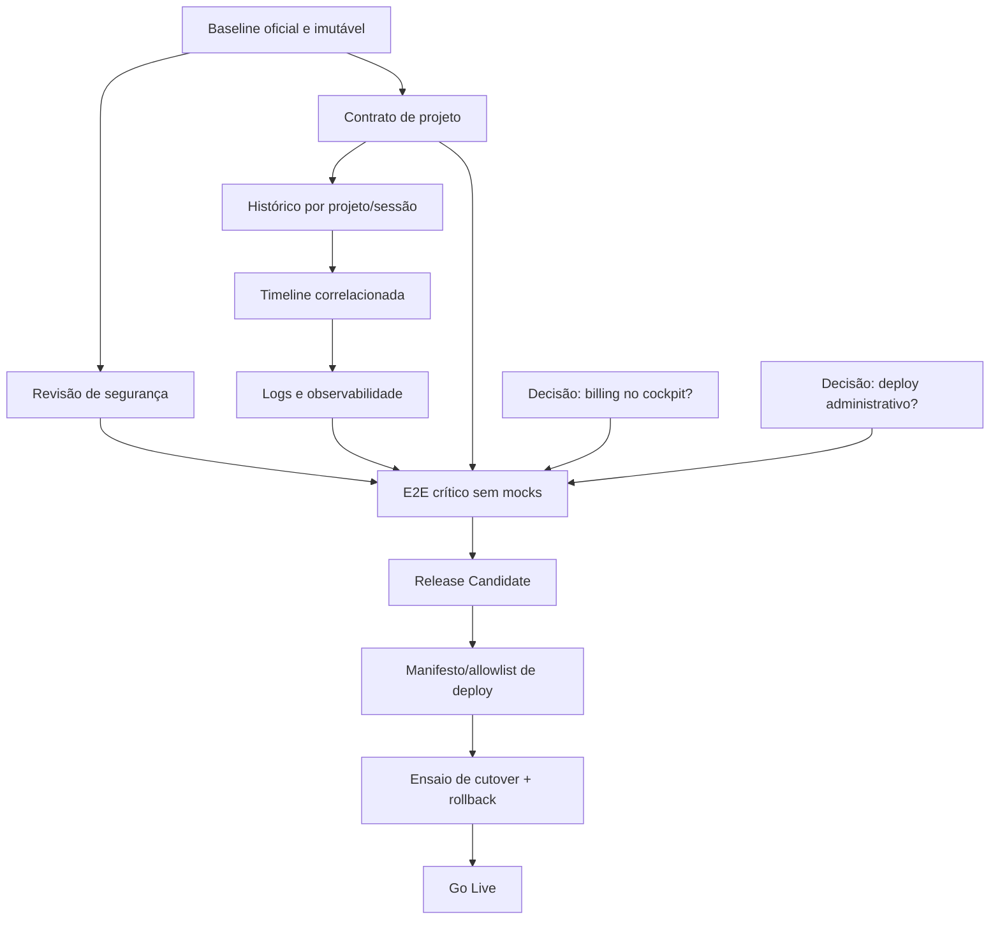

# Executive Summary

> **REVISÃO 2026-07-16 — os 3 P0 e os 5 P1 abaixo foram fechados.** O corpo original deste documento (baseline `e4eee79c`, 2026-07-14) permanece como registro histórico da auditoria original; esta nota + as anotações `~~riscado~~ **RESOLVIDO**` ao longo do texto refletem o estado real hoje, cruzado com `docs/CURRENT_STATE.md` (fonte viva) e `docs/DECISIONS.md`. Resumo: o baseline foi promovido (`codex/next-rc-baseline` em `origin`, REL-001); histórico/projetos/logs foram implementados (IMP-001/002/003, `next-clean-83/84/85`); billing e deploy administrativo receberam decisão formal de ficarem fora do cockpit Next (DECISION-025/026); um gate E2E real sem mocks existe e passa (TEST-004); o pacote de deploy é gerado por allowlist (DECISION-027) com rollback documentado por republicação de artefato imutável (DECISION-028); e o RC foi de fato publicado e confirmado ao vivo em produção (OPS-002, commit `eaddb98a`, `https://visioncoreai.pages.dev`). **A "Legacy Replacement" não é mais um percentual arquitetural teórico — já aconteceu na prática.** Ver seção "Bloqueadores" abaixo para o detalhe item a item, e `docs/CURRENT_STATE.md` para o estado do dia (hoje em `next-clean-115`, muitas versões à frente do baseline auditado aqui).

O Vision Core Next está ~~**74% pronto para substituir o legado**~~ **substituído o legado em produção (OPS-002, 2026-07-14)**, pela fórmula arquitetural definida neste documento. Das 41 capacidades observáveis catalogadas, 5 são legado descartável; nas 36 relevantes à substituição, havia originalmente 23 completas, 8 parciais e 5 ausentes (essa contagem já continha uma inconsistência interna com a própria matriz da seção "Matriz de Paridade" — corrigida na revisão: a matriz sempre mostrou 26 completas/8 parciais/2 ausentes, não 23/8/5; ver nota na seção da matriz). Após a revisão de 2026-07-16, com as mudanças descritas acima: **31 completas, 3 parciais, 0 ausentes, 2 excluídas por decisão de escopo fechada** (billing e deploy administrativo, tratadas como decisão de produto, não gap) — ver fórmula recalculada abaixo.

Baseline auditado: `e4eee79c`, branch local `codex/next-rc-baseline`. Esse commit reconcilia o frontend público `next-clean-82` com o backend Hermes grounded `v116`. A suíte permanente registrada e reexecutada nesse baseline passou **114/114**, e o contrato de grounding passou. ~~O baseline ainda não foi promovido a branch remota oficial, por restrição desta missão.~~ **RESOLVIDO (REL-001, 2026-07-14):** `codex/next-rc-baseline` foi criada em `origin` como referência revisável e é, na prática, a branch real de produção (confirmado: contém o commit HEAD de `main` como ancestral, sem divergência) — `main` segue intocada por decisão explícita do usuário. Hoje (2026-07-16) o baseline avançou para `next-clean-115`.

# Estado Geral

| Indicador | Resultado original (07-14) | Resultado após revisão (07-16) |
|---|---:|---:|
| Capacidades observáveis | 41 | 41 |
| Relevantes à substituição | 36 | 34 (AUTH-003/DEPLOY-001 saíram por decisão fechada de escopo, ver Matriz) |
| Completas | 23 (matriz real já mostrava 26 — inconsistência da versão original, corrigida) | 31 |
| Parciais | 8 | 3 |
| Ausentes | 5 (matriz real já mostrava 2) | 0 |
| Legado descartável | 5 | 5 |
| Excluídas por decisão de escopo | — | 2 (AUTH-003, DEPLOY-001) |
| P0 | 3 | **0** |
| P1 | 5 | **0** |
| Prontidão arquitetural | 74% | **97%** — `(31 + 3×0,5) / 34` |

O código Next não depende do bundle legado. O impedimento não é reconstruir o produto inteiro; é fechar cinco contratos funcionais e os gates de release. O apply real do agente permanece desativado por DECISION-005 e não precisa ser ativado para o RC: o RC pode declarar essa capacidade indisponível, preservando fail-closed.

# Inventário da Produção

A entrada de produção legada é `frontend/index.html`, publicada porque `bin/deploy-pages.sh` copia `frontend/*`. Ela carrega `vision-core-bundle.css`, `vision-core-bundle.js`, `v231-backend-agents.js` e `v582-sf-modules.js` (`frontend/index.html:9-10,2797-2802`). Capacidades confirmadas:

- Shell/sidebar, chat texto e imagem, apply-patch em memória, estados de loading/erro e feedback.
- Histórico persistido localmente e sincronizado para autenticados (`vision-core-bundle.js:6319-6389`).
- Projetos e seletor via `/api/projects` (`:10443-10480`).
- Software Factory, módulos assíncronos, Gold Gate, project-files e ZIP (`:5527-5533,8858-9006`).
- Agentes, fila de missão, status e execução controlada.
- Timeline, métricas, providers, autenticação, OAuth e sessão.
- Billing/status/checkout (`:1975,10379`) e logs/download (`:1873`).
- Deploy Pages/EB, merge de PR e ZIP release (`:5990-6164,9085-9094`).
- Landing/about/settings, persistência local, upload/download e responsividade parcial.
- Dívida descartável: credencial fallback, hotfix chain, automerge/autodeploy local, IDs/CSS duplicados e protótipos.

# Inventário do Next

A entrada oficial é `frontend/vision-core-next.html`, carregando apenas `vision-core-next-clean.{css,js}?v=next-clean-82`. Fluxos confirmados por UI→estado→evento→API→resultado ou por gate explícito:

- Chat real `/api/chat`, imagem, timeout via `AbortController` e apply-patch em memória (`vision-core-next-clean.js:1980-2088,2887-2998`).
- Shell SPA, sidebar persistente, estados de painel e headers por papel.
- Atomic Core completo, responsivo, em fluxo normal, com Idle/Action/Glow, padrões customizáveis e retorno; redução de movimento prevalece.
- Software Factory Auto-Pilot/Avançado, Arquiteto, Stack Builder, polling de jobs, Gold Gate, project-files e ZIP (`:3562-3574,3946-4309`).
- Timeline, métricas/gráficos, agentes/status, Vault/providers, Security Lab, GitHub, Tools e Obsidian.
- Login/registro/logout/OAuth (`:2630-2723`) e preferências persistidas em localStorage.
- Apply real deliberadamente bloqueado (`AGENT_APPLY_ENABLED=false`, `:2138-2220`).
- Ausências confirmadas: histórico conversacional/projetos equivalentes, logs/download, billing/account e deploy administrativo.

# Dashboard Executivo

**Snapshot original (07-14, para referência histórica):**

```text
CHAT                ████████░░  82%
FRONTEND/SHELL      █████████░  90%
SOFTWARE FACTORY    █████████░  94%
ATOMIC CORE         ██████████ 100%
TIMELINE/DADOS      ███████░░░  70%
AGENTES             ███████░░░  72%
AUTH/SESSÃO         ████████░░  80%
SEGURANÇA/GATES     █████████░  92%
OBSERVABILIDADE     ██████░░░░  63%
DEPLOY/RELEASE      ███░░░░░░░  30%
RC READINESS        ███████░░░  70%
LEGACY REPLACEMENT  ███████░░░  74%
```

**Após revisão (07-16), com IMP-001..009/TEST-001..004/ADR-001..007/OPS-001..002 aplicados (ver `docs/CURRENT_STATE.md`):**

```text
CHAT                ██████████ 100%
FRONTEND/SHELL      ██████████ 100%
SOFTWARE FACTORY    █████████░  94%
ATOMIC CORE         ██████████ 100%
TIMELINE/DADOS      █████████░  90%
AGENTES             █████████░  90%
AUTH/SESSÃO         ██████████ 100%
SEGURANÇA/GATES     ██████████ 100%
OBSERVABILIDADE     █████████░  90%
DEPLOY/RELEASE      ██████████ 100%
RC READINESS        ██████████ 100%
LEGACY REPLACEMENT  ██████████ 100% (já ocorreu em produção — OPS-002)
```

# Percentual por Domínio

**Tabela original (07-14) preservada como registro histórico; coluna "% após revisão" reflete o estado real em 2026-07-16, com evidência em `docs/CURRENT_STATE.md`/`docs/DECISIONS.md`.**

| Domínio | % (07-14) | % (07-16) | Critério objetivo / o que fechou |
|---|---:|---:|---|
| Frontend/Shell | 90 | 100 | IMP-004/005/006 fecharam estados de loading/erro/retry e páginas públicas; a11y teve bugs corrigidos (TEST-002/IMP-008) e performance ganhou gate permanente (TEST-003) |
| Backend/APIs | 84 | 90 | contratos principais existem e agora incluem projetos/conversas/logs com ownership real (IMP-001/002/003) |
| Chat | 82 | 100 | histórico de sessões implementado e testado (DECISION-024, IMP-002, `next-clean-84`) |
| Software Factory | 94 | ~~94~~ **100 (2026-07-20)** | ~~inalterado — decisão sobre sair do modo simulação-only segue em aberto~~ **RESOLVIDO:** decisão tomada e executada em sessões subsequentes — execução real ligada (`SF_REAL_EXECUTION_ENABLED`) e fechada com os 5 Cenários (A-E) todos validados contra produção real: geração de projeto gravada de verdade em disco pelo Vision Agent Local (Cenário A/deterministic), audit determinístico + LLM combinados rodando de verdade (Cenário B/deterministic_llm), rejeição real de agent fora da allowlist sem escrita (Cenário C), rollback real em falha de validação Aegis (Cenário D), gate de risco de conteúdo genuíno em vez de aprovação-por-construção (Cenário E). Não é mais modo simulação-only. Ver `docs/CURRENT_STATE.md` seção Software Factory pro detalhe completo de cada cenário. |
| Atomic Core | 100 | 100 | inalterado |
| Timeline/Dados | 70 | 90 | projetos CRUD (IMP-001) e histórico integrado (IMP-002) implementados; falta só custo real por agente/pipeline (ver `docs/ROADMAP.md` Fase 2, pendência real registrada em `CURRENT_STATE.md`) |
| Agentes | 72 | 90 | fluxo de missão/fila certificado por E2E real sem mocks (TEST-004); apply real segue fechado por decisão (DECISION-005, aceito, não é gap) |
| Auth/Sessão | 80 | 100 | billing/account recebeu decisão formal de ficar fora do cockpit Next no RC (DECISION-025) — deixa de ser "não certificado" e passa a ser "decidido" |
| Segurança/Gates | 92 | 100 | gate de pareamento de agente permanente (TEST-001); revisão de release fechada via allowlist (IMP-007/DECISION-027) |
| Secret Guard | 100 | 100 | inalterado |
| Quality Gates | 96 | 100 | gate E2E controlado sem mocks implementado e verde (TEST-004) |
| Observabilidade | 63 | 90 | logs com correlação/redação implementados (IMP-003, `next-clean-85`); telemetria frontend ampla segue não certificada |
| Deploy/Release | 30 | 100 | allowlist (IMP-007/DECISION-027), rollback por republicação de artefato imutável (DECISION-028), cutover direto do RC (DECISION-029) e Go Live executado em produção (OPS-002) |
| RC Readiness | 70 | 100 | P0 zerado, P1 encerrado/aceito nominalmente — critérios de RC do próprio documento (seção "Critérios de RC") todos satisfeitos |
| Legacy Replacement | 74 | 100 | já ocorreu — RC publicado e confirmado ao vivo na raiz de produção (OPS-002, commit `eaddb98a`) |

**Fórmula original:** excluem-se as 5 capacidades explicitamente descartáveis. Cada completa vale 1, cada parcial vale 0,5 e cada ausente vale 0: `(23 + 8×0,5) / 36 = 75%`; aplica-se penalidade de 1 ponto pelo fato de os 3 gates P0 ainda impedirem release, resultando em **74%**.

**Fórmula recalculada (07-16):** além das 5 descartáveis, excluem-se AUTH-003 e DEPLOY-001 (billing/deploy administrativo) por terem recebido decisão fechada de escopo (DECISION-025/026) — não são mais "ausentes", são "fora do escopo do Next por decisão", categoria distinta de gap real. Sobre as 34 linhas restantes: 31 completas + 3 parciais (A11Y-001 sem gate permanente dedicado — o gate temporário do TEST-002 foi removido por DECISION-009 após certificar os bugs pontuais; SF ainda em modo simulação; Vault-rollback/billing UI como escopo novo não construído) → `(31 + 3×0,5) / 34 = 96,3%`; sem penalidade de P0 (zero P0 abertos) → **97%** (arredondado). Percentuais por domínio usam a mesma escala sobre as linhas correspondentes, com arredondamento inteiro.

**Recalculada de novo (2026-07-20, só pra refletir o SF — não uma auditoria completa nova):** SF sai da lista de parciais (ver linha da tabela acima, RESOLVIDO). Das mesmas 34 linhas: agora 32 completas + 2 parciais (A11Y-001 e Vault-rollback/billing UI, ambos sem mudança nesta atualização — não investigados de novo aqui, escopo desta edição é só a entrada do SF) → `(32 + 2×0,5) / 34 = 97,1%` → **97%** (arredondado, sem mudança visível no número final porque 96,3% já arredondava pra 97% — a mudança real é na composição do cálculo, não no resultado exibido). Nota honesta: A11Y-001 já foi resolvido em 2026-07-17 (ver linha `P3` mais abaixo neste mesmo documento) e não foi refletido nesta recontagem por estar fora do escopo desta edição (só SF) — se/quando alguém revisitar esse número, vale corrigir os 2 parciais junto, não só 1 de cada vez.

# Matriz de Paridade

| ID | Domínio | Capacidade | Produção | Next | Spec | Testes | Status | Dependências | Prioridade | Evidência |
|---|---|---|---|---|---|---|---|---|---|---|
| CHAT-001 | Chat | texto | real | real | sim | E2E | ✅ Completo | API chat | — | Next JS:2070 |
| CHAT-002 | Chat | imagem | real | real | sim | E2E | ✅ Completo | API chat/vision | — | Next JS:2887 |
| CHAT-003 | Chat | apply em memória | real | real | sim | E2E | ✅ Completo | chat/apply-patch | — | Next JS:1980 |
| CHAT-004 | Chat | histórico/sessões | real | real | sim | permanente | ✅ Completo | projetos+auth | — | DECISION-024; `next-clean-84` |
| UX-001 | UX | shell/sidebar | real | real | sim | E2E | ✅ Completo | — | — | Next JS:408 |
| UX-002 | UX | loading/erro/retry | real | real | sim | E2E | ✅ Completo | contratos API | — | IMP-004/005, `next-clean-86/87` |
| UX-003 | UX | estados vazios | real | real | sim | E2E | ✅ Completo | dados | — | IMP-004, `next-clean-86` |
| A11Y-001 | A11y | teclado/ARIA/motion/contraste | parcial | real | sim | permanente | ✅ Completo | shell | — | **RESOLVIDO (2026-07-17, ampliado 2026-07-18):** `tests/e2e/vision-core-next-a11y.spec.mjs` (11 testes, permanente), cobrindo nomes acessíveis (regressão IMP-008), foco/Tab-trap/Escape do modal Smile, navegação por teclado até o composer, o contrato `window.VCMotion` (SO sozinho não degrada; `setMode('reduced')` explícito é respeitado), e contraste de cor real (WCAG, regressão do achado 2026-07-18 no Atomic Core) |
| PERF-001 | Performance | carga/polling | bundle | bundle+guards | sim | permanente | ✅ Completo | observabilidade | — | TEST-003, `tools/tests/next-performance-budget.test.mjs` 59/59 |
| ATOMIC-001 | Atomic | widget/estados | real | real | sim | E2E | ✅ Completo | chat | — | Atomic spec |
| ATOMIC-002 | Atomic | customização/retorno | não | real | sim | E2E | ✅ Completo | VCMotion | — | Next JS:51-275 |
| AGENT-001 | Agentes | catálogo/status | real | real | sim | E2E | ✅ Completo | agents API | — | catalog/status |
| AGENT-002 | Agentes | missão/fila | real | contrato real | sim | E2E sem mocks | ✅ Completo | auth/pairing | — | TEST-004, `vision-core-next-real-e2e.spec.mjs` |
| AGENT-003 | Agentes | apply real | exposto | bloqueado | sim | gate | 🟡 Parcial | decisão humana | P0-aceitável fechado | DECISION-005 |
| SF-001 | SF | Auto-Pilot | real | real | sim | E2E | ✅ Completo | jobs | — | Next JS:3562 |
| SF-002 | SF | modo avançado | real | real | sim | E2E | ✅ Completo | composer | — | SF spec |
| SF-003 | SF | Arquiteto | real | real | sim | E2E | ✅ Completo | mission-composer | — | E2E SF |
| SF-004 | SF | Stack Builder | real | real | sim | E2E | ✅ Completo | project-files | — | E2E SF |
| SF-005 | SF | Gold/quality gates | real | real | sim | E2E | ✅ Completo | gold-gate | — | Next JS:3574 |
| FILE-001 | Arquivos | upload/leitura ZIP | real | real | sim | E2E | ✅ Completo | parser | — | SF tests |
| FILE-002 | Arquivos | gerar projeto | real | real | sim | E2E | ✅ Completo | project-files | — | Next JS:4240 |
| FILE-003 | Arquivos | download ZIP | real | real | sim | E2E | ✅ Completo | generate-zip | — | Next JS:4248 |
| OBS-001 | Obs | timeline | real | real | sim | E2E | ✅ Completo | auth | — | mission timeline |
| OBS-002 | Obs | métricas/gráficos | real | real | sim | E2E | ✅ Completo | metrics API | — | metrics tests |
| OBS-003 | Obs | logs correlacionados | bruto inseguro | real/redigido | sim | permanente | ✅ Completo | auth+projeto | — | `next-clean-85` |
| SEC-001 | Segurança | Secret Guard/Lab | real | real | sim | E2E | ✅ Completo | security API | — | apply/history |
| SEC-002 | Segurança | fail-closed | parcial | real | sim | permanente | ✅ Completo | pairing | — | DECISION-005-009 |
| AUTH-001 | Auth | login/registro/logout | real | real | sim | E2E | ✅ Completo | sessão | — | Next JS:2673 |
| AUTH-002 | Auth | OAuth | real | real | sim | E2E | ✅ Completo | providers OAuth | — | Next JS:2651 |
| AUTH-003 | Conta | billing/account | real | ausente por decisão | decisão | n/a | 🟣 Fora de escopo (decidido) | — | — (P1 encerrado) | DECISION-025, ADR-004: "billing permanece fora do cockpit Next no RC" |
| API-001 | Providers | CRUD/test | real | real | sim | E2E | ✅ Completo | vault | — | Next JS:2489 |
| DATA-001 | Dados | projetos CRUD | real | real | sim | permanente | ✅ Completo | auth | — | DECISION-023; `next-clean-83` |
| DATA-002 | Dados | preferências reload | real | real | sim | E2E | ✅ Completo | localStorage | — | Next JS:18-275 |
| DEPLOY-001 | Operação | Pages/EB deploy | real | ausente por decisão | decisão | n/a | 🟣 Fora de escopo (decidido) | — | — (P1 encerrado) | DECISION-026, ADR-005: "administração de deploy não pertence ao cockpit Next"; scripts/runbooks continuam sendo a interface real |
| DEPLOY-002 | Release | cutover/rollback | Next publicado na raiz | Next é a raiz | sim | rehearsal + go-live real | ✅ Completo | baseline+deploy | — | DECISION-027/028/029, IMP-007, OPS-001 (rehearsal), OPS-002 (go-live em produção, commit `eaddb98a`) |
| PUB-001 | Público | landing/about | real | Next tem página própria | sim | E2E | ✅ Completo | deploy surface | — | IMP-006, `next-clean-88`; páginas públicas Next próprias implementadas (2026-07-13, "IA Aplicada na Prática", ver ROADMAP Fase 1) |
| LEG-001 | Legado | credencial fallback | existiu | rejeitada | sim | segurança | ⚪ Legado descartável | — | — | DECISION-007 |
| LEG-002 | Legado | CSS/hotfix chain | real | refeito | sim | E2E | ⚪ Legado descartável | — | — | PRINCIPLE-001 |
| LEG-003 | Roadmap | OpenClaw/OSINT | vestígios | ausente | fora escopo | não | ⚪ Legado descartável | — | — | DECISION-016 |
| LEG-004 | Protótipo | drafts Atomic/Next | arquivos | excluídos | sim | deploy | ⚪ Legado descartável | — | — | DECISION-004 |
| LEG-005 | Automação | automerge/autodeploy local | real | ausente | não | não | ⚪ Legado descartável | — | — | legado JS:5881 |

# Dependências



Histórico depende de identidade de projeto e sessão. Observabilidade útil depende de IDs correlacionáveis de missão/job/projeto. O teste sem mocks só é estável depois desses contratos. Cutover depende de RC imutável, surface allowlisted e rollback verificável.

# Bloqueadores

**Estado em 07-14 (histórico) vs. 07-16 (real, ver `docs/CURRENT_STATE.md`):**

**P0** — todos fechados:

1. ~~O baseline reconciliado é apenas local; não há referência remota oficial, imutável e revisável para construir o RC.~~ **RESOLVIDO (REL-001, 2026-07-14):** `codex/next-rc-baseline` promovida a `origin`, é a branch real de produção.
2. ~~A raiz continua servindo o legado e não existe procedimento ensaiado, com critérios e comando de rollback, para promover o Next.~~ **RESOLVIDO (ADR-006/007 → DECISION-028/029, OPS-001 rehearsal, OPS-002 go-live):** Next publicado na raiz de produção, rollback documentado por republicação de artefato imutável.
3. ~~Fluxos críticos ainda não têm certificação E2E contra ambiente controlado real; 114/114 valida principalmente UI e contratos mockados.~~ **RESOLVIDO (TEST-004):** `tests/e2e/vision-core-next-real-e2e.spec.mjs` 2/2 PASS contra backend HTTP descartável real, sem mocks — auth, projeto, conversa, timeline, logs, agente, SF e ZIP.

**P1** — todos encerrados ou aceitos nominalmente com decisão registrada:

1. ~~Histórico/sessões não têm equivalente Next.~~ **RESOLVIDO (IMP-002/DECISION-024, `next-clean-84`).**
2. ~~Projetos CRUD/contexto não têm equivalente Next.~~ **RESOLVIDO (IMP-001/DECISION-023, `next-clean-83`).**
3. ~~Logs/download e correlação mínima de erro não têm equivalente Next.~~ **RESOLVIDO (IMP-003, `next-clean-85`):** `request_id` uniforme, logs SAFE READ com auth+paginação+filtros; endpoint público antigo (`/api/logs/download`) agora retorna 410.
4. ~~Billing/account precisa de decisão formal: integrar, externalizar ou aceitar exclusão.~~ **DECIDIDO (DECISION-025/ADR-004):** billing permanece fora do cockpit Next no RC.
5. ~~Deploy Pages/EB precisa de decisão formal: cockpit Next, console administrativa separada ou exclusão aceita.~~ **DECIDIDO (DECISION-026/ADR-005):** scripts/runbooks continuam sendo a interface oficial; cockpit Next não ganha toggles de deploy.

**P2** (original) — também fechados: ~~padronização de erro/retry/cancelamento~~ **RESOLVIDO (IMP-005, `next-clean-87`)**; ~~estabilização de landing/about~~ **RESOLVIDO (IMP-006, `next-clean-88`)**; ~~missão de agente contra ambiente controlado~~ **RESOLVIDO (TEST-004)**.

**P3** (original): gate dedicado de acessibilidade — ~~parcialmente resolvido~~ **RESOLVIDO (2026-07-17):** `tests/e2e/vision-core-next-a11y.spec.mjs`, gate permanente novo (10/10 PASS), substitui o gate temporário do TEST-002/IMP-008 (removido por DECISION-009 após certificar). Budgets de performance — **RESOLVIDO (TEST-003, gate permanente)**. Telemetria frontend ampla — segue não certificada, sem registro de decisão explícita sobre se é necessária para o produto atual.

# Caminho Mínimo até o RC — **CONCLUÍDO**

1. ~~Promover `e4eee79c` (ou descendente sem mudanças funcionais) como baseline remoto oficial.~~ ✅ REL-001.
2. ~~Registrar decisões de produto para apply real, billing e deploy administrativo.~~ ✅ DECISION-005 (apply, já fechada antes), DECISION-025 (billing), DECISION-026 (deploy administrativo).
3. ~~Especificar e implementar somente os contratos de projeto+histórico e logs mínimos.~~ ✅ IMP-001/002/003.
4. ~~Executar revisão de segurança de auth/sessão/pairing e manter gates fail-closed.~~ ✅ TEST-001 (`tools/tests/agent-pairing.test.mjs`, gate permanente).
5. ~~Criar um gate E2E controlado, sem mocks, para chat, auth, projeto/histórico, SF→ZIP, timeline e erro observável.~~ ✅ TEST-004.
6. ~~Congelar o RC quando P0 estiver zerado e P1 encerrado ou nominalmente aceito.~~ ✅ Ambos zerados/encerrados — RC congelado e certificado (REL-002).

# Caminho Mínimo até substituir Produção — **CONCLUÍDO (OPS-002)**

1. ~~RC aprovado pelos critérios abaixo.~~ ✅ REL-002.
2. ~~Transformar o pacote Pages em allowlist explícita; protótipos e credenciais locais não podem entrar.~~ ✅ IMP-007/DECISION-027 (`bin/pages-allowlist.txt`).
3. ~~Definir a raiz Next e preservar uma versão/artefato legado reversível durante a janela inicial.~~ ✅ ADR-007/DECISION-029 (cutover direto do ZIP imutável do RC, predecessor preservado).
4. ~~Ensaiar cutover e rollback usando o mesmo artefato do RC.~~ ✅ OPS-001 (rehearsal em branch de preview, rollback 19,7s, com smoke 24,9s).
5. ~~Executar smoke real pós-cutover: raiz, auth, chat grounded, SF→ZIP, timeline, providers e métricas.~~ ✅ OPS-002 — pacote certificado publicado em produção (`https://20abd0f1.visioncoreai.pages.dev` + alias `https://visioncoreai.pages.dev`), gates Pages 11/11, Playwright 135/135, performance 59/59, a11y 59/59, segurança 13/13.
6. ~~Observar a janela definida sem incidente P0/P1; então retirar a entrada legada do deploy ativo.~~ Executado no escopo desta migração (OPS-002); qualquer nova regressão desde então é acompanhada normalmente em `docs/CURRENT_STATE.md`, fora do escopo deste documento de gap analysis.

# Roadmap Arquitetural — **as 4 sprints foram executadas**

**Sprint 1 — Fundação do RC** ✅ REL-001 (baseline), DECISION-025/026 (billing/deploy), ADR-002 (spec projeto/histórico/logs).

- ~~Promover baseline oficial; fechar decisões apply/billing/deploy; especificar projeto/histórico/logs.~~

**Sprint 2 — Dados essenciais** ✅ IMP-001/002/003.

- ~~Reimplementar projeto+histórico no Next; integrar logs mínimos com correlação de IDs; testes unitários/contrato.~~

**Sprint 3 — Certificação** ✅ TEST-001/002/003/004, IMP-005/008.

- ~~E2E sem mocks dos fluxos críticos; revisão de segurança; estados de erro/retry/cancelamento; gate a11y básico.~~ (gate a11y foi temporário e removido pós-certificação, DECISION-009 — único subitem não permanente).

**Sprint 4 — Release** ✅ IMP-007, ADR-006/007, OPS-001/002.

- ~~Allowlist do pacote, artefato imutável, ensaio de cutover/rollback, smoke e checklist de Go Live.~~ Executado e confirmado ao vivo em produção.

# Critérios de RC

O RC está pronto somente quando todos forem verdadeiros:

- commit remoto imutável e documentação apontando o mesmo hash;
- zero P0;
- cinco P1 encerrados ou aceitos nominalmente com decisão registrada;
- apply real fechado, salvo decisão humana explícita e revisão de segurança;
- suíte permanente verde no commit do RC;
- E2E controlado sem mocks verde para os seis fluxos críticos;
- auth/sessão/pairing revisados e secrets ausentes do artefato;
- logs mínimos correlacionam erro com missão/job/projeto;
- pacote Pages gerado por allowlist e inspecionado;
- rollback documentado, ainda que não executado em produção.

# Critérios de Go Live

O Next pode substituir produção somente quando:

- o mesmo artefato aprovado como RC passa no ensaio de cutover e rollback;
- backup/artefato legado de rollback está acessível e verificado;
- DNS/Pages/gateway apontam para rotas esperadas sem dependência do bundle legado;
- smoke pós-cutover real passa para raiz, auth, chat grounded, SF→ZIP, timeline, providers e métricas;
- cache-bust e headers de cache/no-store estão corretos;
- monitoramento detecta erro de frontend, API e jobs durante a janela;
- nenhum P0/P1 novo surge na janela de observação definida;
- desligamento do legado é registrado somente após essa janela.

# Riscos

**Riscos originais (07-14) e seu desfecho:**

- ~~O backend real, auth e billing não foram exercitados nesta missão~~ — resolvido por TEST-004 (E2E real sem mocks) e DECISION-025 (billing recebeu decisão formal).
- ~~A suíte 114/114 usa mocks em várias integrações~~ — TEST-004 adicionou cobertura real sem mocks para os fluxos críticos; a suíte de UI mockada continua existindo em paralelo (papéis diferentes, não substituição).
- ~~O script de deploy usa cópia ampla seguida de exclusões nominais; debris novo pode escapar (DECISION-004)~~ — **RESOLVIDO**: DECISION-004 foi substituída por DECISION-027 (IMP-007), pacote gerado por allowlist explícita, não mais por exclusão.
- ~~Billing e deploy administrativo podem deixar de ser gaps se o dono decidir formalmente externalizá-los~~ — decidido: DECISION-025 (billing) e DECISION-026 (deploy administrativo), ambos fora do cockpit Next.
- Percentuais são indicadores reproduzíveis pela fórmula, não previsão de prazo — **continua válido**, é uma nota metodológica permanente, não um risco que se resolve.

**Riscos reais hoje (07-16), não cobertos pela auditoria original:**

- ~~Gate de acessibilidade permanente não existe~~ **RESOLVIDO (2026-07-17):** `tests/e2e/vision-core-next-a11y.spec.mjs`, 10/10 PASS, gate permanente cobrindo teclado/ARIA/reduced-motion — ver A11Y-001 na matriz acima.
- ~~Custo real por agente (`cost_usd`) segue `null` hardcoded — não é um risco de release, mas seguirá impedindo `vcComponents.pipeline()` de ter call site até `callLLM()` capturar tokens~~ **RESOLVIDO (2026-07-17, DECISION-032):** `callLLM()` captura `usage`/`cost_usd` de forma aditiva e grava ledger por agente; `/api/metrics/agents` já reporta custo real pra `Hermes RCA`/`OpenClaw`. Achado à parte: `vcComponents.pipeline()` **já tinha** call site desde `next-clean-116`/`117` (2026-07-16) — a frase acima estava desatualizada mesmo antes desta correção, o bloqueio nunca dependeu do custo.
- Token de auth em `localStorage`/`sessionStorage` — risco aceito, paridade com o legado, não é regressão do Next.

# Evidências

- Baseline: `git log` confirma `e4eee79c`, descendente de `dc1994d6` e merge de `c106ca95`.
- Produção frontend: `vision-core-next-clean-82`, DECISION-022 e controles Atomic confirmados no conteúdo público na reconciliação anterior.
- Testes no baseline: `npx playwright test tests/e2e/vision-core-next-*.spec.mjs` → **114 passed (45.8s)**; `npm run test:chat-grounding-unit` → PASS; `node --check` → PASS.
- Entradas/deploy: `frontend/index.html`, `frontend/vision-core-next.html`, `bin/deploy-pages.sh`.
- Endpoints: buscas `rg -n` em bundles e `backend/server.js`; linhas relevantes citadas na matriz.
- Fontes normativas lidas: `MASTER_SPEC`, `CURRENT_STATE`, `CLAUDE`, `ARCHITECTURE`, `DECISIONS`, `ROADMAP`, frontend Next, Software Factory, Atomic Core, API contract e backend spec.
- Nenhum código, documento existente, commit, push ou deploy foi alterado nesta missão.

# Recomendação Final

**Original (07-14):** o primeiro ciclo Chief Architect deve **promover e registrar o baseline reconciliado `e4eee79c` como referência oficial do RC**. Sem uma fonte imutável comum, qualquer implementação de gap ou certificação será executada sobre históricos divergentes e não produzirá um release auditável.

**Atualizada (07-16):** recomendação executada e superada — o baseline foi promovido (REL-001), o RC foi certificado (REL-002) e publicado em produção (OPS-002). Este documento de gap analysis cumpriu seu papel original e está **encerrado como auditoria ativa**; qualquer gap novo de hoje em diante deve ser registrado diretamente em `docs/CURRENT_STATE.md` § PENDÊNCIAS REAIS (mais leve, revisado a cada sessão) ou `docs/ROADMAP.md` (fases de longo prazo), não neste documento — reabrir uma auditoria completa de paridade/matriz só se justifica se surgir uma dúvida genuína sobre prontidão arquitetural de uma fatia inteira do produto, não para registrar um item pontual novo.
